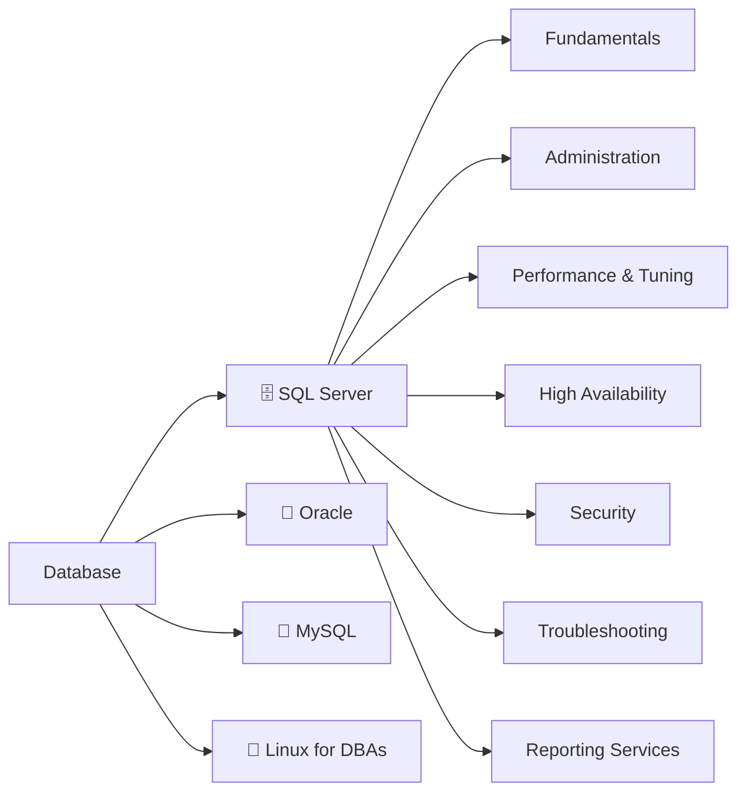

# 🗃️ Database Learning Guides

A complete, practical knowledge base covering relational database concepts, SQL Server administration, Oracle, MySQL, and the Linux skills DBAs need day-to-day — rewritten and expanded from years of hands-on notes into a structured, example-driven reference.

## 📂 Sections

### 🗄️ [Microsoft SQL Server](./SQL-Server/README.md)
The largest and most complete section — everything from core T-SQL concepts to production DBA operations.

| Sub-section | Covers |
|---|---|
| [Fundamentals](./SQL-Server/Fundamentals/README.md) | Keys, joins, normalization, stored procedures, functions, triggers, transactions, temp tables, indexes, classic interview query patterns |
| [Administration](./SQL-Server/Administration/README.md) | Backup & restore, DBA operational checklists, file management, collation, patching |
| [Performance & Tuning](./SQL-Server/Performance-and-Tuning/README.md) | Execution plans, blocking/deadlocks, CPU/memory troubleshooting, DBCC commands |
| [High Availability](./SQL-Server/High-Availability/README.md) | Failover clustering, Always On Availability Groups, log shipping, replication |
| [Security](./SQL-Server/Security/README.md) | Logins/users/roles, TDE/Always Encrypted/Dynamic Data Masking, auditing |
| [Troubleshooting](./SQL-Server/Troubleshooting/README.md) | Version differences, connection issues, common errors |
| [Reporting Services](./SQL-Server/Reporting-Services/ssrs-overview.md) | SSRS architecture and setup |

### 🔶 [Oracle Database](./Oracle/README.md)
Architecture, RMAN backup/recovery, user management, tablespaces, and a full terminology bridge to SQL Server.

### 🐬 [MySQL](./MySQL/README.md)
Storage engines, data types, export/import, and migrating MySQL databases to SQL Server.

### 🐧 [Linux for Oracle DBAs](./Linux-Oracle/README.md)
The essential shell commands and environment concepts needed to support Oracle on Linux.

## How to Use This Guide

- 🔍 **New to databases?** Start with [SQL Server Fundamentals](./SQL-Server/Fundamentals/README.md) — keys, joins, and normalization first.
- 🛠️ **Already a developer, becoming a DBA?** Jump to [Administration](./SQL-Server/Administration/README.md) and [Performance & Tuning](./SQL-Server/Performance-and-Tuning/README.md).
- 🔀 **Working across platforms?** [Oracle vs. SQL Server Terminology](./Oracle/oracle-vs-sql-server-terminology.md) and [MySQL vs. SQL Server Data Types](./MySQL/mysql-vs-sql-server-data-types.md) are built exactly for that.
- 🎯 **Interview prep?** [Common SQL Query Patterns](./SQL-Server/Fundamentals/common-sql-query-patterns.md) covers the classics (Nth highest salary, dedupe rows, DELETE vs TRUNCATE, etc.)

---
⬅ [Back to Learning Guides Home](../README.md)
