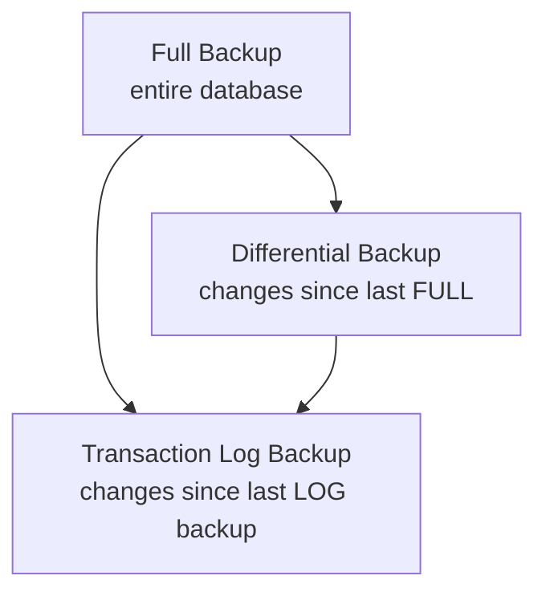

# SQL Server Backup & Restore

**What is it?** Backing up a database captures its data (and transaction history) to a file so it can be restored after data loss, corruption, hardware failure, or human error. It's the single most important responsibility of a DBA.

**Why it matters:** No amount of high availability or clustering replaces backups — HA protects against *hardware* failure, but not against someone running `DELETE FROM Orders` without a `WHERE` clause. Only backups protect against that.

## Recovery Models & What They Allow

| Recovery Model | Full Backups | Transaction Log Backups | Point-in-Time Restore | Typical Use |
|---|---|---|---|---|
| **Simple** | ✅ | ❌ (log auto-truncates) | ❌ | Dev/test, non-critical data |
| **Full** | ✅ | ✅ | ✅ | Production systems requiring minimal data loss |
| **Bulk-Logged** | ✅ | ✅ (minimally logged for bulk ops) | ⚠️ Limited during bulk operations | Large bulk load windows |

```sql
ALTER DATABASE MyDatabase SET RECOVERY FULL;
```

## Backup Types



| Type | Captures | Typical Schedule |
|---|---|---|
| **Full** | The entire database at a point in time | Weekly/nightly, baseline for everything else |
| **Differential** | All changes since the *last full* backup | Nightly (between full backups) |
| **Transaction Log** | All log activity since the *last log backup* | Every 15 min – 1 hour, for point-in-time recovery |

## Taking Backups

```sql
-- Full backup
BACKUP DATABASE MyDatabase
TO DISK = 'D:\Backups\MyDatabase_Full.bak'
WITH INIT, COMPRESSION, CHECKSUM;

-- Differential backup
BACKUP DATABASE MyDatabase
TO DISK = 'D:\Backups\MyDatabase_Diff.bak'
WITH DIFFERENTIAL, COMPRESSION, CHECKSUM;

-- Transaction log backup
BACKUP LOG MyDatabase
TO DISK = 'D:\Backups\MyDatabase_Log.trn'
WITH COMPRESSION, CHECKSUM;
```

> 💡 `WITH CHECKSUM` verifies page checksums during backup so you catch corruption early. `WITH COMPRESSION` shrinks backup size and I/O (Enterprise-only prior to SQL Server 2016; available on all editions from 2016+).

## Restoring a Database

```sql
-- Full restore (with recovery — database becomes usable immediately)
RESTORE DATABASE MyDatabase
FROM DISK = 'D:\Backups\MyDatabase_Full.bak'
WITH REPLACE, RECOVERY;

-- Full + Differential + Log chain (point-in-time restore)
RESTORE DATABASE MyDatabase
FROM DISK = 'D:\Backups\MyDatabase_Full.bak'
WITH NORECOVERY, REPLACE;

RESTORE DATABASE MyDatabase
FROM DISK = 'D:\Backups\MyDatabase_Diff.bak'
WITH NORECOVERY;

RESTORE LOG MyDatabase
FROM DISK = 'D:\Backups\MyDatabase_Log.trn'
WITH RECOVERY, STOPAT = '2026-07-28 09:00:00';
```

| Keyword | Meaning |
|---|---|
| `WITH RECOVERY` | This is the last file in the restore chain — bring the database fully online |
| `WITH NORECOVERY` | More backup files are coming — leave the database in "restoring" state |
| `WITH REPLACE` | Overwrite an existing database of the same name |
| `STOPAT` | Restore the transaction log only up to a specific point in time |

## Restoring to a New Location (`MOVE`)

```sql
RESTORE DATABASE AdventureWorks
FROM DISK = 'C:\AdventureWorks.BAK'
WITH MOVE 'AdventureWorks_Data' TO 'G:\SQLData\AdventureWorks_Data.mdf',
     MOVE 'AdventureWorks_Log'  TO 'H:\SQLLog\AdventureWorks_Log.ldf';
```

`WITH MOVE` only needs to be specified on the **first** restore in a multi-file chain — subsequent differential/log restores continue writing to that new location automatically.

## The 3-2-1 Backup Rule


- **3** copies total (production + 2 backups).
- **2** different types of media (e.g., local disk + cloud/tape).
- **1** copy kept offsite, protecting against site-wide disasters (fire, flood, ransomware).

## Backup Verification & Restore Testing

A backup you've never restored is not a real backup. Best practices:

```sql
-- Verify backup integrity without a full restore
RESTORE VERIFYONLY FROM DISK = 'D:\Backups\MyDatabase_Full.bak';

-- Periodically run DBCC CHECKDB on the restored copy
DBCC CHECKDB ('MyDatabase_TestRestore') WITH NO_INFOMSGS;
```

Schedule regular **restore drills** to a test server — this is the only way to be confident your backups actually work when you need them.

---
[⬅ Back to Administration](./README.md) | [⬅ Back to Database Home](../../README.md)
