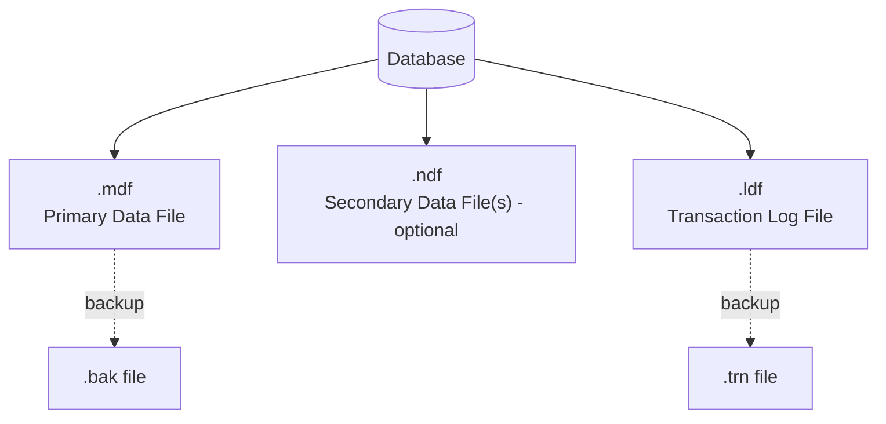

# SQL Server File Types: .mdf, .ndf, .ldf, .bak, .trn

Understanding these file extensions is fundamental — every SQL Server database is physically stored across some combination of them.

| Extension | Full Name | Purpose |
|---|---|---|
| **.mdf** | Primary data file | Stores the database's schema, tables, indexes — every database has exactly **one** |
| **.ndf** | Secondary data file | Optional additional data files, used to spread data across multiple disks/filegroups |
| **.ldf** | Log file | Stores the transaction log — every operation is recorded here before being written to the data file (write-ahead logging) |
| **.bak** | Backup file | Output of a `BACKUP DATABASE` command — a full or differential backup |
| **.trn** | Transaction log backup file | Output of a `BACKUP LOG` command |



## Why the Transaction Log Matters

SQL Server uses **write-ahead logging (WAL)**: every change is written to the `.ldf` transaction log *before* it's written to the data file. This is what makes `ROLLBACK` and crash recovery possible — if the server crashes mid-write, SQL Server replays the log on restart to bring the database back to a consistent state.

```sql
-- See the physical files for a database
SELECT name, physical_name, type_desc, size / 128.0 AS SizeMB
FROM sys.master_files
WHERE database_id = DB_ID('YourDatabase');
```

## Filegroups

A **filegroup** is a logical grouping of one or more `.mdf`/`.ndf` files. By default every database has one filegroup, `PRIMARY`. Filegroups let you:
- Spread I/O across multiple physical disks for performance.
- Put historical/archive tables on cheaper, slower storage.
- Back up individual filegroups independently for very large databases (piecemeal restore).

```sql
ALTER DATABASE MyDatabase ADD FILEGROUP FG_Archive;

ALTER DATABASE MyDatabase
ADD FILE (
    NAME = 'MyDatabase_Archive',
    FILENAME = 'D:\SQLData\MyDatabase_Archive.ndf',
    SIZE = 500MB
) TO FILEGROUP FG_Archive;
```

## Related: System Database Files

| System DB | Purpose |
|---|---|
| `master` | Tracks all system-level info: logins, linked servers, configuration, and the existence of every other database |
| `model` | Template — every new database is created as a copy of `model` |
| `msdb` | Stores SQL Server Agent jobs, backup/restore history, alerts, mail |
| `tempdb` | Scratch space for temp tables, sorting, worktables, row versioning — recreated fresh every time SQL Server restarts |
| `resource` (hidden) | Contains all system objects (read-only, not user-visible in Object Explorer) |

---
[⬅ Back to Administration](./README.md) | [⬅ Back to Database Home](../../README.md)
