# 🤖 Agentic AI Crash Course — Azure AI Edition

> **Build real, tool-using, autonomous AI agents with Python, Azure AI Foundry, the Microsoft Agent Framework, and Streamlit — from absolute zero to a deployed multi-agent app.**

This course is an Azure-flavored remix of the community project [`agentic-ai-crash-course`](https://github.com/AIwithhassan/agentic-ai-crash-course). The original teaches agent concepts with the OpenAI SDK + a third-party agent runtime. Here, every concept is rebuilt on **Microsoft's official Azure stack**:

| Original repo | This course |
|---|---|
| OpenAI Responses API | **Azure AI Foundry** model deployments (GPT-4o / GPT-4.1 / GPT-5.x) |
| `agentspan` runtime | **Microsoft Agent Framework** (`agent-framework` Python package) |
| Tavily search tool | **Bing Grounding** / custom Python tools |
| Plain terminal I/O | **Streamlit** web UI |
| Single script | Multi-page, versioned course + hosted deployment |

---

## 🧭 How this course is organized

Each numbered file is a **standalone lesson** — read them in order the first time, then use them as reference later. Copy this whole `docs/` (or `course/`) folder straight into your own GitHub repo as a new section.

```
📦 agentic-ai-azure-course/
 ┣ 📄 00-README.md                              ← you are here (index)
 ┣ 📄 01-introduction-to-agentic-ai.md           ← concepts & mental model
 ┣ 📄 02-azure-ai-foundry-setup.md               ← Azure resources & auth
 ┣ 📄 03-python-environment-setup.md             ← uv/venv, project layout
 ┣ 📄 04-your-first-agent.md                     ← "Hello Agent" (main.py rebuild)
 ┣ 📄 05-tools-and-function-calling.md           ← custom tools + Bing grounding
 ┣ 📄 06-memory-and-conversation.md              ← threads & chat memory
 ┣ 📄 07-guardrails-structured-output-approval.md← safety, Pydantic, human-in-loop
 ┣ 📄 08-streamlit-ui.md                         ← turn agents into a web app
 ┣ 📄 09-multi-agent-workflows.md                ← orchestration & handoffs
 ┣ 📄 10-deploy-to-azure.md                      ← ship it (Container Apps / Foundry Hosted Agents)
 ┣ 📄 11-next-steps-resources.md                 ← where to go from here
 ┗ 📁 project/                                   ← 🏃 runnable code (Groq free tier + Azure)
    ┣ 📄 README.md
    ┣ 📄 provider.py           ← 🔀 one switch: Groq (free) or Azure (production)
    ┣ 📄 main.py                (Lesson 04)
    ┣ 📄 chatbot_agent.py        (Lessons 05–06)
    ┣ 📄 customer_support.py     (Lesson 07)
    ┣ 📄 streamlit_app.py        (Lesson 08)
    ┣ 📄 multi_agent.py          (Lesson 09)
    ┣ 📄 pyproject.toml / requirements.txt
    ┗ 📄 .env.example
```

---

## 🗺️ The learning path

```mermaid
flowchart LR
    A["🧠 1. Concepts<br/>What is an agent?"] --> B["☁️ 2. Azure Setup<br/>Foundry project + model"]
    B --> C["🐍 3. Python Env<br/>uv + venv"]
    C --> D["👋 4. First Agent<br/>Agent Framework basics"]
    D --> E["🛠️ 5. Tools<br/>Functions + Bing search"]
    E --> F["🧵 6. Memory<br/>Multi-turn threads"]
    F --> G["🛡️ 7. Guardrails<br/>Structured output + approvals"]
    G --> H["🖥️ 8. Streamlit UI<br/>Chat app"]
    H --> I["🕸️ 9. Multi-Agent<br/>Orchestration"]
    I --> J["🚀 10. Deploy<br/>Azure Container Apps"]
```



---

## ✅ Prerequisites

| Skill / Tool | Level needed |
|---|---|
| Python | Basic — variables, functions, `async/await` helps but is explained |
| Azure account | Free tier is enough to start ([create one](https://azure.microsoft.com/free/)) |
| Command line | Comfortable running `pip`/`uv` commands |
| AI/ML background | **None required** — every term is defined the first time it's used |

---

## 🎯 What you'll build

By the end of this course you will have shipped:

1. 🗣️ A **terminal chatbot** talking directly to an Azure AI Foundry model.
2. 🛠️ A **tool-using agent** ("Alex") that can call functions and search the web.
3. 🎫 A **customer support agent** with guardrails, structured Pydantic output, and human-approved refunds.
4. 🖥️ A **Streamlit web app** wrapping your agents in a polished chat UI.
5. 🕸️ A **multi-agent system** where a triage agent hands off to specialists.
6. ☁️ A **deployed agent** running live on Azure.

---

## 🔑 Key vocabulary (quick reference)

| Term | Plain-English meaning |
|---|---|
| **Agent** | An LLM + instructions + tools that can decide *what to do next*, not just answer once |
| **Azure AI Foundry** | Microsoft's platform for deploying, managing, and calling foundation models in Azure |
| **Model deployment** | A named, callable instance of a model (e.g. `gpt-4o-mini`) inside your Foundry project |
| **Agent Framework** | Microsoft's open-source Python/.NET SDK for building agents (`agent-framework` package) |
| **Tool / Function calling** | Giving the model a Python function it can decide to invoke |
| **Thread / memory** | The running conversation history an agent uses for context |
| **Guardrail** | A check that blocks unsafe or malformed input/output before/after the model runs |
| **Orchestration / handoff** | One agent delegating a task to another, specialized agent |

---

## 💻 Want to just run the code?

Every lesson's script is ready to run in **[`project/`](./project/README.md)** — a small, cloned-and-go project that works with **two swappable LLM backends**:

- 🟢 **Groq** (free, open-source-hosted models — no Azure account needed, start here)
- 🔵 **Azure AI** (GPT models — production path, one `.env` line to switch)

```bash
cd project
uv sync
cp .env.example .env   # add your free Groq key, or your Azure details
uv run python main.py
```

See **[project/README.md](./project/README.md)** for full setup of both paths.

---

## ▶️ Start here

Go to **[01 — Introduction to Agentic AI »](./01-introduction-to-agentic-ai.md)**

---

<sub>This course is an independent educational remix inspired by the structure of `AIwithhassan/agentic-ai-crash-course`, rebuilt end-to-end for the Azure AI ecosystem (Azure AI Foundry + Microsoft Agent Framework + Streamlit). Not affiliated with or endorsed by the original author.</sub>
