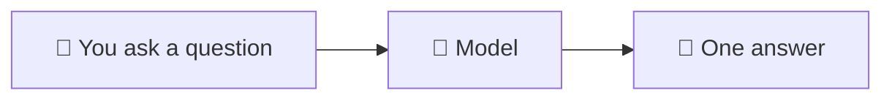
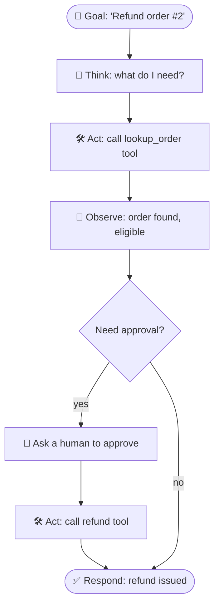
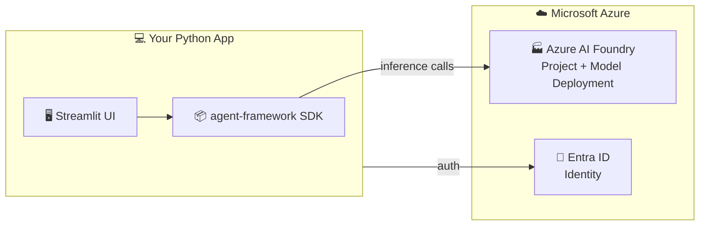

# 01 · 🧠 Introduction to Agentic AI

⬅️ [Back to index](./00-README.md) | ➡️ Next: [02 — Azure AI Foundry Setup](./02-azure-ai-foundry-setup.md)

---

## 🤔 What is "Agentic AI"?

A normal chatbot works like this:

You ask, it answers, conversation over. It cannot check a database, browse the web, or take five steps to solve a problem.

An **agent** adds a loop: the model can **think → act → observe → think again** until the goal is done.

> 💡 **Analogy:** A chatbot is a very smart encyclopedia. An agent is a smart *employee* — it can pick up the phone, look things up, follow your company's rules, and know when to ask a manager before doing something risky.

---

## 🧩 The four ingredients of every agent

| Ingredient | What it is | Real-world analogy |
|---|---|---|
| 1️⃣ **Model** | The LLM doing the reasoning (e.g. `gpt-4o` on Azure AI Foundry) | The employee's brain |
| 2️⃣ **Instructions** | The system prompt defining role, tone, and rules | The job description |
| 3️⃣ **Tools** | Functions the agent can call (search, database, refund, email…) | The employee's tools/software access |
| 4️⃣ **Memory / state** | Conversation history, or longer-term memory | The employee's notebook |

Add **guardrails** (rules the agent must never break) and **orchestration** (multiple agents working together) and you have a production agentic system — which is exactly what this course builds, piece by piece.

---

## ☁️ Why build this on Azure?

This course instead uses Microsoft's **first-party, enterprise-ready** stack:

| Capability | Azure AI Foundry + Agent Framework gives you |
|---|---|
| 🔐 **Identity & auth** | Azure AD / Entra ID, `DefaultAzureCredential`, Managed Identity — no API keys floating around |
| 🌍 **Model choice** | GPT-4o, GPT-4.1, GPT-5.x, Llama, Mistral, DeepSeek, and more — swap models without changing code |
| 🛡️ **Governance** | Content filters, RBAC, private networking, audit logs baked into the platform |
| 🧵 **Managed state** | Foundry can manage conversation threads server-side for you |
| 🕸️ **Multi-agent + hosting** | Native workflow orchestration and one-command deployment to Azure |
| 📊 **Observability** | Built-in tracing/evaluation in the Foundry portal |

---

## 🗂️ Mapping the original repo to Azure

| Original file | Purpose | Azure rebuild (this course) |
|---|---|---|
| `main.py` | Raw OpenAI chat loop | **Lesson 4** — `Agent` + `FoundryChatClient` |
| `chatbot_agent.py` | Agent with memory, a greeting tool, Tavily web search | **Lessons 5–6** — custom tools + Bing grounding + threads |
| `customer_support.py` | Guardrails, structured Pydantic output, human-approved refunds | **Lesson 7** — same pattern, Azure-native |
| *(not in original)* | Web UI | **Lesson 8** — Streamlit |
| *(not in original)* | Multi-agent orchestration | **Lesson 9** |
| *(not in original)* | Deployment | **Lesson 10** |

---

## 🧪 Try it yourself (no code yet)

Before writing anything, describe an agent you'd like to build in one sentence, following this template:

> "An agent named **___** whose job is to **___**, using the tools **___**, that must never **___**."

Example: *"An agent named **Sam** whose job is to triage IT support tickets, using the tools `search_kb` and `create_ticket`, that must never delete a ticket without approval."*

Keep this sentence — you'll build exactly this kind of agent by Lesson 7.

---

## 📝 Recap

- An **agent** = model + instructions + tools + memory, looping until the goal is met.
- Azure AI Foundry + Microsoft Agent Framework give you the same agent patterns as the original repo, with enterprise auth, governance, and hosting built in.
- This course mirrors the original repo's three scripts, then goes further with a UI, multi-agent orchestration, and deployment.

➡️ Next: **[02 — Azure AI Foundry Setup](./02-azure-ai-foundry-setup.md)**
