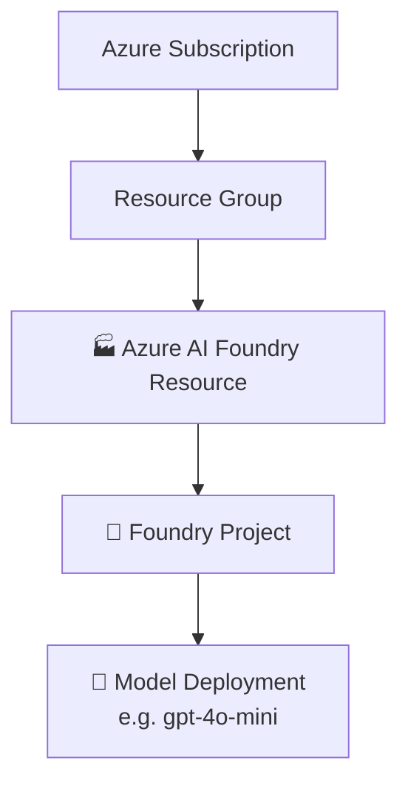
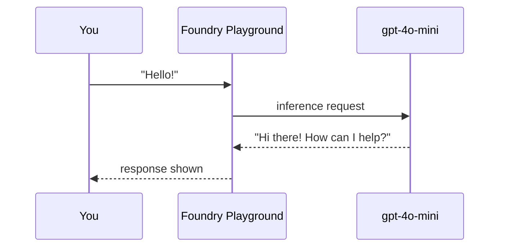

# 02 · ☁️ Azure AI Foundry Setup

⬅️ [01 — Introduction](./01-introduction-to-agentic-ai.md) | ➡️ Next: [03 — Python Environment Setup](./03-python-environment-setup.md)

---

## 🎯 Goal of this lesson

Get a **live, callable model deployment** on Azure that every later lesson's code will point to. By the end you'll have:

- An Azure AI Foundry **project**
- A deployed **chat model** (e.g. `gpt-4o-mini`)
- A working **authentication method** (no copy-pasted API keys in code)

---

## 🏗️ Step 1 — Create a Foundry project



1. Go to **[ai.azure.com](https://ai.azure.com)** and sign in with your Azure account.
2. Select **Create new** → **Foundry project**.
3. Choose (or create) a **resource group** and a **region** that supports the models you want (e.g. `eastus`, `swedencentral`).
4. Give the project a name, e.g. `agentic-ai-crash-course`.
5. Wait for deployment to finish — you'll land on the **Project overview** page.

> 📌 Copy your **Project endpoint** from this page (it looks like `https://<resource>.services.ai.azure.com/api/projects/<project>`). You'll need it as `FOUNDRY_PROJECT_ENDPOINT`.

---

## 🧠 Step 2 — Deploy a model

1. In your project, open **Model catalog**.
2. Search for `gpt-4o-mini` (cheap and fast — great for learning) or `gpt-4o` / `gpt-4.1` for higher quality.
3. Click **Deploy**, accept defaults, and note the **deployment name** (often the same as the model name).

| Model | Good for | Relative cost |
|---|---|---|
| `gpt-4o-mini` | Learning, tool-calling practice | 💰 |
| `gpt-4o` | Production-quality reasoning | 💰💰 |
| `gpt-4.1` | Long context, complex agents | 💰💰 |
| `gpt-5.x` (if available in your region) | Frontier reasoning, multi-agent orchestration | 💰💰💰 |

---

## 🔐 Step 3 — Set up authentication (no hard-coded keys!)

Azure lets you skip API keys entirely and authenticate with your **Azure identity**. This is the recommended approach used throughout this course.

### Option A — Local development: Azure CLI login

```bash
az login
```

This lets `AzureCliCredential()` in your Python code silently obtain tokens using your signed-in identity.

### Option B — Production: Managed Identity

When you deploy to Azure (Lesson 10), use `ManagedIdentityCredential()` instead — no secrets stored anywhere.

### Grant yourself access

In the Foundry portal, under **Project → Access control (IAM)**, assign yourself (or your app's identity) the role:

- **Azure AI User** (to call the model)
- **Azure AI Project Manager** (if you'll manage deployments too)

> ⚠️ **Never** commit API keys, connection strings, or `.env` files to GitHub. We'll add `.env` to `.gitignore` in the next lesson.

---

## 🧾 Step 4 — Collect your environment values

You'll need exactly two values for almost every lesson:

```env
FOUNDRY_PROJECT_ENDPOINT=https://<your-resource>.services.ai.azure.com/api/projects/<your-project>
AZURE_AI_MODEL_DEPLOYMENT_NAME=gpt-4o-mini
```

Optional, used in Lesson 5 (web search grounding):

```env
BING_CONNECTION_ID=<your-bing-grounding-connection-id>
```

---

## ✅ Sanity check

Run this quick test in the Foundry portal's **Playground** tab: type "Hello!" to your deployed model and confirm you get a reply. If that works, your Azure side is ready — no Python needed yet.



---

## 🩹 Troubleshooting

| Symptom | Likely fix |
|---|---|
| `403 Forbidden` | Missing **Azure AI User** role on your account — check IAM |
| `DeploymentNotFound` | Deployment name in `.env` doesn't match the portal exactly |
| `az login` opens browser but nothing happens | Try `az login --use-device-code` |
| Model not available in region | Redeploy in a region that supports it (check the model catalog page) |

---

## 📝 Recap

- Created a Foundry **project** and deployed a **model**.
- Authenticated with `az login` instead of API keys.
- Captured `FOUNDRY_PROJECT_ENDPOINT` and `AZURE_AI_MODEL_DEPLOYMENT_NAME` for use in code.

➡️ Next: **[03 — Python Environment Setup](./03-python-environment-setup.md)**
