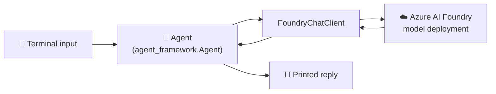
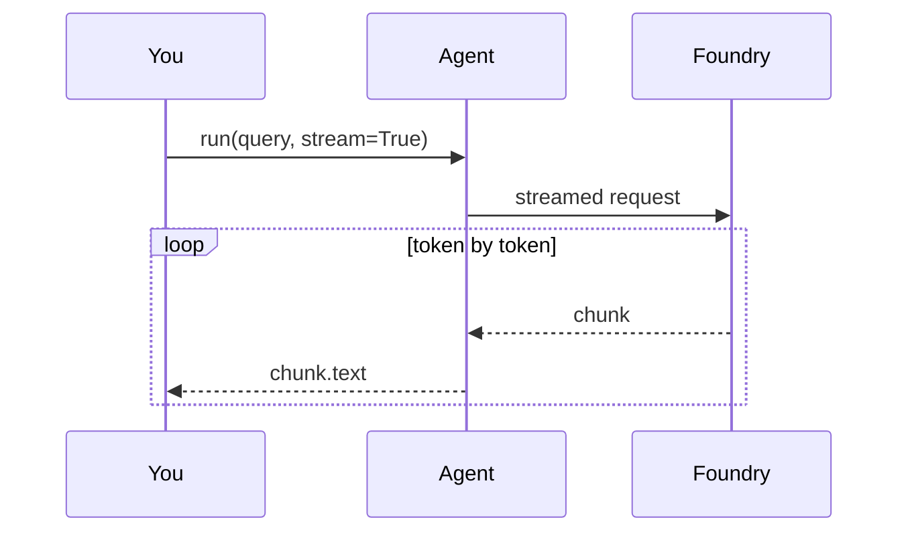

# 04 · 👋 Your First Agent

⬅️ [03 — Python Environment](./03-python-environment-setup.md) | ➡️ Next: [05 — Tools & Function Calling](./05-tools-and-function-calling.md)

---

## 🎯 Goal

Rebuild the original repo's `main.py` (a minimal OpenAI terminal chatbot) as `main.py` in this course — but powered by **Azure AI Foundry** through the **Microsoft Agent Framework**.



---

## 🧱 The two core building blocks

| Concept | What it does |
|---|---|
| `FoundryChatClient` | Connects to your Azure AI Foundry project + model deployment, handles auth |
| `Agent` | Wraps the client with a name, instructions, tools, and a `.run()` method |

---

## 💻 The code — `main.py`

```python
"""
main.py — Minimal terminal chatbot using Azure AI Foundry + Microsoft Agent Framework.
Equivalent to the original repo's main.py (which used the raw OpenAI Responses API).
"""

import asyncio
import os

from dotenv import load_dotenv
from azure.identity import AzureCliCredential
from agent_framework import Agent
from agent_framework.foundry import FoundryChatClient

load_dotenv()

client = FoundryChatClient(
    project_endpoint=os.environ["FOUNDRY_PROJECT_ENDPOINT"],
    model=os.environ["AZURE_AI_MODEL_DEPLOYMENT_NAME"],
    credential=AzureCliCredential(),
)

agent = Agent(
    client=client,
    name="HelloAgent",
    instructions="You are a friendly, concise assistant.",
)


async def main() -> None:
    print("🤖 HelloAgent ready. Type 'q' to quit.\n")
    while True:
        query = input("Ask Query: ")
        if query.strip().lower() == "q":
            print("👋 Goodbye!")
            break

        result = await agent.run(query)
        print(f"Agent: {result}\n")


if __name__ == "__main__":
    asyncio.run(main())
```

Run it:

```bash
uv run python main.py
```

```
🤖 HelloAgent ready. Type 'q' to quit.

Ask Query: What is agentic AI?
Agent: Agentic AI refers to AI systems that can plan, use tools, and take
multi-step actions toward a goal — not just answer a single question.

Ask Query: q
👋 Goodbye!
```

---

## 🔍 Line-by-line breakdown

| Line | What's happening |
|---|---|
| `load_dotenv()` | Loads `FOUNDRY_PROJECT_ENDPOINT` / `AZURE_AI_MODEL_DEPLOYMENT_NAME` from `.env`. Agent Framework does **not** auto-load `.env`, so this call is required. |
| `AzureCliCredential()` | Reuses your `az login` session — zero API keys in code. |
| `FoundryChatClient(...)` | The Azure-specific "transport" that knows how to call your Foundry deployment. |
| `Agent(client=..., instructions=...)` | The Azure-native equivalent of the original repo's `agentspan` agent object. |
| `await agent.run(query)` | Sends the message, runs the agent loop, returns the final text. |

---

## ⚡ Bonus: streaming responses

Users don't like waiting for a wall of text. Stream tokens as they're generated:

```python
print("Agent: ", end="", flush=True)
async for chunk in agent.run(query, stream=True):
    if chunk.text:
        print(chunk.text, end="", flush=True)
print()
```



---

## 🩹 Troubleshooting

| Symptom | Fix |
|---|---|
| `KeyError: 'FOUNDRY_PROJECT_ENDPOINT'` | `.env` not loaded or missing — re-run Lesson 3's `check_setup.py` |
| `CredentialUnavailableError` | Run `az login` again; your CLI session may have expired |
| Long delay then timeout | Check the deployment name matches the portal **exactly** (case-sensitive) |

---

## 📝 Recap

- Two objects — `FoundryChatClient` + `Agent` — replace the original repo's direct OpenAI calls.
- `agent.run(query)` is the async equivalent of a single chat turn.
- Streaming is a one-line change (`stream=True`) for a much better UX.

➡️ Next: **[05 — Tools & Function Calling](./05-tools-and-function-calling.md)**
