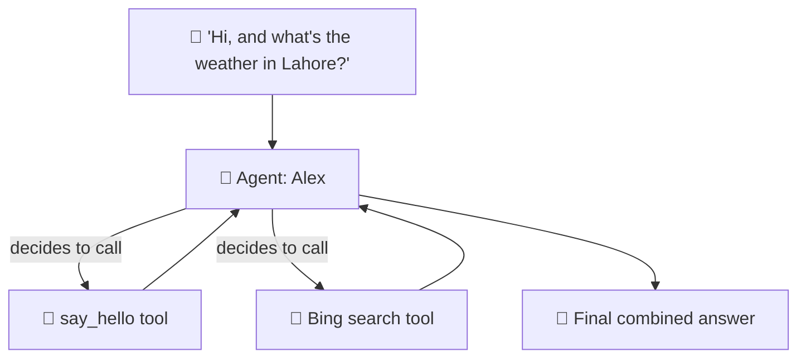
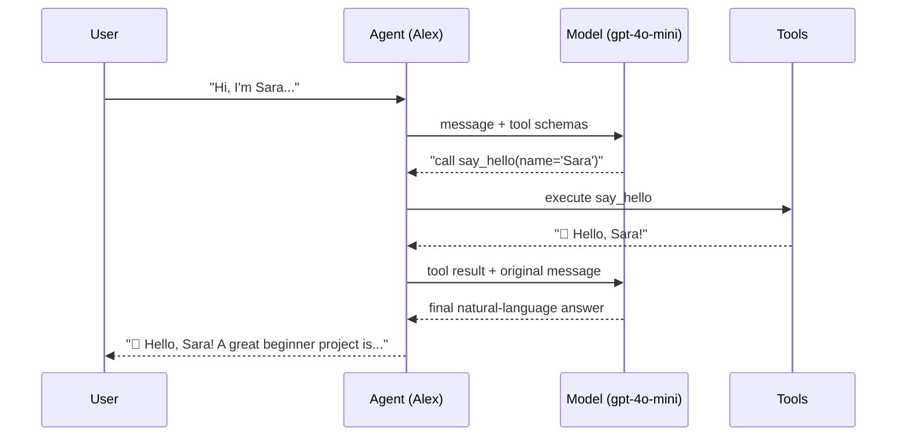

# 05 · 🛠️ Tools & Function Calling

⬅️ [04 — Your First Agent](./04-your-first-agent.md) | ➡️ Next: [06 — Memory & Conversation](./06-memory-and-conversation.md)

---

## 🎯 Goal

Rebuild the original repo's `chatbot_agent.py` — an agent named **Alex** with a custom greeting tool and live internet search (originally via Tavily) — using **Azure-native tools** and **Bing Grounding**.



---

## 🧠 What is "function calling"?

You describe a Python function to the model (name, parameters, docstring). The model **decides** — based on the user's message — whether to call it, and with what arguments. The Agent Framework runs the actual Python code and feeds the result back to the model.

> 💡 **Analogy:** You don't personally decide *when* your employee checks the weather app — they decide, based on what the customer asked. Function calling is you handing the employee an app and a clear description of when to use it.

---

## 🪛 Step 1 — Write a custom tool

Any typed, documented Python function can become a tool with the `@tool` decorator (or equivalent registration, depending on SDK version):

```python
from agent_framework import tool

@tool
def say_hello(name: str) -> str:
    """Greet a user by name. Must be called once at the start of every conversation."""
    return f"👋 Hello, {name}! Great to meet you."
```

| Part | Why it matters |
|---|---|
| Type hints (`name: str`) | Tells the model what arguments to pass |
| Docstring | The model reads this to decide *when* to call the tool |
| Return value | Fed back to the model as the tool's "observation" |

---

## 🌐 Step 2 — Add Bing Grounding (the Azure replacement for Tavily)

Azure AI Foundry has a **built-in Bing Grounding tool** — no third-party API key needed. You connect a Bing Search resource to your Foundry project once, then reference it by connection ID.

### One-time setup (Azure portal / Foundry portal)

1. In **ai.azure.com** → your project → **Connected resources** → **Add connection** → **Grounding with Bing Search**.
2. Create or select a Bing Search resource, complete the connection.
3. Copy the **connection ID** into `.env` as `BING_CONNECTION_ID`.

### Using it in code

```python
from agent_framework.foundry import FoundryChatClient

client = FoundryChatClient(
    project_endpoint=os.environ["FOUNDRY_PROJECT_ENDPOINT"],
    model=os.environ["AZURE_AI_MODEL_DEPLOYMENT_NAME"],
    credential=AzureCliCredential(),
)

bing_search_tool = client.bing_grounding_tool(
    connection_id=os.environ["BING_CONNECTION_ID"],
)
```

> 🔁 **No Bing connection yet?** Swap in any plain Python function tool instead — e.g. wrap the `requests` library around a free search API. The agent logic below works identically either way; only the tool's implementation changes.

```python
# Fallback: a simple custom search tool if you don't have Bing Grounding configured
import requests

@tool
def web_search(query: str) -> str:
    """Search the public web and return a short summary of results."""
    resp = requests.get("https://api.duckduckgo.com/", params={"q": query, "format": "json"})
    return resp.json().get("AbstractText") or "No summary found."
```

---

## 🤖 Step 3 — Full `chatbot_agent.py`

```python
"""
chatbot_agent.py — Agent "Alex" with a required greeting tool + web search.
Equivalent to the original repo's chatbot_agent.py (agentspan + Tavily).
"""

import asyncio
import os

from dotenv import load_dotenv
from azure.identity import AzureCliCredential
from agent_framework import Agent, tool
from agent_framework.foundry import FoundryChatClient

load_dotenv()


@tool
def say_hello(name: str) -> str:
    """Greet a user by name. Call this once, at the very start of the conversation."""
    return f"👋 Hello, {name}! Great to meet you."


client = FoundryChatClient(
    project_endpoint=os.environ["FOUNDRY_PROJECT_ENDPOINT"],
    model=os.environ["AZURE_AI_MODEL_DEPLOYMENT_NAME"],
    credential=AzureCliCredential(),
)

bing_search_tool = client.bing_grounding_tool(
    connection_id=os.environ.get("BING_CONNECTION_ID", ""),
)

agent = Agent(
    client=client,
    name="Alex",
    instructions=(
        "You are Alex, a warm and helpful assistant. "
        "Always greet the user by name using the say_hello tool at the start "
        "of a new conversation. Use web search for anything time-sensitive "
        "or that requires current information."
    ),
    tools=[say_hello, bing_search_tool],
)


async def main() -> None:
    print("🤖 Alex is online. Type 'q' to quit.\n")
    while True:
        query = input("Ask Query: ")
        if query.strip().lower() == "q":
            print("👋 Goodbye!")
            break
        result = await agent.run(query)
        print(f"Alex: {result}\n")


if __name__ == "__main__":
    asyncio.run(main())
```

```bash
uv run python chatbot_agent.py
```

```
🤖 Alex is online. Type 'q' to quit.

Ask Query: Hi, I'm Sara. What's a good agentic AI project for beginners?
Alex: 👋 Hello, Sara! A great beginner project is a simple customer-support
agent with order lookup and refund tools — exactly what Lesson 7 covers!
```

---

## 🧵 How the decision loop actually works



---

## 🧪 Try it yourself

Add a third tool: `get_current_time()` that returns the current UTC time, with **no arguments**. Update `instructions` to mention when Alex should use it. Notice how you never write the "if user asks for time" logic yourself — the model figures that out from the docstring.

---

## 📝 Recap

| Original repo | Azure rebuild |
|---|---|
| `agentspan` `@tool`-style greeting tool | `agent_framework.tool` decorator — same idea |
| Tavily internet search tool | Azure **Bing Grounding** (or a custom `requests`-based tool) |
| `openai/gpt-5.4` model string | Azure Foundry **model deployment name** |

➡️ Next: **[06 — Memory & Conversation](./06-memory-and-conversation.md)**
