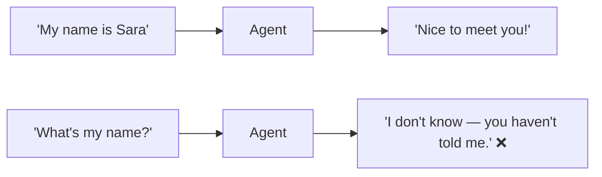
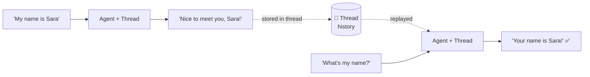
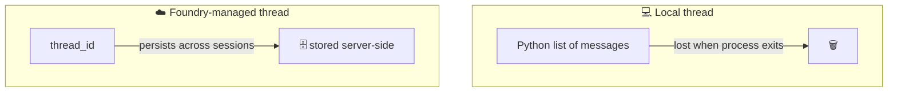

# 06 · 🧵 Memory & Conversation

⬅️ [05 — Tools & Function Calling](./05-tools-and-function-calling.md) | ➡️ Next: [07 — Guardrails, Structured Output & Human Approval](./07-guardrails-structured-output-approval.md)

---

## 🎯 Goal

Understand **why** Alex from Lesson 5 forgets everything between turns if you don't add memory — and fix it with Agent Framework's conversation **threads**.

---

## 🤯 The problem: stateless by default

Every call to `agent.run(query)` is, by default, a fresh request — the model has no idea what you said one line ago.



---

## 🧠 The fix: a `Thread` (conversation memory)

A **thread** is an object that accumulates the message history and is passed into every `run()` call.



```python
from agent_framework import Agent
# ... client / agent setup as in Lesson 4/5 ...

thread = agent.new_thread()   # creates empty conversation memory

result1 = await agent.run("My name is Sara.", thread=thread)
result2 = await agent.run("What's my name?", thread=thread)
print(result2)  # "Your name is Sara!"
```

> 📝 **Naming may vary slightly by SDK version** — some releases expose this as `agent.get_new_thread()` or a `ConversationThread` object you construct directly. If `new_thread()` isn't found, check `agent_framework`'s changelog; the *concept* (a stateful object you pass to every `run()` call) is stable even if the exact method name shifts.

---

## 🖥️ Two flavors of memory

| Type | Where it lives | Good for |
|---|---|---|
| **Local thread** | In your Python process (a list of messages) | Simple terminal apps, prototypes |
| **Foundry-managed thread** | Server-side, inside your Azure AI Foundry project | Production apps, multi-session users, audit/compliance |

For server-managed history, set `default_options={"store": True}` on the client (or leave the default — many Foundry configurations persist automatically) and reference the returned `thread_id` on subsequent calls instead of resending the whole history yourself.



---

## 🔁 Updating `chatbot_agent.py` with a persistent loop

```python
async def main() -> None:
    print("🤖 Alex is online. Type 'q' to quit.\n")
    thread = agent.new_thread()          # 👈 one thread for the whole session

    while True:
        query = input("Ask Query: ")
        if query.strip().lower() == "q":
            print("👋 Goodbye!")
            break
        result = await agent.run(query, thread=thread)   # 👈 pass it every time
        print(f"Alex: {result}\n")
```

Now Alex remembers your name, earlier questions, and context for the whole session — just like the original repo's `agentspan`-based memory, but backed by Azure.

---

## ⚖️ Memory design considerations

| Consideration | Guidance |
|---|---|
| **Context window limits** | Long threads eventually exceed the model's context — summarize or trim old turns for long-running agents |
| **Privacy** | Server-managed threads may retain data — check your organization's data retention policy in Foundry |
| **Multi-user apps** | One `thread` per **user/session**, never shared globally (Lesson 8's Streamlit app stores one thread per browser session) |
| **Cost** | Longer threads = more tokens sent per call = higher cost per turn |

---

## 🧪 Try it yourself

Modify `main()` to print `len(thread.messages)` (or the equivalent property in your SDK version) after every turn, so you can *see* memory growing turn by turn.

---

## 📝 Recap

- Agents are stateless by default — a **thread** object carries history across turns.
- Local threads live in your Python process; **Foundry-managed threads** persist server-side and scale to real users.
- Always scope one thread per user session in multi-user apps (critical for Lesson 8's Streamlit app).

➡️ Next: **[07 — Guardrails, Structured Output & Human Approval](./07-guardrails-structured-output-approval.md)**
