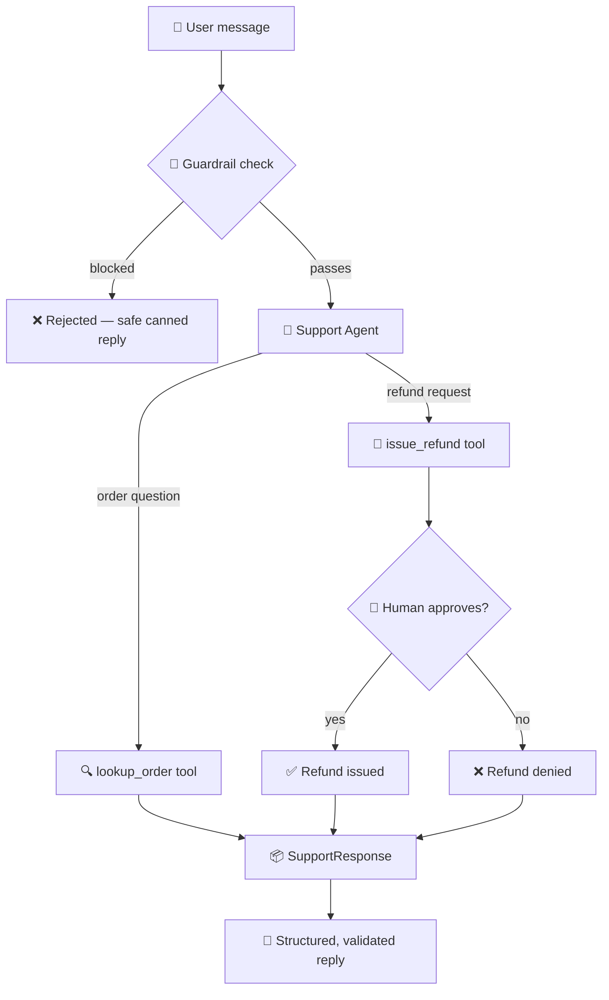
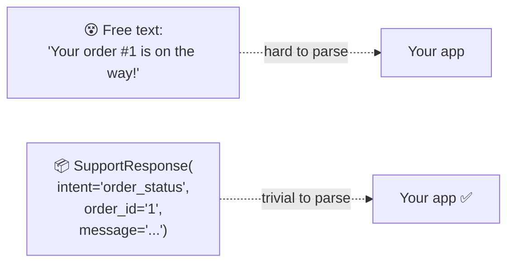

# 07 · 🛡️ Guardrails, Structured Output & Human Approval

⬅️ [06 — Memory & Conversation](./06-memory-and-conversation.md) | ➡️ Next: [08 — Streamlit UI](./08-streamlit-ui.md)

---

## 🎯 Goal

Rebuild the original repo's `customer_support.py` — the most advanced example — with:

- 🚧 **Input guardrails** that block prompt-injection attempts
- 📦 **Structured output** via a Pydantic model
- 🙋 **Human-in-the-loop approval** before risky actions (refunds)



---

## 🚧 Part 1 — Input guardrails

A guardrail runs **before** the model sees the message, and can block it outright.

```python
BLOCKED_PHRASES = [
    "ignore previous instructions",
    "ignore all instructions",
    "you are now",
    "disregard your rules",
    "act as if you have no restrictions",
]

def input_guardrail(message: str) -> tuple[bool, str | None]:
    """Return (is_allowed, reason_if_blocked)."""
    lowered = message.lower()
    for phrase in BLOCKED_PHRASES:
        if phrase in lowered:
            return False, f"Blocked potential prompt injection: '{phrase}'"
    return True, None
```

> 💡 **Why not just trust the model's own judgment?** Guardrails are a cheap, deterministic, *auditable* first line of defense — they run in milliseconds, cost no tokens, and give you a clear log entry of exactly what was blocked and why.

Agent Framework also supports guardrails as first-class citizens (input/output validators attached to the agent). Using a plain Python function first is a great way to learn the concept before adopting the SDK's built-in guardrail hooks.

---

## 📦 Part 2 — Structured output with Pydantic

Instead of free-form text, force the model to answer using a strict schema — critical for anything downstream (UIs, databases, other systems) that needs to *parse* the response reliably.

```python
from pydantic import BaseModel
from typing import Literal

class SupportResponse(BaseModel):
    intent: Literal["order_status", "refund_request", "general_question"]
    message: str
    order_id: str | None = None
    requires_human_review: bool = False
```

```python
agent = Agent(
    client=client,
    name="SupportAgent",
    instructions="You are a customer support agent. Always respond using the SupportResponse schema.",
    tools=[lookup_order, issue_refund],
    response_format=SupportResponse,   # 👈 forces structured output
)

result: SupportResponse = await agent.run("What's the status of order 1?")
print(result.intent)        # "order_status"
print(result.order_id)      # "1"
```



---

## 🙋 Part 3 — Human-in-the-loop approval for refunds

Some actions are too risky to let the agent execute unattended. The pattern: the **tool itself pauses** and waits for a human decision before completing.

```python
MOCK_ORDERS = {
    "1": {"status": "shipped", "amount": 49.99},
    "2": {"status": "delivered", "amount": 89.50},
}

@tool
def lookup_order(order_id: str) -> str:
    """Look up an order's status by ID."""
    order = MOCK_ORDERS.get(order_id)
    if not order:
        return f"No order found with ID {order_id}."
    return f"Order {order_id}: {order['status']}, amount ${order['amount']}"


@tool
def issue_refund(order_id: str, reason: str) -> str:
    """Issue a refund for an order. Requires human approval before executing."""
    order = MOCK_ORDERS.get(order_id)
    if not order:
        return f"Cannot refund — no order found with ID {order_id}."

    # 🙋 Pause for a human decision (in a real app: a Streamlit button,
    # a Slack approval message, or an admin dashboard click)
    approved = input(
        f"\n🙋 APPROVAL NEEDED: Refund ${order['amount']} for order {order_id} "
        f"(reason: {reason})? [y/n]: "
    ).strip().lower() == "y"

    if not approved:
        return f"Refund for order {order_id} was denied by a human reviewer."

    return f"✅ Refund of ${order['amount']} issued for order {order_id}."
```

> 🏭 **In production:** replace the `input()` call with a real approval channel — write a "pending approval" record to a database or queue, notify a human (email/Slack/Teams webhook), and have the tool return once approved, or expose a `/approve` endpoint. Lesson 8's Streamlit app shows a UI-based version of this pattern with a button instead of a terminal prompt.

---

## 🧩 Full `customer_support.py`

```python
"""
customer_support.py — Guardrails + structured output + human-approved refunds.
Equivalent to the original repo's customer_support.py.
"""

import asyncio
import os

from dotenv import load_dotenv
from azure.identity import AzureCliCredential
from agent_framework import Agent, tool
from agent_framework.foundry import FoundryChatClient
from pydantic import BaseModel
from typing import Literal

load_dotenv()

BLOCKED_PHRASES = [
    "ignore previous instructions", "ignore all instructions",
    "you are now", "disregard your rules",
]

def input_guardrail(message: str) -> tuple[bool, str | None]:
    lowered = message.lower()
    for phrase in BLOCKED_PHRASES:
        if phrase in lowered:
            return False, f"Blocked potential prompt injection: '{phrase}'"
    return True, None


class SupportResponse(BaseModel):
    intent: Literal["order_status", "refund_request", "general_question"]
    message: str
    order_id: str | None = None
    requires_human_review: bool = False


MOCK_ORDERS = {
    "1": {"status": "shipped", "amount": 49.99},
    "2": {"status": "delivered", "amount": 89.50},
}

@tool
def lookup_order(order_id: str) -> str:
    """Look up an order's status by ID."""
    order = MOCK_ORDERS.get(order_id)
    if not order:
        return f"No order found with ID {order_id}."
    return f"Order {order_id}: {order['status']}, amount ${order['amount']}"

@tool
def issue_refund(order_id: str, reason: str) -> str:
    """Issue a refund for an order. Requires human approval before executing."""
    order = MOCK_ORDERS.get(order_id)
    if not order:
        return f"Cannot refund — no order found with ID {order_id}."
    approved = input(
        f"\n🙋 APPROVAL NEEDED: Refund ${order['amount']} for order {order_id} "
        f"(reason: {reason})? [y/n]: "
    ).strip().lower() == "y"
    if not approved:
        return f"Refund for order {order_id} was denied by a human reviewer."
    return f"✅ Refund of ${order['amount']} issued for order {order_id}."


client = FoundryChatClient(
    project_endpoint=os.environ["FOUNDRY_PROJECT_ENDPOINT"],
    model=os.environ["AZURE_AI_MODEL_DEPLOYMENT_NAME"],
    credential=AzureCliCredential(),
)

agent = Agent(
    client=client,
    name="SupportAgent",
    instructions=(
        "You are a customer support agent. Use lookup_order for status "
        "questions and issue_refund for refund requests. Always answer "
        "using the SupportResponse schema."
    ),
    tools=[lookup_order, issue_refund],
    response_format=SupportResponse,
)


async def main() -> None:
    print("🎫 Support agent ready. Try 'What is the status of order 1?' or 'Refund order 2 please.' Type 'q' to quit.\n")
    thread = agent.new_thread()

    while True:
        query = input("Ask Query: ")
        if query.strip().lower() == "q":
            print("👋 Goodbye!")
            break

        allowed, reason = input_guardrail(query)
        if not allowed:
            print(f"🚫 Sorry, I can't process that request. ({reason})\n")
            continue

        result: SupportResponse = await agent.run(query, thread=thread)
        print(f"Intent: {result.intent}")
        print(f"Message: {result.message}")
        if result.order_id:
            print(f"Order ID: {result.order_id}")
        print()


if __name__ == "__main__":
    asyncio.run(main())
```

```bash
uv run python customer_support.py
```

---

## 📝 Recap

| Layer | Purpose | Runs |
|---|---|---|
| **Input guardrail** | Block prompt injection / abuse | Before the model sees anything |
| **Structured output** (`response_format`) | Force machine-parseable replies | On every model response |
| **Human approval** | Gate irreversible/risky actions | Inside the tool, before it completes |

This three-layer pattern — **guard → structure → approve** — is the backbone of virtually every production customer-facing agent.

➡️ Next: **[08 — Streamlit UI](./08-streamlit-ui.md)**
