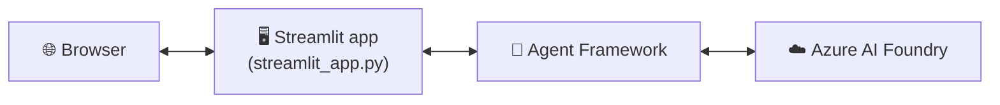
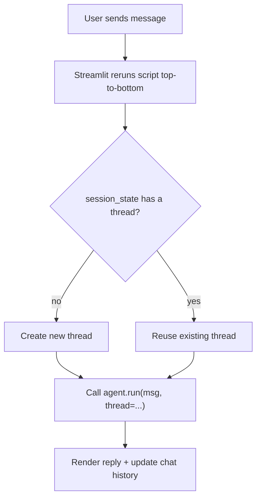
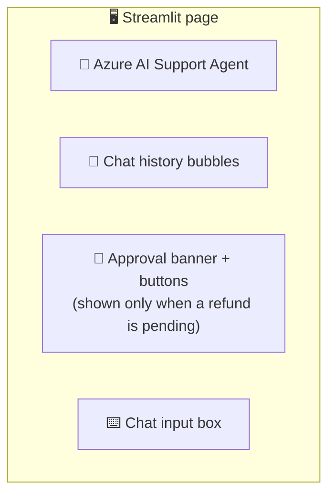

# 08 · 🖥️ Streamlit UI

⬅️ [07 — Guardrails & Structured Output](./07-guardrails-structured-output-approval.md) | ➡️ Next: [09 — Multi-Agent Workflows](./09-multi-agent-workflows.md)

---

## 🎯 Goal

Turn the terminal-only agents from Lessons 4–7 into a **shareable web app** using [Streamlit](https://streamlit.io) — including a real button-based human-approval flow instead of a blocking `input()` call.



---

## 📦 Step 1 — Install Streamlit

Already added in Lesson 3's `pyproject.toml`. If you skipped it:

```bash
uv add streamlit
```

---

## 🧠 Step 2 — Why terminal code doesn't drop straight into Streamlit

Streamlit **reruns your entire script on every interaction** (every click, every text input). Two things need to change:

| Terminal pattern | Streamlit pattern |
|---|---|
| `while True: input(...)` loop | `st.chat_input()` — one message per rerun |
| Local Python variable holds thread | `st.session_state` holds the thread (survives reruns) |
| `input(...)` blocks for human approval | A `st.button()` renders and waits for a click across reruns |



---

## 💻 `streamlit_app.py`

```python
"""
streamlit_app.py — Web UI for the Azure AI Foundry support agent (Lesson 7),
with a real human-approval button instead of a blocking input() call.
"""

import asyncio
import os

import streamlit as st
from dotenv import load_dotenv
from azure.identity import AzureCliCredential
from agent_framework import Agent, tool
from agent_framework.foundry import FoundryChatClient
from pydantic import BaseModel
from typing import Literal

load_dotenv()

st.set_page_config(page_title="🎫 Azure Support Agent", page_icon="🤖")
st.title("🎫 Azure AI Support Agent")
st.caption("Powered by Azure AI Foundry + Microsoft Agent Framework")


# ── Data + tools ────────────────────────────────────────────────
MOCK_ORDERS = {
    "1": {"status": "shipped", "amount": 49.99},
    "2": {"status": "delivered", "amount": 89.50},
}

class SupportResponse(BaseModel):
    intent: Literal["order_status", "refund_request", "general_question"]
    message: str
    order_id: str | None = None

@tool
def lookup_order(order_id: str) -> str:
    """Look up an order's status by ID."""
    order = MOCK_ORDERS.get(order_id)
    if not order:
        return f"No order found with ID {order_id}."
    return f"Order {order_id}: {order['status']}, amount ${order['amount']}"

@tool
def issue_refund(order_id: str, reason: str) -> str:
    """Issue a refund. Human must approve via the UI before this completes."""
    order = MOCK_ORDERS.get(order_id)
    if not order:
        return f"Cannot refund — no order found with ID {order_id}."
    # Instead of blocking on input(), flag it for UI approval and
    # return a pending status the agent can relay to the user.
    st.session_state.pending_refund = {"order_id": order_id, "reason": reason,
                                        "amount": order["amount"]}
    return f"Refund of ${order['amount']} for order {order_id} is pending human approval."


# ── Agent (cached across reruns) ────────────────────────────────
@st.cache_resource
def get_agent() -> Agent:
    client = FoundryChatClient(
        project_endpoint=os.environ["FOUNDRY_PROJECT_ENDPOINT"],
        model=os.environ["AZURE_AI_MODEL_DEPLOYMENT_NAME"],
        credential=AzureCliCredential(),
    )
    return Agent(
        client=client,
        name="SupportAgent",
        instructions="You are a customer support agent. Use lookup_order and issue_refund as needed.",
        tools=[lookup_order, issue_refund],
        response_format=SupportResponse,
    )

agent = get_agent()

# ── Session state: one thread + history per browser session ────
if "thread" not in st.session_state:
    st.session_state.thread = agent.new_thread()
if "history" not in st.session_state:
    st.session_state.history = []
if "pending_refund" not in st.session_state:
    st.session_state.pending_refund = None


# ── Render chat history ─────────────────────────────────────────
for turn in st.session_state.history:
    with st.chat_message(turn["role"]):
        st.write(turn["content"])

# ── Pending human approval banner ───────────────────────────────
if st.session_state.pending_refund:
    r = st.session_state.pending_refund
    st.warning(f"🙋 Approval needed: refund **${r['amount']}** for order **{r['order_id']}** "
               f"(reason: {r['reason']})")
    col1, col2 = st.columns(2)
    if col1.button("✅ Approve refund"):
        st.session_state.history.append(
            {"role": "assistant", "content": f"✅ Refund of ${r['amount']} approved and issued."})
        st.session_state.pending_refund = None
        st.rerun()
    if col2.button("❌ Deny refund"):
        st.session_state.history.append(
            {"role": "assistant", "content": "❌ Refund request denied by reviewer."})
        st.session_state.pending_refund = None
        st.rerun()

# ── Chat input ───────────────────────────────────────────────────
if prompt := st.chat_input("Ask about an order, e.g. 'Refund order 2 please.'"):
    st.session_state.history.append({"role": "user", "content": prompt})
    with st.chat_message("user"):
        st.write(prompt)

    with st.chat_message("assistant"):
        with st.spinner("Thinking..."):
            result: SupportResponse = asyncio.run(
                agent.run(prompt, thread=st.session_state.thread)
            )
        st.write(result.message)
        st.session_state.history.append({"role": "assistant", "content": result.message})

    st.rerun()
```

Run it:

```bash
uv run streamlit run streamlit_app.py
```

Your browser opens at `http://localhost:8501` 🎉

---

## 🖼️ What the UI looks like conceptually



---

## 🧩 Key Streamlit concepts used

| Concept | Purpose |
|---|---|
| `st.session_state` | Survives reruns — holds the thread, chat history, pending approvals |
| `@st.cache_resource` | Creates the `Agent`/client **once**, not on every rerun (expensive to rebuild) |
| `st.chat_message` / `st.chat_input` | Built-in chat UI primitives |
| `st.rerun()` | Forces Streamlit to redraw immediately after state changes (e.g. after approval) |
| `asyncio.run(...)` | Bridges Agent Framework's async `agent.run()` into Streamlit's sync execution model |

---

## 🎨 Optional polish

- Add `st.sidebar` with a "🔄 New conversation" button that resets `st.session_state.thread`.
- Show `result.intent` as a colored `st.badge`-style label.
- Add `st.image` for a bot avatar, or `st.toast("✅ Refund issued!")` for confirmations.

---

## 📝 Recap

- Streamlit reruns top-to-bottom on every interaction — `st.session_state` is how state (thread, history, pending approvals) survives.
- The blocking `input()` from Lesson 7 becomes a **button + banner** pattern for human approval.
- `@st.cache_resource` avoids reconnecting to Azure AI Foundry on every keystroke.

➡️ Next: **[09 — Multi-Agent Workflows](./09-multi-agent-workflows.md)**
