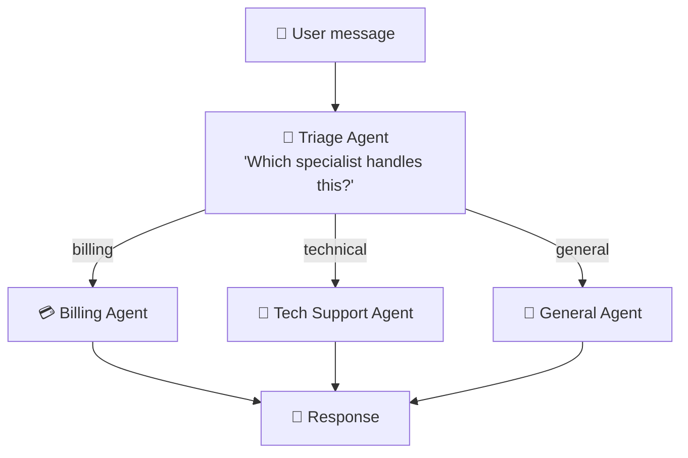
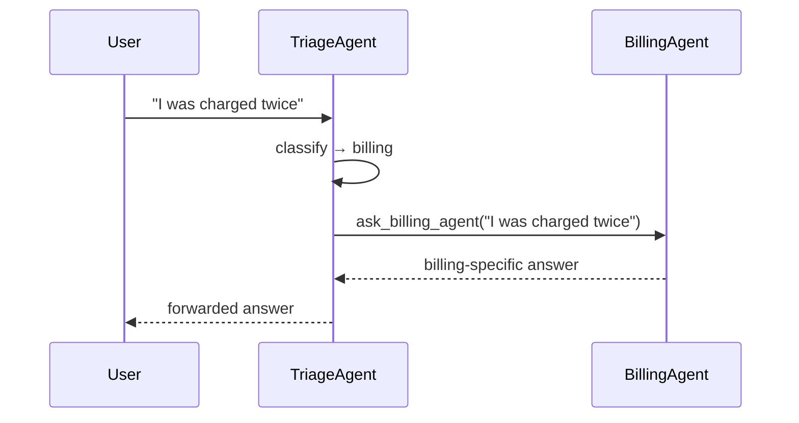
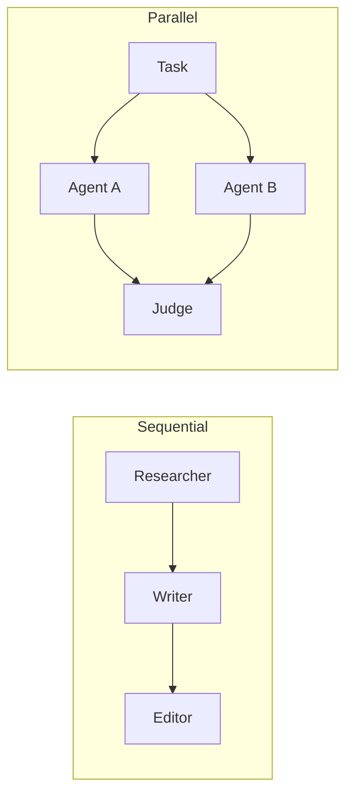

# 09 · 🕸️ Multi-Agent Workflows

⬅️ [08 — Streamlit UI](./08-streamlit-ui.md) | ➡️ Next: [10 — Deploy to Azure](./10-deploy-to-azure.md)

---

## 🎯 Goal

Go beyond a single agent. Build a **triage agent** that routes conversations to specialist agents — the pattern behind most real-world multi-agent products (support bots that hand off billing vs. technical issues, research assistants that delegate to a "search agent" and a "writer agent", etc.).

---

## 🤔 Why split into multiple agents?

| One giant agent | Multiple specialized agents |
|---|---|
| One huge instructions prompt trying to cover every case | Each agent has a short, focused prompt — easier to tune and test |
| Hard to reason about which tools apply when | Each agent only has the tools relevant to its job |
| One failure mode affects everything | Failures are isolated per specialist |
| Hard to scale a team working on it | Different people/teams can own different agents |

> 💡 **Analogy:** A single overworked generalist employee vs. a small team with a receptionist (triage) who routes you to billing, tech support, or sales.

---

## 🏗️ The triage pattern



---

## 💻 Building it with Agent Framework

Microsoft Agent Framework supports handoffs by letting one agent's tool be **"call another agent."**

```python
"""
multi_agent.py — Triage agent handing off to specialist agents.
"""

import asyncio
import os

from dotenv import load_dotenv
from azure.identity import AzureCliCredential
from agent_framework import Agent, tool
from agent_framework.foundry import FoundryChatClient

load_dotenv()

client = FoundryChatClient(
    project_endpoint=os.environ["FOUNDRY_PROJECT_ENDPOINT"],
    model=os.environ["AZURE_AI_MODEL_DEPLOYMENT_NAME"],
    credential=AzureCliCredential(),
)

# ── Specialist agents ────────────────────────────────────────────
billing_agent = Agent(
    client=client,
    name="BillingAgent",
    instructions="You handle billing questions: invoices, payments, refunds. Be precise about amounts.",
)

tech_agent = Agent(
    client=client,
    name="TechSupportAgent",
    instructions="You handle technical issues: bugs, errors, how-to questions. Ask for error messages if missing.",
)

general_agent = Agent(
    client=client,
    name="GeneralAgent",
    instructions="You handle general questions that aren't billing or technical.",
)


# ── Specialists exposed as tools for the triage agent ───────────
@tool
async def ask_billing_agent(question: str) -> str:
    """Route a billing-related question to the billing specialist."""
    return str(await billing_agent.run(question))

@tool
async def ask_tech_agent(question: str) -> str:
    """Route a technical support question to the tech specialist."""
    return str(await tech_agent.run(question))

@tool
async def ask_general_agent(question: str) -> str:
    """Route a general question to the general-purpose specialist."""
    return str(await general_agent.run(question))


triage_agent = Agent(
    client=client,
    name="TriageAgent",
    instructions=(
        "You are a triage agent. For every user message, decide whether it is "
        "a billing, technical, or general question, and delegate by calling "
        "exactly one of: ask_billing_agent, ask_tech_agent, ask_general_agent. "
        "Return the specialist's answer to the user, unedited."
    ),
    tools=[ask_billing_agent, ask_tech_agent, ask_general_agent],
)


async def main() -> None:
    print("🧭 Triage agent ready. Type 'q' to quit.\n")
    thread = triage_agent.new_thread()
    while True:
        query = input("Ask Query: ")
        if query.strip().lower() == "q":
            break
        result = await triage_agent.run(query, thread=thread)
        print(f"Agent: {result}\n")


if __name__ == "__main__":
    asyncio.run(main())
```

```
Ask Query: I was charged twice for my subscription
Agent: [BillingAgent] I'm sorry about that — duplicate charges usually happen
when a payment retries after a temporary failure. I can help you request a
refund for the duplicate charge...

Ask Query: My app crashes when I click save
Agent: [TechSupportAgent] Could you share the exact error message you're
seeing when the app crashes? That'll help me pinpoint the cause...
```

---

## 🧭 Sequence view



---

## 🔀 Other orchestration patterns worth knowing

| Pattern | When to use |
|---|---|
| **Sequential pipeline** | Agent A's output feeds Agent B feeds Agent C (e.g. researcher → writer → editor) |
| **Parallel fan-out** | Multiple agents work the same problem simultaneously, then a judge agent picks the best answer |
| **Supervisor / worker** | A supervisor agent plans and assigns subtasks to worker agents, then aggregates results |
| **Group chat** | Several agents converse with each other and the user in a shared thread until consensus |



Agent Framework's **workflow** module (graph-based orchestration) supports all of these more explicitly than the manual "agent-as-tool" pattern shown above — worth exploring once you're comfortable with the basics here.

---

## 🧪 Try it yourself

Add a fourth specialist, `SalesAgent`, and update `TriageAgent`'s instructions to route pricing/purchasing questions to it. Notice you don't need to touch `BillingAgent` or `TechSupportAgent` at all — that's the whole point of specialization.

---

## 📝 Recap

- Multi-agent systems break one hard prompt into several focused ones.
- The simplest handoff pattern: wrap a specialist agent's `.run()` in a `@tool` the triage agent can call.
- More advanced patterns (sequential, parallel, supervisor, group chat) are available via Agent Framework's workflow orchestration for complex production systems.

➡️ Next: **[10 — Deploy to Azure](./10-deploy-to-azure.md)**
