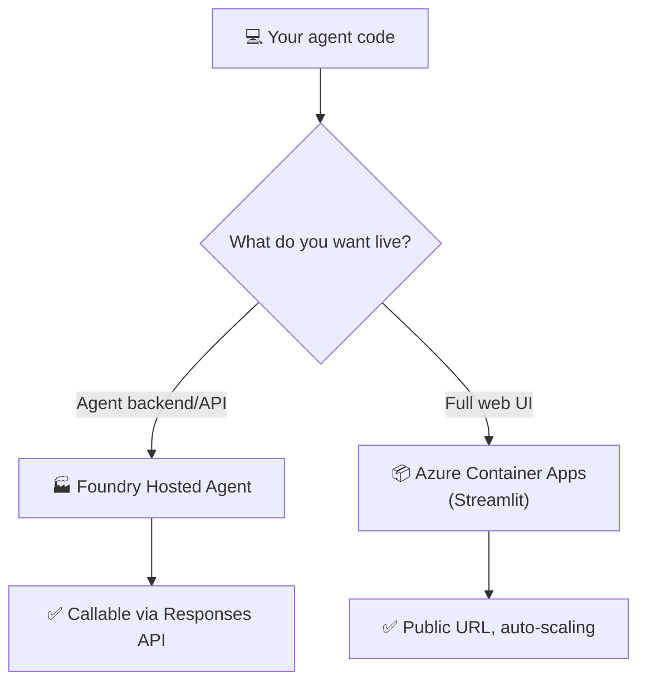
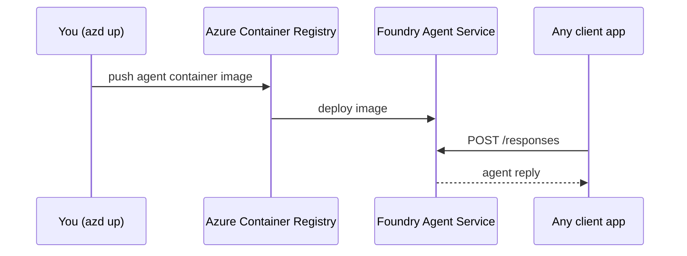
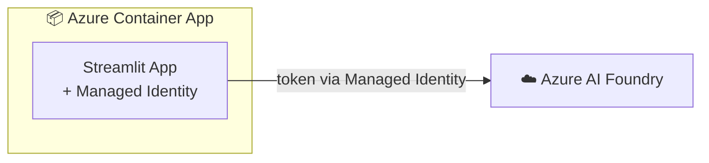

# 10 · 🚀 Deploy to Azure

⬅️ [09 — Multi-Agent Workflows](./09-multi-agent-workflows.md) | ➡️ Next: [11 — Next Steps & Resources](./11-next-steps-resources.md)

---

## 🎯 Goal

Ship what you built — either as a **hosted agent** inside Azure AI Foundry, or as a **Streamlit web app** on Azure Container Apps.



---

## 🏭 Option A — Foundry Hosted Agents (agent as a managed backend)

Azure AI Foundry can package, containerize, and host your `Agent` for you, exposing it over the standard **Responses API** protocol — ideal when other apps (or the Streamlit UI) will call it as a service.

### 1. Wrap your agent with a host server

```python
"""
hosted_agent.py — Wraps SupportAgent for Foundry hosting.
"""

import os
from agent_framework import Agent
from agent_framework.foundry import FoundryChatClient
from agent_framework_foundry_hosting import ResponsesHostServer
from azure.identity import DefaultAzureCredential

client = FoundryChatClient(
    project_endpoint=os.environ["FOUNDRY_PROJECT_ENDPOINT"],
    model=os.environ["AZURE_AI_MODEL_DEPLOYMENT_NAME"],
    credential=DefaultAzureCredential(),   # 👈 Managed Identity in production
)

agent = Agent(
    client=client,
    instructions="You are a helpful AI assistant.",
    default_options={"store": False},      # hosting manages history for you
)

server = ResponsesHostServer(agent)
server.run()
```

### 2. Scaffold + deploy with `azd`

```bash
# One-time: install the Azure Developer CLI + Foundry extension
azd extension install microsoft.foundry

# Scaffold a hosted-agent project from a manifest
azd ai agent init -m ./agent.manifest.yaml

# Run locally to test (serves on http://localhost:8088)
azd ai agent run

# Deploy for real — builds a container, pushes to Azure Container Registry,
# and deploys to Foundry Agent Service
azd up
```

### 3. Call your hosted agent

```bash
curl -X POST https://<your-hosted-agent-url>/responses \
  -H "Content-Type: application/json" \
  -d '{"input": "What is the status of order 1?"}'
```



---

## 🌐 Option B — Streamlit app on Azure Container Apps

If you built the Lesson 8 UI, this is the fastest path to a public URL.

### 1. Add a `Dockerfile`

```dockerfile
FROM python:3.11-slim

WORKDIR /app
COPY pyproject.toml uv.lock ./
RUN pip install uv && uv sync --frozen --no-dev

COPY . .

EXPOSE 8501
CMD ["uv", "run", "streamlit", "run", "streamlit_app.py", \
     "--server.port=8501", "--server.address=0.0.0.0"]
```

### 2. Deploy with Azure CLI

```bash
# Create resources
az group create --name agentic-ai-rg --location eastus
az acr create --resource-group agentic-ai-rg --name agenticaiacr --sku Basic

# Build & push the image
az acr build --registry agenticaiacr --image agentic-support-app:v1 .

# Create the Container App environment + app
az containerapp env create \
  --name agentic-ai-env --resource-group agentic-ai-rg --location eastus

az containerapp create \
  --name agentic-support-app \
  --resource-group agentic-ai-rg \
  --environment agentic-ai-env \
  --image agenticaiacr.azurecr.io/agentic-support-app:v1 \
  --target-port 8501 --ingress external \
  --system-assigned \
  --env-vars FOUNDRY_PROJECT_ENDPOINT=<endpoint> AZURE_AI_MODEL_DEPLOYMENT_NAME=<deployment>
```

### 3. Grant the app's Managed Identity access

```bash
az role assignment create \
  --assignee <container-app-principal-id> \
  --role "Azure AI User" \
  --scope <your-foundry-project-resource-id>
```

Because you used `DefaultAzureCredential()` throughout the course, the deployed app **automatically** picks up its Managed Identity — no secrets to rotate, ever.



---

## ✅ Pre-launch checklist

- [ ] `.env` values moved to Container App **environment variables** or **Key Vault references** (never baked into the image)
- [ ] Using `DefaultAzureCredential()` / Managed Identity, not `AzureCliCredential()`, in production code
- [ ] Content filters reviewed in the Foundry portal
- [ ] Rate limiting / quota checked for your model deployment
- [ ] Logging/tracing enabled (Foundry portal → **Tracing**) so you can debug live agent runs
- [ ] Human-approval flow (Lesson 7/8) tested end-to-end in the deployed environment

---

## 📝 Recap

| Deployment target | Best for |
|---|---|
| **Foundry Hosted Agent** | Agent as a callable backend/API for other systems |
| **Azure Container Apps** | Full Streamlit web app with a public URL |

Both paths reuse the exact same `Agent` code from Lessons 4–9 — you're only changing *how it's exposed*, not *how it's built*.

➡️ Next: **[11 — Next Steps & Resources](./11-next-steps-resources.md)**
