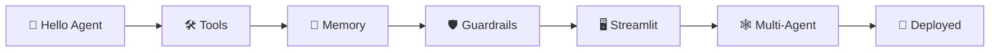
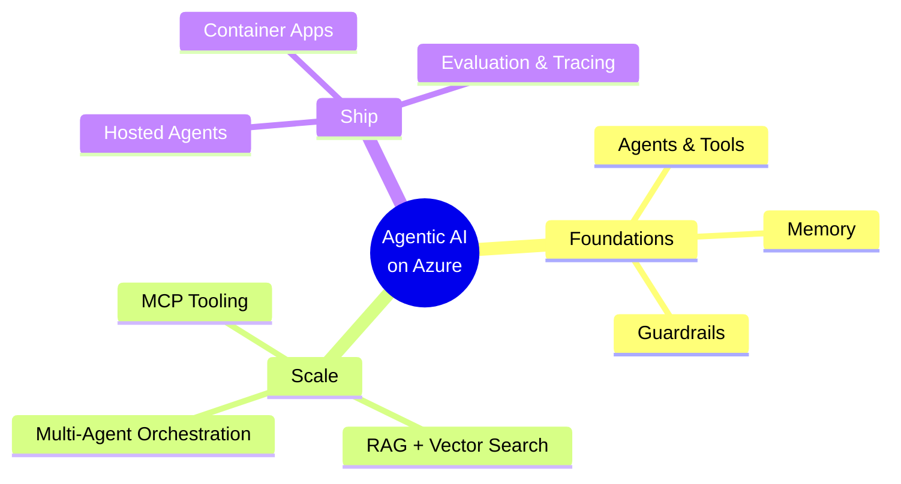

# 11 · 🎓 Next Steps & Resources

⬅️ [10 — Deploy to Azure](./10-deploy-to-azure.md) | 🏠 [Back to index](./00-README.md)

---

## 🏆 Congratulations!

You went from a blank terminal to a **deployed, tool-using, memory-aware, guardrailed, multi-agent system** running on Azure. That's the full production loop most companies use for real agentic products.

---

## 📋 Course recap

| # | Lesson | Core skill |
|---|---|---|
| 01 | Introduction to Agentic AI | Mental model: model + instructions + tools + memory |
| 02 | Azure AI Foundry Setup | Project, model deployment, keyless auth |
| 03 | Python Environment Setup | `uv`, `pyproject.toml`, `.env` hygiene |
| 04 | Your First Agent | `FoundryChatClient` + `Agent` |
| 05 | Tools & Function Calling | Custom tools, Bing Grounding |
| 06 | Memory & Conversation | Threads, local vs. Foundry-managed |
| 07 | Guardrails, Structured Output & Approval | Safety layers, Pydantic, human-in-the-loop |
| 08 | Streamlit UI | Session state, chat UI, approval buttons |
| 09 | Multi-Agent Workflows | Triage + specialist handoff pattern |
| 10 | Deploy to Azure | Hosted agents, Container Apps |

---

## 🧭 Where to go deeper

| Topic | Why it matters next |
|---|---|
| **RAG (Retrieval-Augmented Generation)** | Ground your agent in your own documents using Azure AI Search + embeddings |
| **Vector databases** | Store and query embeddings at scale (Azure AI Search, Cosmos DB for MongoDB vCore) |
| **MCP (Model Context Protocol)** | A standard way to expose tools to *any* agent framework, not just your own code |
| **Evaluation** | Foundry's built-in evaluation tools to measure agent quality, safety, and groundedness before shipping |
| **Observability** | Distributed tracing across multi-agent calls (Foundry Tracing / OpenTelemetry) |
| **Agent workflows (graph orchestration)** | Formal DAG-based orchestration for complex, branching multi-agent systems |

---

## 📚 Official documentation

- 🏭 **Azure AI Foundry** — [ai.azure.com](https://ai.azure.com) · [learn.microsoft.com/azure/ai-foundry](https://learn.microsoft.com/azure/ai-foundry/)
- 🤖 **Microsoft Agent Framework** — [github.com/microsoft/agent-framework](https://github.com/microsoft/agent-framework) · [learn.microsoft.com/agent-framework](https://learn.microsoft.com/en-us/agent-framework/)
- 🖥️ **Streamlit** — [docs.streamlit.io](https://docs.streamlit.io)
- 🔐 **Azure Identity SDK** — [learn.microsoft.com/python/api/overview/azure/identity-readme](https://learn.microsoft.com/python/api/overview/azure/identity-readme)
- 📦 **Pydantic** — [docs.pydantic.dev](https://docs.pydantic.dev)

---

## 💡 Project ideas to practice with

1. 📄 **Document Q&A agent** — add RAG over your own PDFs using Azure AI Search.
2. 📅 **Scheduling agent** — connect a calendar API tool with human-approved booking.
3. 🧾 **Expense-report triage** — multi-agent system: classify → validate → approve/reject.
4. 🛒 **Shopping assistant** — Bing Grounding for product research + a cart tool with checkout approval.
5. 🐛 **Bug-triage bot** — connects to a real issue tracker via a custom tool, routes by severity.

---

## 🙏 Credits

This course reimagines the structure and spirit of the community project **[`AIwithhassan/agentic-ai-crash-course`](https://github.com/AIwithhassan/agentic-ai-crash-course)**, rebuilding every example on Microsoft's Azure AI Foundry + Agent Framework stack, and extending it with a Streamlit UI, multi-agent orchestration, and Azure deployment. It is an independent educational adaptation and is not affiliated with or endorsed by the original repository's author.

---

🏠 **[Back to course index](./00-README.md)**
