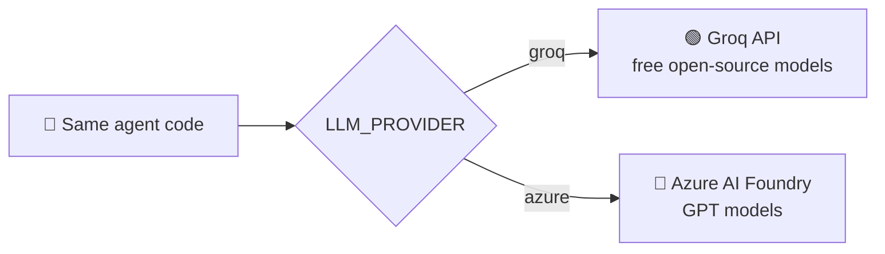
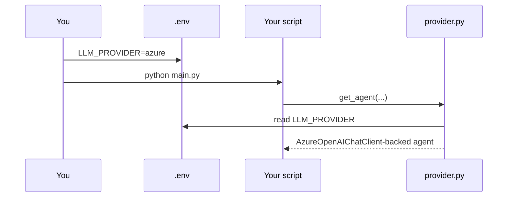

# 🤖 Agentic AI Crash Course — Runnable Project

**Test free with Groq (open-source models). Ship with Azure AI (GPT models).**
Companion code for the [Agentic AI Crash Course — Azure Edition](../) lessons.

This is a small, real project you can `git clone` and run — same layout as the
original [`agentic-ai-crash-course`](https://github.com/AIwithhassan/agentic-ai-crash-course)
repo, but every script works with **two swappable backends**:

| Provider | Cost | Best for |
|---|---|---|
| 🟢 **Groq** | Free tier, no Azure account needed | Learning, quick testing, first run |
| 🔵 **Azure AI** | Pay-as-you-go | Production, enterprise auth, governance |

Switching backends is **one line in `.env`** — no code changes.



---

## 📁 What's in this folder

| File | Lesson | Purpose |
|---|---|---|
| `provider.py` | — | 🔀 The switcher: builds a Groq or Azure client based on `.env` |
| `main.py` | 04 | Minimal terminal chatbot |
| `chatbot_agent.py` | 05–06 | Agent "Alex" with tools + multi-turn memory |
| `customer_support.py` | 07 | Guardrails + structured output + human-approved refunds |
| `streamlit_app.py` | 08 | Web UI with a real approval-button flow |
| `multi_agent.py` | 09 | Triage agent handing off to specialist agents |

---

## 🚀 Quick start (free path — 2 minutes, no Azure account)

### 1. Install dependencies

```bash
# with uv (recommended)
uv sync

# or with pip
python -m venv .venv && source .venv/bin/activate   # Windows: .venv\Scripts\activate
pip install -r requirements.txt
```

### 2. Get a free Groq API key

Sign up at **[console.groq.com/keys](https://console.groq.com/keys)** (free, no credit card) and copy your key.

### 3. Configure `.env`

```bash
cp .env.example .env
```

Edit `.env`:

```env
LLM_PROVIDER=groq
GROQ_API_KEY=gsk_your_key_here
GROQ_MODEL=llama-3.3-70b-versatile
```

### 4. Run any example

```bash
uv run python main.py
uv run python chatbot_agent.py
uv run python customer_support.py
uv run python multi_agent.py
uv run streamlit run streamlit_app.py
```

(Swap `uv run python` for `python` if you're using plain pip/venv.)

---

## ☁️ Switching to Azure AI (production path)

When you're ready to move off the free tier onto Azure:

1. Follow **[docs/02-azure-ai-foundry-setup.md](../02-azure-ai-foundry-setup.md)** to create a Foundry/Azure OpenAI resource and deploy a model (e.g. `gpt-4o-mini`).
2. Run `az login` once (keyless auth — no secrets in code).
3. Update `.env`:

```env
LLM_PROVIDER=azure
AZURE_OPENAI_ENDPOINT=https://your-resource.openai.azure.com
AZURE_OPENAI_DEPLOYMENT_NAME=gpt-4o-mini
AZURE_AUTH=cli
```

4. Re-run the exact same commands from Quick Start — **zero code changes**.



> 🖥️ **No Azure account yet?** Everything in this project runs fully on the free Groq path first — swap to Azure only when you want production-grade auth, governance, and hosting.

---

## 🧠 How `provider.py` works (read this once)

```python
from provider import get_agent

agent = get_agent(
    name="HelloAgent",
    instructions="You are a friendly assistant.",
    tools=[my_tool],          # optional
)
```

Under the hood, `get_agent()`:

1. Reads `LLM_PROVIDER` from `.env`.
2. If `groq` → builds `agent_framework.openai.OpenAIChatClient` pointed at Groq's OpenAI-compatible endpoint (`https://api.groq.com/openai/v1`).
3. If `azure` → builds `agent_framework.azure.AzureOpenAIChatClient` using either `az login` (default) or an API key.
4. Wraps either client with `.as_agent(...)`, so every lesson script is 100% identical regardless of provider.

Every lesson script imports **only** `provider`, never the Groq/Azure clients directly — that's what makes the switch a one-line `.env` change.

---

## 🩹 Troubleshooting

| Symptom | Fix |
|---|---|
| `EnvironmentError: GROQ_API_KEY is not set` | Add your free key to `.env` — see Quick Start step 2 |
| `EnvironmentError: AZURE_OPENAI_ENDPOINT ... must be set` | You switched `LLM_PROVIDER=azure` without filling in the Azure block in `.env` |
| `CredentialUnavailableError` (Azure path) | Run `az login` again — your CLI session expired |
| `model_decommissioned` (Groq path) | Check [console.groq.com/docs/models](https://console.groq.com/docs/models) for the current model list and update `GROQ_MODEL` |
| `ModuleNotFoundError: agent_framework` | Run `uv sync` (or `pip install -r requirements.txt`) again |

---

## 🔄 SDK version note

`agent-framework` is actively developed and method names occasionally shift
between releases (e.g. `agent.get_new_thread()` may become `agent.new_thread()`
in a future version). If a script errors on a method name, check
[github.com/microsoft/agent-framework](https://github.com/microsoft/agent-framework)
for the current API — the *pattern* (client → `.as_agent()` → `.run()` /
thread object) is stable even as exact names evolve.

---

## 📚 Full course

This project is the companion code for the full lesson-by-lesson course.
Start at **[00-README.md](../00-README.md)** for the complete walkthrough,
diagrams, and explanations behind every file here.
