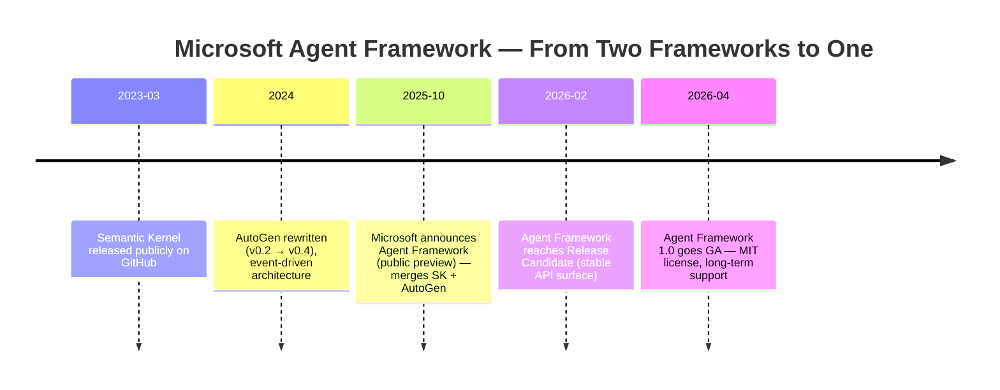
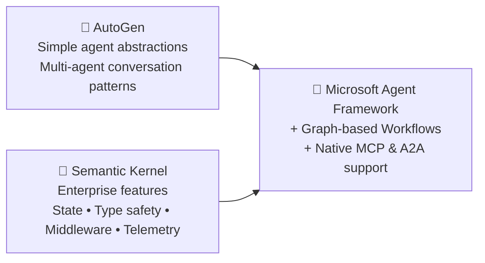

# 1️⃣ History & Why the Microsoft Agent Framework Exists

*(Read this first — everything else in this guide will make more sense once you know the story.)*

Imagine you're a kid with two different toy boxes. One box is full of LEGO bricks that snap together really well and are great for building sturdy houses (reliable, enterprise-grade). The other box is full of magnetic building tiles that are amazing for making creative shapes fast, and even *talk to each other* (flexible, research-y, conversational). For two years, Microsoft gave developers **two separate toy boxes** and said "pick one." This guide is about the day Microsoft **combined both boxes into one**.

## 🧵 The two parents: Semantic Kernel & AutoGen

To understand Microsoft Agent Framework (MAF), you need to meet its two "parents":

### 👴 Semantic Kernel (born March 17, 2023)
Semantic Kernel (SK) was Microsoft's enterprise-grade SDK for plugging LLMs into real business applications (.NET, Python, Java). Think of it as the **reliable, production-ready parent**: it gave developers plugins, memory, planners, and connectors so companies could safely put AI inside real software — the kind that powers products like Microsoft 365 Copilot. It was presented at Microsoft Build 2023 and quickly grew to a large community.

### 👶 AutoGen (Microsoft Research)
AutoGen came from Microsoft Research and took a very different approach: **agents that *talk to each other*** in conversational loops to solve problems together. It was brilliant for research and experimentation — multiple AI "characters" debating, critiquing, and collaborating — but it wasn't originally built with enterprise concerns (security, state management, observability) as the first priority. AutoGen had a major architecture rewrite (v0.2 → v0.4) in 2024, moving to an event-driven, async design.

Both projects were popular — together they had **over 75,000 GitHub stars** — but they solved overlapping problems from *opposite directions*:

| | Semantic Kernel | AutoGen |
|---|---|---|
| Mental model | LLM-powered **plugins/functions** calling functions | Agents having **conversations** with each other |
| Strength | Enterprise features: state, type safety, middleware, telemetry | Simple, expressive multi-agent patterns |
| Weakness | Less natural for multi-agent conversation | Less enterprise-hardened |

Teams building serious products on Azure often had to **choose one and live with its gaps**, or maintain two separate codebases. That's an annoying, expensive problem for real companies.

## 🎉 The Merger: Microsoft Agent Framework is announced

On **October 1, 2025**, Microsoft announced something new: the **Microsoft Agent Framework (MAF)** — a single, open-source framework that merges AutoGen's simple multi-agent abstractions with Semantic Kernel's enterprise-grade foundations (state management, type safety, middleware, telemetry), and adds a new capability neither predecessor had cleanly: **graph-based workflows** for explicit, structured multi-agent orchestration.

Microsoft has described the new framework as effectively **"Semantic Kernel v2.0 — built by the same team!"** — and committed to supporting Semantic Kernel v1.x for at least one year after MAF's general availability, so nobody's existing code breaks overnight.

## 📅 The Timeline

- **October 1, 2025** — Public preview announced. Published as `agent-framework` on PyPI (Python) and `Microsoft.Agents.AI` on NuGet (.NET). AutoGen enters **maintenance mode** (bug fixes only; new features now go into MAF).
- **February 19, 2026** — Release Candidate reached for both .NET and Python, with a stable API surface and all v1.0 features complete.
- **April 3, 2026** — **Version 1.0 goes GA (General Availability)** — stable APIs, MIT license, a long-term support commitment, and **native MCP (Model Context Protocol) and A2A (Agent-to-Agent) interoperability** baked in from day one.

> 💡 **Beginner tip:** "GA" (General Availability) just means "it's stable and ready for real production use" — not an experiment anymore.

## 🧠 What MAF actually *combines*

Think of it like this simple formula:

The framework cleanly separates two ideas that used to be tangled together:

1. **Agents** — stateful units that can reason, call tools, and respond (the "who").
2. **Workflows** — graph-based orchestration that connects multiple agents and functions for complex, multi-step, long-running processes (the "how they work together").

## 🌍 Why should *you* care?

- It's **open source** (MIT license) and works across **Python, .NET, and Go**.
- It supports a broad ecosystem: **Microsoft Foundry, Azure OpenAI, OpenAI, GitHub Copilot SDK**, and more.
- It has **built-in observability** (OpenTelemetry) — so when your agent misbehaves in production, you can actually see why.
- It supports **checkpointing, streaming, human-in-the-loop, and even "time-travel" debugging** for workflows.
- It's the framework Microsoft itself is standardizing on for enterprise agentic AI — so learning it now is a durable, future-proof skill, much like learning Semantic Kernel was in 2023.

## 📝 Quick recap (in one sentence for your video)

> "Microsoft used to have two separate agent toolkits — Semantic Kernel for reliable enterprise apps, and AutoGen for flexible multi-agent research — and in 2025–2026 they merged both into one open-source framework called the **Microsoft Agent Framework**, giving developers the best of both worlds in a single, production-ready package."

---

⬅️ [Back to Index](README.md) | ➡️ Next: [Installation & Setup](02-installation-and-setup.md)
