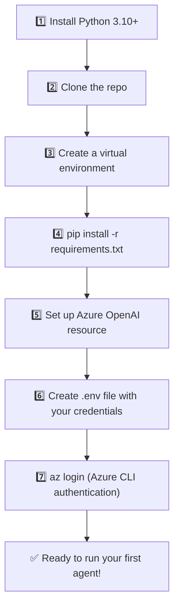

# 2️⃣ Installation & Setup — Get Your Environment Ready

Before writing any agent code, we need three things ready: **Python**, the **agent-framework** package, and **Azure credentials**. Let's do this slowly, step by step — like setting up a new game console before playing.

## 🪜 Step-by-step setup



### Step 1 — Install Python
Download Python 3.10 or newer from [python.org](https://www.python.org/downloads/). Confirm it's installed:

```bash
python --version
```

### Step 2 — Clone the example repository

```bash
git clone https://github.com/Sandesh-hase/Microsoft-Agent-Framework.git
cd Microsoft-Agent-Framework
```

### Step 3 — Create a virtual environment (keeps your project's packages isolated)

```bash
python -m venv venv
# Windows
venv\Scripts\activate
# macOS/Linux
source venv/bin/activate
```

### Step 4 — Install the dependencies

The repo's `requirements.txt` lists exactly what you need:

```text
agent-framework
python-dotenv
PyPDF2
pymupdf
```

Install them with:

```bash
pip install -r requirements.txt
```

**What each package does (in plain English):**

| Package | What it's for |
|---|---|
| `agent-framework` | The star of the show — Microsoft's SDK for building and running AI agents |
| `python-dotenv` | Reads secret settings (API keys, endpoints) from a `.env` file so you never hard-code secrets in your script |
| `PyPDF2` / `pymupdf` | Used later to read text out of PDF files (invoices, resumes) so an agent can understand them |

### Step 5 — Create an Azure OpenAI resource

1. Go to the [Azure Portal](https://portal.azure.com).
2. Create an **Azure OpenAI** resource (or use an existing one).
3. Deploy a chat model — the examples in this guide use `gpt-4o-mini`.
4. Note down your **endpoint URL** and the **deployment name**.

> 🆓 **No Azure subscription yet?** You can experiment for free using **GitHub Models** (`https://gh.io/models`), which works with the same Agent Framework APIs — perfect for learning before you commit to a paid Azure resource.

### Step 6 — Create your `.env` file

In the root of your project, create a file named `.env`:

```env
AZURE_OPENAI_ENDPOINT="https://<your-resource-name>.openai.azure.com/"
AZURE_OPENAI_CHAT_DEPLOYMENT_NAME="gpt-4o-mini"
```

> ⚠️ **Never commit your `.env` file to GitHub!** Add it to `.gitignore` immediately. It's meant to stay private on your machine.

### Step 7 — Authenticate with Azure CLI

The example notebooks use `AzureCliCredential`, which means the framework borrows your identity from the **Azure CLI** instead of you pasting an API key into code. This is the safer, more "enterprise" way to authenticate.

```bash
az login
```

That's it — a browser window opens, you sign in with your Azure account, and you're authenticated. No secret keys floating around in your code!

## ✅ Sanity check

Create a tiny test script to make sure everything works:

```python
from dotenv import load_dotenv
load_dotenv()

import os
print("Endpoint loaded:", os.getenv("AZURE_OPENAI_ENDPOINT") is not None)
```

If it prints `True`, you're fully set up and ready to build your first agent.

---

⬅️ [Back: History](01-history-and-why-it-exists.md) | ➡️ Next: [Core Concepts & Architecture](03-architecture-and-concepts.md)
