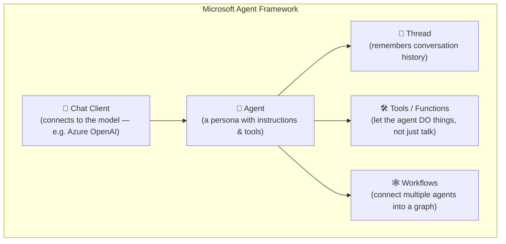
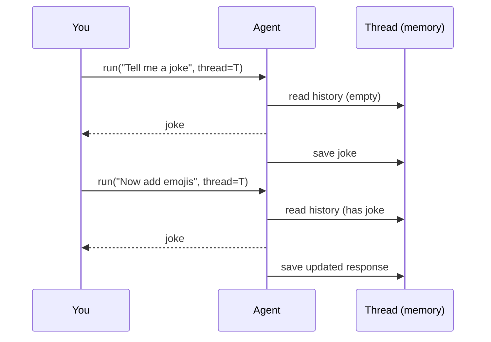
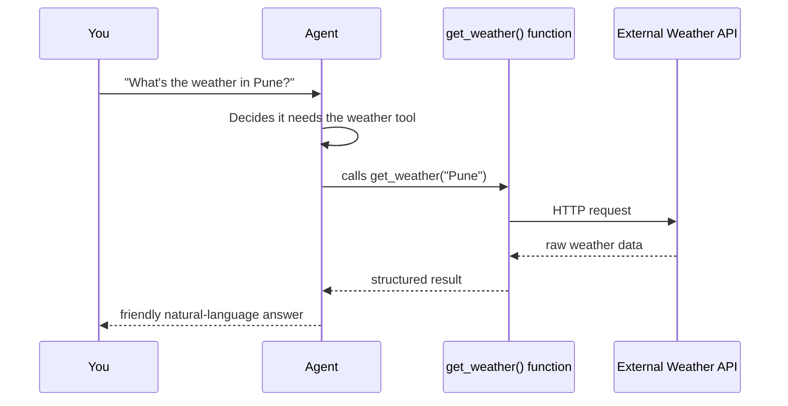
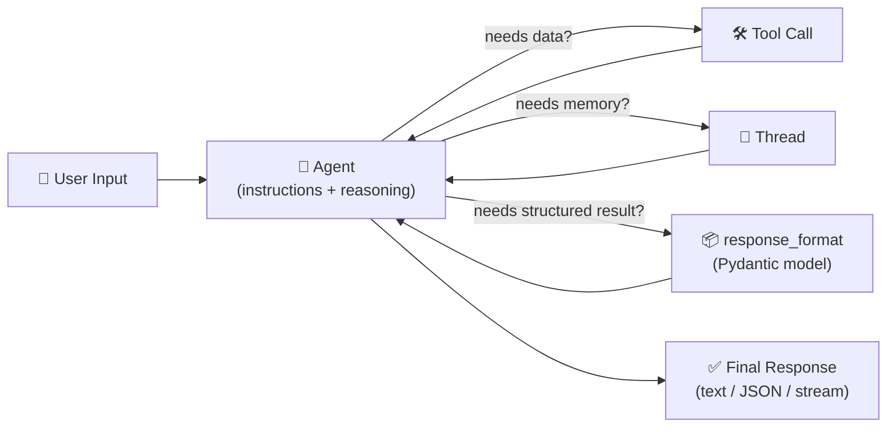

# 3️⃣ Core Concepts & Architecture

Before touching code, let's build a mental model. If you understand these five building blocks, the rest of the framework will feel obvious.

## 🧱 The Five Building Blocks



### 1. Chat Client — the "phone line" to the model
The **Chat Client** is what actually talks to an LLM provider (Azure OpenAI, OpenAI, GitHub Models, etc.). You create one client, then use it to build one or more agents on top of it.

```python
from agent_framework.azure import AzureOpenAIChatClient
from azure.identity import AzureCliCredential

client = AzureOpenAIChatClient(credential=AzureCliCredential())
```

### 2. Agent — a "character" with a job
An **Agent** is created from a chat client. You give it:
- **`instructions`** — its personality and rules (a system prompt)
- **`name`** — an identifier
- optionally **`tools`** — abilities it can use

```python
agent = client.create_agent(
    instructions="You are an expert psychologist AI...",
    name="MoodAnalyzer"
)
```

Think of an agent as a **stateless actor**: on its own, it does **not** remember previous messages. Every `agent.run(...)` call is like meeting the agent for the first time — unless you hand it a *Thread*.

### 3. Thread — the agent's short-term memory
Agents are stateless by design (this keeps them scalable and cheap to run). If you want a **multi-turn conversation** — where the agent remembers what you said two messages ago — you create a **Thread** and pass it along with every call:

```python
thread = agent.get_new_thread()
result1 = await agent.run("Tell me a joke about a pirate.", thread=thread)
result2 = await agent.run("Now tell it in the voice of a pirate's parrot.", thread=thread)
```



> 🧒 **Beginner analogy:** Think of the Agent as a very smart person with amnesia, and the Thread as their notebook. Every time you talk to them, they read their notebook first to remember what you already discussed, then write down the new conversation.

### 4. Tools / Function Calling — giving the agent "hands"
By default, an agent can only *talk*. **Tools** let it *act* — call a weather API, query a database, read a file. You write a normal Python function, describe it, and hand it to the agent. The model decides *on its own* when it needs to call that tool.

```python
from agent_framework import ai_function

@ai_function(name="weather_tool", description="Retrieves weather information for any location")
def get_weather(location: str) -> dict:
    ...

agent = client.create_agent(instructions="...", tools=get_weather)
```



### 5. Workflows — connecting multiple agents like a team
A single agent is great, but real problems often need a **team**: one agent researches, another writes, another reviews. **Workflows** are graph-based orchestrations that connect multiple agents and functions into sequential, concurrent, hand-off, or group-collaboration patterns. We cover this in depth in [Page 8](08-workflows-multi-agent-orchestration.md).

## 🏗️ The big picture: how a request flows through the system



## 📊 Response types you'll work with

| Method | What it returns |
|---|---|
| `agent.run(message)` | Full response at once (`result.text`) |
| `agent.run_stream(message)` | Response streamed chunk-by-chunk, like ChatGPT's typing effect |
| `agent.run(message, response_format=MyModel)` | A structured, validated object (`result.value`) instead of free text |

## 🔑 Key takeaway

> **Agent = brain. Thread = memory. Tools = hands. Workflow = teamwork.**

Keep this mental model in mind as we move into hands-on examples next.

---

⬅️ [Back: Installation & Setup](02-installation-and-setup.md) | ➡️ Next: [Example 1 — Your First Agent](04-example-1-your-first-agent.md)
