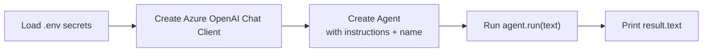

# 4️⃣ Example 1 — Your First Agent (the "MoodAnalyzer")

📓 Based on: [`01-create_agent.ipynb`](https://github.com/irshadvaza/Microsoft-Agent-Framework/blob/main/01-create_agent.ipynb)

In this example, we'll build a small AI **psychologist-style agent** that reads text and describes the emotions behind it. It's the simplest possible agent — perfect for your first-ever run.



## Step 1 — Load your secrets

```python
from dotenv import load_dotenv
load_dotenv()
```

**In plain English:** this line opens your `.env` file (from [Page 2](02-installation-and-setup.md)) and loads your Azure endpoint and deployment name into memory, so the rest of the script can use them quietly and safely.

## Step 2 — Create the agent

```python
import asyncio
from agent_framework.azure import AzureOpenAIChatClient
from azure.identity import AzureCliCredential

# Create a psychologist-style agent
client = OpenAIChatClient(
    model=model,
    azure_endpoint=endpoint,
    api_key=api_key,
)

agent = client.as_agent(
    instructions=(
        "You are an empathetic AI assistant that analyzes emotions "
        "expressed in text. Provide supportive and insightful responses. "
        "Do not diagnose mental health conditions."
    ),
    name="MoodAnalyzer",
)

```

**Breaking this down line by line:**

- `AzureOpenAIChatClient(credential=AzureCliCredential())` — connects to your Azure OpenAI resource using your logged-in Azure CLI identity (from `az login`). No API key pasted anywhere.
- `.create_agent(...)` — builds the agent in one line.
- `instructions=` — this is the agent's **personality and job description**. It's the single most important line: change it, and the agent's entire behaviour changes.
- `name="MoodAnalyzer"` — a friendly label for this agent (useful once you have several agents in a workflow).

## Step 3 — Run the agent and get a response

```python
async def main():
    user_input = (
        "I've been feeling so unmotivated lately, "
        "even though I want to achieve a lot."
    )

    
```

**Why `async`/`await`?** Talking to an AI model over the internet takes time (a network round-trip). `async` lets your program stay responsive instead of freezing while it waits — this is standard practice across the whole Agent Framework.

`result.text` is simply the agent's full written reply, ready to print or display.

## Step 4 — Streaming the response (like a "typing" effect)

```python
result = await agent.run(user_input)

    print("AI Response:\n")
    print(result.text)


if __name__ == "__main__":
    asyncio.run(main())
```

**What's different?** Instead of waiting for the *whole* answer, `run_stream()` gives you small pieces (`update.text`) as they're generated — exactly like watching ChatGPT type its answer live. Great for chat UIs where users don't want to stare at a blank screen.

## Step 5 — Bonus: sending an image, not just text

Agents aren't limited to plain text. You can send **multi-modal** content (text + image) in one message:

```python
from agent_framework import ChatMessage, TextContent, UriContent, Role

message = ChatMessage(
    role=Role.USER,
    contents=[
        TextContent(text="Analyze the emotional mood of this picture. Describe what feelings it evokes and why."),
        UriContent(
            uri="https://upload.wikimedia.org/wikipedia/commons/3/36/Hopetoun_falls.jpg",
            media_type="image/jpeg"
        )
    ]
)

result = await agent.run(message)
print(result.text)
```

**In plain English:** instead of a plain string, you build a `ChatMessage` with a *list of contents* — one `TextContent` (your question) and one `UriContent` (a link to an image). The model looks at both together and responds. This works because modern models like GPT-4o are **multi-modal** — they understand images and text at once.

## 🎓 What you just learned

- How to spin up an Azure OpenAI-backed agent in ~5 lines of code.
- The difference between `run()` (wait for full answer) and `run_stream()` (typing effect).
- How to send images alongside text using `ChatMessage`.

## 🧪 Try it yourself
Change the `instructions` line to make a totally different agent — a "SarcasticCritic," a "MotivationalCoach," or a "PirateStoryteller." Notice how *only that one sentence* completely reshapes the agent's personality.

---

⬅️ [Back: Core Concepts](03-architecture-and-concepts.md) | ➡️ Next: [Example 2 — Agents with Tools](05-example-2-agent-with-tools.md)
