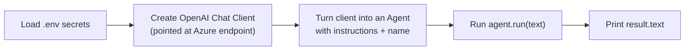

# 4️⃣ Example 1 — Your First Agent (the "MoodAnalyzer")

📓 Based on: [`01-create_agent.ipynb`](https://github.com/irshadvaza/Microsoft-Agent-Framework/blob/main/01-create_agent.ipynb)

In this example, we'll build a small AI **empathetic assistant** that reads text and responds thoughtfully to the emotions behind it. It's the simplest possible agent — perfect for your first-ever run.

> ✅ **Verified working version.** The code below is the confirmed, working version (API-key auth, `.py` script) — use this one if the notebook's `AzureCliCredential` version gives you errors. See the note at the end of this page for why the two versions differ.



## Step 1 — Imports and loading your secrets

```python
import asyncio
import os

from dotenv import load_dotenv
from agent_framework.openai import OpenAIChatClient

load_dotenv()

endpoint = os.getenv("AZURE_OPENAI_ENDPOINT")
api_key = os.getenv("AZURE_OPENAI_API_KEY")
model = os.getenv("AZURE_OPENAI_DEPLOYMENT")
```

**In plain English:** `load_dotenv()` opens your `.env` file (from [Page 2](02-installation-and-setup.md)) and loads it into your program's environment variables. The three `os.getenv(...)` lines then pull out your endpoint URL, secret key, and deployment name — keeping every secret out of your actual code.

## Step 2 — Create the chat client

```python
client = OpenAIChatClient(
    model=model,
    azure_endpoint=endpoint,
    api_key=api_key,
)
```

**Breaking this down:**

- `OpenAIChatClient` — despite the name, this class can talk to **either** OpenAI directly **or** an Azure OpenAI resource — it just depends on which arguments you pass it. Passing `azure_endpoint` is what tells it "use my Azure resource."
- `model=` — your deployment name (e.g. `gpt-4o-mini`), not the underlying model family name.
- `api_key=` — authenticates directly with a secret key, the simplest auth method to get running.

## Step 3 — Turn the client into an agent

```python
agent = client.as_agent(
    instructions=(
        "You are an empathetic AI assistant that analyzes emotions "
        "expressed in text. Provide supportive and insightful responses. "
        "Do not diagnose mental health conditions."
    ),
    name="MoodAnalyzer",
)
```

- `.as_agent(...)` — wraps the chat client into a ready-to-run **Agent** (the equivalent of `create_agent()` you may see in other versions/docs — see the compatibility note below).
- `instructions=` — the agent's **personality and job description**. It's the single most important argument here: change it, and the agent's entire behaviour changes. Notice this version also includes a safety boundary — *"Do not diagnose mental health conditions"* — a good habit for anything emotion/health-adjacent.
- `name="MoodAnalyzer"` — a friendly label for this agent (useful once you have several agents in a workflow).

## Step 4 — Run the agent and get a response

```python
async def main():
    user_input = (
        "I've been feeling so unmotivated lately, "
        "even though I want to achieve a lot."
    )

    result = await agent.run(user_input)

    print("AI Response:\n")
    print(result.text)


if __name__ == "__main__":
    asyncio.run(main())
```

**Why `async`/`await`?** Talking to an AI model over the internet takes time (a network round-trip). `async` lets your program stay responsive instead of freezing while it waits — this is standard practice across the whole Agent Framework.

`result.text` is simply the agent's full written reply, ready to print or display.

`asyncio.run(main())` inside `if __name__ == "__main__":` is the standard, safe way to kick off an async function from a plain `.py` script (as opposed to a notebook, where you can just `await main()` directly because the notebook already has an event loop running).

## 🩹 Why did the notebook version fail for me?

If you tried the original notebook code (`AzureOpenAIChatClient` + `AzureCliCredential` + `.create_agent()`) and it errored out, you're not doing anything wrong — you likely just have a different installed version of `agent-framework` than the notebook was written against. This package is under **very active development** (see [Page 1](01-history-and-why-it-exists.md) — it only reached GA in April 2026), and class names / method names have shifted between pre-release versions. Two quick ways to sort it out:

1. Check what's actually installed and what it exposes:
   ```bash
   pip show agent-framework
   python -c "import agent_framework; print(dir(agent_framework))"
   python -c "from agent_framework import openai; print(dir(openai))"
   ```
2. When in doubt, prefer **API-key auth with `OpenAIChatClient` + `.as_agent()`** (this page's version) — it's the simplest, most portable path and the one confirmed working. Once it's running, you can experiment with switching to `AzureCliCredential` for a more "keyless" production setup.

## Step 5 — Streaming the response (like a "typing" effect)

> 📝 The snippets below are written notebook-style (`await main()` at the top level). If you're in a `.py` script like Step 4, just drop this logic *inside* your `main()` function and keep the `asyncio.run(main())` wrapper at the bottom.

```python
async def main():
    async for update in agent.run_stream("Tell me how you're feeling today, in 500 words"):
        if update.text:
            print(update.text, end="", flush=True)
    print()

await main()  # in a .py script: call this via asyncio.run(main()) instead
```

**What's different?** Instead of waiting for the *whole* answer, `run_stream()` gives you small pieces (`update.text`) as they're generated — exactly like watching ChatGPT type its answer live. Great for chat UIs where users don't want to stare at a blank screen.

## Step 6 — Bonus: sending an image, not just text

Agents aren't limited to plain text. You can send **multi-modal** content (text + image) in one message:

```python
from agent_framework import ChatMessage, TextContent, UriContent, Role

message = ChatMessage(
    role=Role.USER,
    contents=[
        TextContent(text="Analyze the emotional mood of this picture. Describe what feelings it evokes and why."),
        UriContent(
            uri="https://upload.wikimedia.org/wikipedia/commons/3/36/Hopetoun_falls.jpg",
            media_type="image/jpeg"
        )
    ]
)

result = await agent.run(message)
print(result.text)
```

**In plain English:** instead of a plain string, you build a `ChatMessage` with a *list of contents* — one `TextContent` (your question) and one `UriContent` (a link to an image). The model looks at both together and responds. This works because modern models like GPT-4o are **multi-modal** — they understand images and text at once.

## 🎓 What you just learned

- How to spin up an Azure OpenAI-backed agent in ~5 lines of code.
- The difference between `run()` (wait for full answer) and `run_stream()` (typing effect).
- How to send images alongside text using `ChatMessage`.

## 🧪 Try it yourself
Change the `instructions` line to make a totally different agent — a "SarcasticCritic," a "MotivationalCoach," or a "PirateStoryteller." Notice how *only that one sentence* completely reshapes the agent's personality.

---

⬅️ [Back: Core Concepts](03-architecture-and-concepts.md) | ➡️ Next: [Example 2 — Agents with Tools](05-example-2-agent-with-tools.md)
