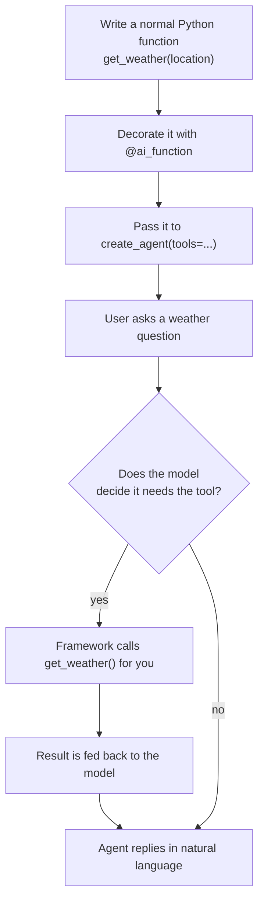
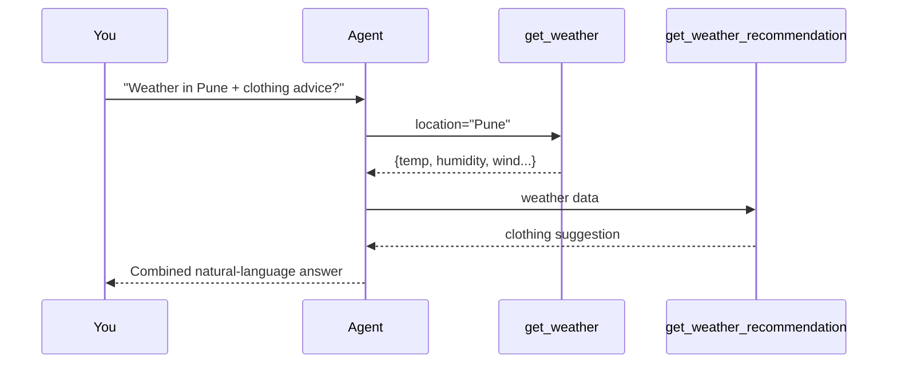

# 5️⃣ Example 2 — Giving Your Agent "Hands" with Tools

📓 Based on: [`02-create-agent-with-function-tool.ipynb`](https://github.com/Sandesh-hase/Microsoft-Agent-Framework/blob/main/02-create-agent-with-function-tool.ipynb)

Our `MoodAnalyzer` from Example 1 could only *talk*. In this example, we build a **weather assistant** that can actually *do something* — fetch live weather data from a real API — by giving it a **tool**.



## Step 1 — Write a plain Python function

```python
import requests
from typing import Annotated, Dict, Any
from pydantic import Field

def get_weather(
    location: Annotated[str, Field(description="City or location to fetch weather for.")]
) -> Dict[str, Any]:
    """
    Fetches detailed real-time weather from MET Norway API.
    Returns a JSON object with temperature, humidity, wind, clouds,
    pressure, precipitation, and human-readable condition.
    """
    # 1. Convert the city name into latitude/longitude using a geocoding API
    # 2. Call the MET Norway weather API with those coordinates
    # 3. Return a clean dictionary of weather details
    ...
```

**Why does this matter?** This is just a regular Python function — nothing agent-specific about it yet. That's the beauty of the design: **any function you already know how to write can become an agent tool.**

Notice the `Annotated[str, Field(description=...)]` part — this is how you describe *what the parameter means* to the model, so it knows what value to pass in. It's like leaving a sticky note for the AI: "hey, this parameter expects a city name."

## Step 2 — Turn the function into an official "tool" with `@ai_function`

```python
from agent_framework import ai_function

@ai_function(name="weather_tool", description="Retrieves weather information for any location")
def get_weather(location: Annotated[str, Field(description="City or location to fetch weather for.")]) -> Dict[str, Any]:
    ...
```

**In plain English:** the `@ai_function` decorator wraps your function with a description the *model itself* reads to decide "should I call this tool right now, and with what arguments?" You're not calling the function — the AI model is deciding to call it, based on the conversation.

## Step 3 — Hand the tool to your agent

```python
import asyncio
from agent_framework.azure import AzureOpenAIChatClient
from azure.identity import AzureCliCredential

instructions = """
You are a helpful and versatile AI assistant.
You may use tools when needed to provide accurate and complete responses.
When you use a tool, return its output exactly as provided—do not modify,
summarize, or remove fields from the tool's return value.
"""

client = AzureOpenAIChatClient(credential=AzureCliCredential())
agent = client.create_agent(
    instructions=instructions,
    tools=get_weather
)
```

That single `tools=get_weather` line is all it takes to make the tool available. If you have multiple tools, you simply pass a list: `tools=[tool_a, tool_b]`.

## Step 4 — Ask a question and watch the tool get called automatically

```python
async def main():
    result = await agent.run("What is the weather like in Pune?")
    print(result.text)

await main()
```

You never explicitly call `get_weather("Pune")` yourself — the model reads your question, realizes it needs live data, extracts `"Pune"` as the argument, calls the function behind the scenes, and then writes a natural-language answer using the real result. **This is called "function calling," and it's the foundation of every tool-using AI agent.**

## Step 5 — Multiple tools working together (a class of tools)

The notebook goes further and wraps *several* related tools inside a Python class:

```python
class WeatherTools:
    def __init__(self):
        self.last_location = None

    def get_weather(self, location: Annotated[str, Field(description="...")]) -> Dict[str, Any]:
        ...

    def get_weather_recommendation(self, ...):
        ...

tools = WeatherTools()
agent = AzureOpenAIChatClient(credential=AzureCliCredential()).create_agent(
    instructions=instructions,
    tools=[tools.get_weather, tools.get_weather_recommendation],
    enable_trace=True
)
```

**Why a class?** It lets tools *share state* (like `self.last_location`) between calls, and keeps related tools organized together — just like grouping related functions in any well-designed Python program.

`enable_trace=True` turns on detailed logging of every tool call — very useful for debugging (and for Example below!).

## Step 6 — Inspecting exactly what the agent did behind the scenes

```python
result = await agent.run("What is the weather like in Pune? and suggest the weather recommendation for clothing")

from agent_framework._types import FunctionCallContent, FunctionResultContent

for msg in result.messages:
    for content in msg.contents:
        if isinstance(content, FunctionCallContent):
            print("Tool Call:", content.name, content.arguments)
        if isinstance(content, FunctionResultContent):
            print("Tool Output:", content.result)
```

**In plain English:** `result.messages` contains the *entire conversation transcript*, including hidden tool calls. This snippet lets you peek "under the hood" and see exactly which tool the model called, with what arguments, and what it got back — great for debugging and for building trust in what your agent is actually doing.



## 🎓 What you just learned

- How to turn any Python function into an agent tool with `@ai_function`.
- How the model *decides on its own* when and how to call a tool.
- How to group related tools in a class to share state.
- How to inspect exactly what tools were called using `FunctionCallContent` / `FunctionResultContent`.

---

⬅️ [Back: Example 1](04-example-1-your-first-agent.md) | ➡️ Next: [Example 3 — Multi-Turn Conversations](06-example-3-multi-turn-conversations.md)
