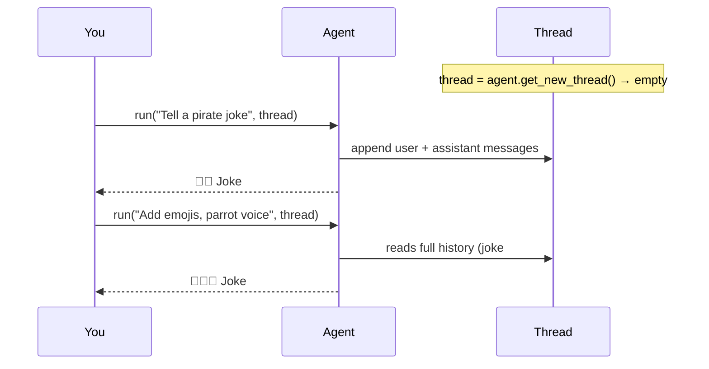
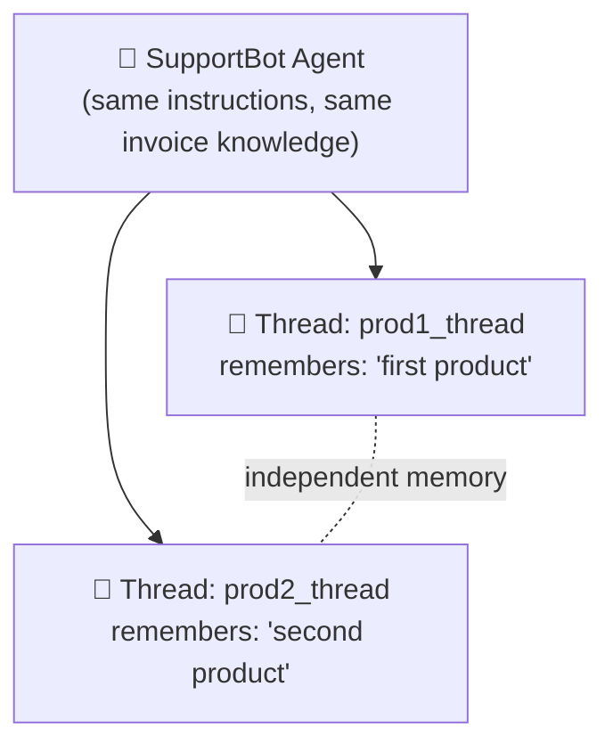

# 6️⃣ Example 3 — Multi-Turn Conversations & Memory (Threads)

📓 Based on: [`03-multi-turn conversation.ipynb`](<https://github.com/Sandesh-hase/Microsoft-Agent-Framework/blob/main/03-multi-turn%20conversation.ipynb>)

## 🧠 The core idea

> **Agents are stateless.** They do **not** remember anything between calls, by default.

This surprises a lot of beginners! Every time you call `agent.run(...)`, the agent treats it like a brand-new conversation — unless you explicitly hand it a **Thread**, which acts as the conversation's memory.


*(Diagram from the repo showing how a Thread carries conversation state between calls.)*

## Step 1 — Create a simple joke-telling agent

```python
import asyncio
from agent_framework.azure import AzureOpenAIChatClient
from azure.identity import AzureCliCredential

agent = AzureOpenAIChatClient(credential=AzureCliCredential()).create_agent(
    instructions="You are good at telling jokes.",
    name="Joker"
)
```

## Step 2 — Create a Thread (the conversation's "notebook")

```python
thread = agent.get_new_thread()
```

That's it. This one line creates an empty container that will hold every message exchanged from now on.

## Step 3 — Have a real back-and-forth conversation

```python
result1 = await agent.run("Tell me a joke about a pirate.", thread=thread)
print(result1.text)

result2 = await agent.run(
    "Now add some emojis to the joke and tell it in the voice of a pirate's parrot.",
    thread=thread
)
print(result2.text)
```

Notice the second question — *"add some emojis to **the** joke"* — only makes sense if the agent remembers the first joke. Because we passed the **same `thread`** both times, it does! If you forgot to pass `thread=thread` on the second call, the agent would have no idea what "the joke" refers to.



## Step 4 — A real-world use case: chatting about a PDF invoice

This is where threads get genuinely powerful. Imagine a customer-support bot that needs to answer questions about **two different customers' invoices at the same time**, without mixing them up.

### 4a. Extract the invoice text from a PDF

```python
from PyPDF2 import PdfReader

def extract_text_from_pdf(pdf_path):
    reader = PdfReader(pdf_path)
    text = ""
    for page in reader.pages:
        text += page.extract_text()
    return text

data_source_text = extract_text_from_pdf("data/invoice.pdf")
```

**In plain English:** this loops through every page of the PDF and glues the extracted text together into one big string — this becomes the "knowledge" our agent will reason over.

### 4b. Feed that text into the agent's instructions

```python
agent = AzureOpenAIChatClient(credential=AzureCliCredential()).create_agent(
    instructions=f"""You are a helpful customer support agent.
                    Use the following information to answer user questions:
                    {data_source_text}""",
    name="SupportBot"
)
```

### 4c. Create *two separate threads* — one per "customer session"

```python
prod1_thread = agent.get_new_thread()
prod2_thread = agent.get_new_thread()
```

### 4d. Two independent conversations, run in parallel, never mixing up

```python
p1_q1 = await agent.run("What is the first purchased product in this invoice?", thread=prod1_thread)
p1_q2 = await agent.run("What is the price of that product?", thread=prod1_thread)  # "that" = product from p1_q1

p2_q1 = await agent.run("What is the second purchased product in this invoice?", thread=prod2_thread)
p2_q2 = await agent.run("What is the price of that product?", thread=prod2_thread)  # "that" = product from p2_q1
```

Even though both threads talk to the **same agent** about the **same invoice**, each thread tracks its own separate conversation history — like two customer service reps handling two different customer calls with the same reference manual open in front of them, but different notepads.



### 4e. Testing that memory truly stays isolated

```python
p1_test = await agent.run("What was the product we talked about", thread=prod1_thread)
p2_test = await agent.run("What was the product we talked about", thread=prod2_thread)
```

`p1_test` correctly answers about the *first* product, and `p2_test` about the *second* — proof that threads don't leak into each other.

## 🎓 What you just learned

- Agents have **no memory by default** — you must explicitly opt in with a `Thread`.
- `agent.get_new_thread()` creates an isolated conversation history.
- You can run **many independent conversations** against the same agent, at the same time, safely.
- Combined with PDF text extraction, this pattern powers real customer-support and document Q&A bots.

---

⬅️ [Back: Example 2](05-example-2-agent-with-tools.md) | ➡️ Next: [Example 4 — Structured Output](07-example-4-structured-output.md)
