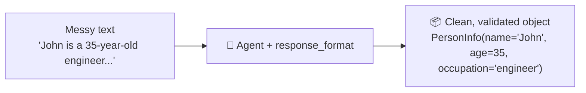
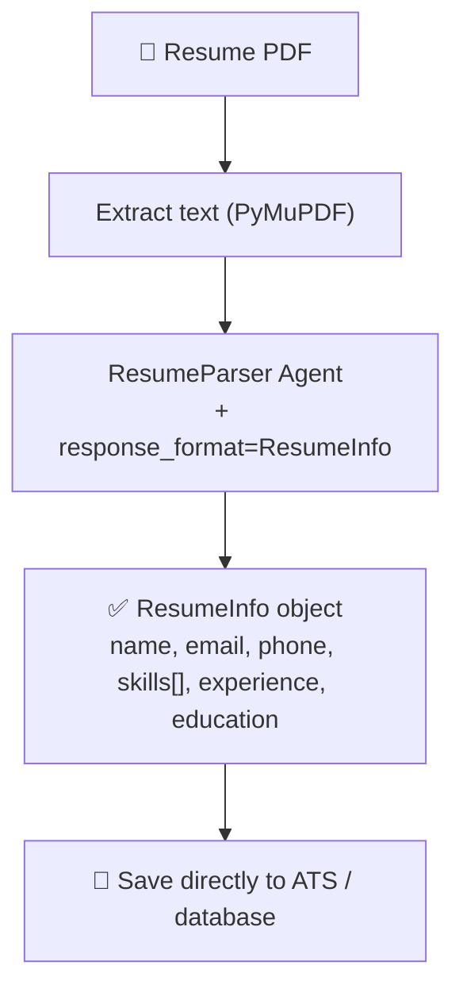

# 7️⃣ Example 4 — Structured Output (Turning Messy Text into Clean JSON)

📓 Based on: [`04-producing-structured-output-with-agents.ipynb`](https://github.com/Sandesh-hase/Microsoft-Agent-Framework/blob/main/04-producing-structured-output-with-agents.ipynb)

## 🤔 The problem this solves

So far, our agents replied with free-flowing text (`result.text`). That's great for chatting, but **terrible** for real software. Imagine a Human Resources system trying to read: *"Sure! John is a 35-year-old software engineer who loves automation."* — a computer program can't reliably pull `name`, `age`, and `occupation` out of that sentence every single time.

**Structured output** solves this: instead of free text, the agent is forced to return data that matches an exact schema you define — every time, guaranteed.



## Step 1 — Define the shape of the data you want (a Pydantic model)

```python
from pydantic import BaseModel

class PersonInfo(BaseModel):
    name: str | None = None
    age: int | None = None
    occupation: str | None = None
```

**In plain English:** `PersonInfo` is a blueprint. It says "I expect a name (text), an age (whole number), and an occupation (text) — and any of them might be missing." Pydantic is a popular Python library for defining and validating data shapes like this.

## Step 2 — Create a normal agent (nothing special yet)

```python
from agent_framework.azure import AzureOpenAIChatClient
from azure.identity import AzureCliCredential

agent = AzureOpenAIChatClient(credential=AzureCliCredential()).create_agent(
    name="HelpfulAssistant",
    instructions="You are a helpful assistant that extracts person information from text."
)
```

## Step 3 — Run it with `response_format`

```python
response = await agent.run(
    "John Sir is a 35-year-old software engineer who loves automation.",
    response_format=PersonInfo
)

if response.value:
    info = response.value
    print(info)
```

The magic is the `response_format=PersonInfo` argument. Instead of getting back `response.text` (a string), you now get `response.value` — an actual **`PersonInfo` object** with real, typed fields (`info.name`, `info.age`, `info.occupation`) that your code can trust and use directly, with zero manual parsing.

> 🎓 **Under the hood:** `ChatAgent` is built on top of any chat client that supports structured output. It uses OpenAI's / Azure OpenAI's native structured-output feature to force the model's response to match your Pydantic schema exactly.

## 🏆 Real use case: Parsing a resume PDF into clean data for a hiring system

Let's level this up into something genuinely useful: turning an uploaded **resume PDF** into structured JSON an Applicant Tracking System (ATS) can use.

### Step 1 — Extract raw text from the resume PDF

```python
import fitz  # PyMuPDF

def extract_text_from_pdf(pdf_path: str) -> str:
    doc = fitz.open(pdf_path)
    text = ""
    for page in doc:
        text += page.get_text()
    doc.close()
    return text

resume_text = extract_text_from_pdf("./data/Resume-1.pdf")
```

### Step 2 — Define a richer schema for everything HR actually needs

```python
from pydantic import BaseModel
from typing import List, Optional

class ResumeInfo(BaseModel):
    name: Optional[str] = None
    email: Optional[str] = None
    phone: Optional[str] = None
    skills: List[str] = []
    total_experience_years: Optional[float] = None
    last_job_title: Optional[str] = None
    education: Optional[str] = None
```

### Step 3 — Create a dedicated resume-parsing agent

```python
resume_agent = AzureOpenAIChatClient(credential=AzureCliCredential()).create_agent(
    name="ResumeParser",
    instructions="""
    You are an advanced AI Resume Parser.
    Extract structured candidate information ONLY in the schema provided.
    Do NOT add extra text. Do NOT summarize.
    """
)
```

### Step 4 — Run the extraction

```python
extracted = await resume_agent.run(resume_text, response_format=ResumeInfo)

if extracted.value:
    parsed_resume = extracted.value
    print(parsed_resume)
```

You now have a fully-typed `ResumeInfo` object with `.skills` as a real Python list, `.total_experience_years` as a real float, ready to save straight into a database — no regex, no guesswork.



## 🌟 Why this pattern matters (real business benefits)

1. **ATS Integration** — clean JSON drops straight into your Applicant Tracking System.
2. **No post-processing** — no regex, no fragile string-splitting hacks.
3. **Zero hallucination formatting** — the schema forces strict, valid JSON structure every time.
4. **Scales to enterprise volume** — process thousands of resumes a day automatically.
5. **Reusable everywhere** — the exact same technique works for invoice parsing, contract extraction, support-ticket classification, insurance claims, and medical records — anywhere messy documents need to become clean data.

## 🎓 What you just learned

- How to define a Pydantic model as your desired output "shape."
- How `response_format=YourModel` turns free text into guaranteed structured data.
- How to combine PDF extraction + structured output into a real document-processing pipeline.

---

⬅️ [Back: Example 3](06-example-3-multi-turn-conversations.md) | ➡️ Next: [Workflows & Multi-Agent Orchestration](08-workflows-multi-agent-orchestration.md)
