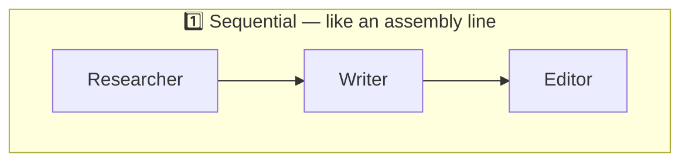
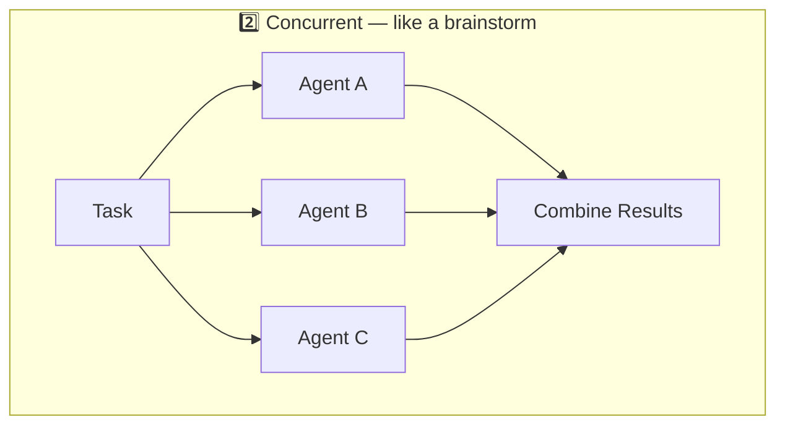
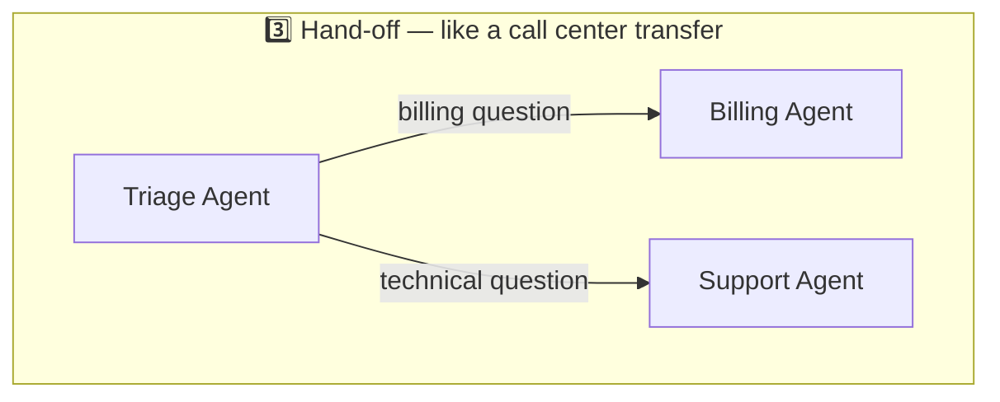
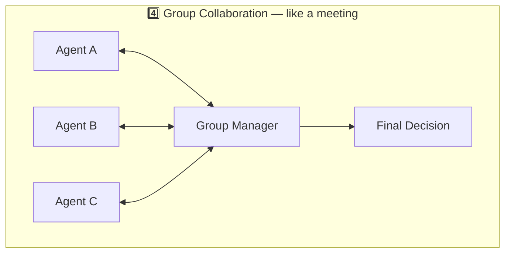
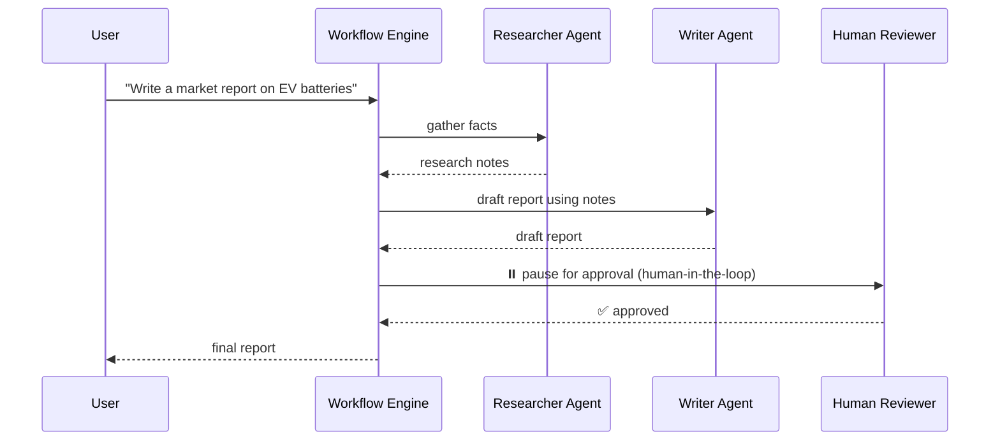

# 8️⃣ Workflows & Multi-Agent Orchestration

So far, every example used **one agent**. But real-world problems are often too big for a single agent to handle well — just like a company doesn't run on one employee. This is where **Workflows** come in, the feature born directly from AutoGen's multi-agent DNA merging with Semantic Kernel's reliability (see [Page 1](01-history-and-why-it-exists.md)).

## 🕸️ What is a Workflow?

> A **Workflow** is a **graph-based orchestration** that connects multiple agents and functions to perform complex, multi-step tasks — ideal for structured, long-running processes that need reliability and modularity.

Instead of one agent trying to do everything (research + write + fact-check + format), you build a **graph** where each node is an agent (or a function), and the edges define how information flows between them.

## 🧩 The four core orchestration patterns

| Pattern | Real-world analogy | Good for |
|---|---|---|
| **Sequential** | An assembly line | Step-by-step pipelines: research → draft → review → publish |
| **Concurrent** | A brainstorming session | Getting several independent opinions/answers fast, then merging them |
| **Hand-off** | A call center transferring your call | Routing a request to the *right* specialist agent (support, billing, sales) |
| **Group Collaboration** | A team meeting with a facilitator | Agents debating/critiquing each other until they converge on an answer |

## ⚙️ Production-grade features built into Workflows

Because MAF inherited Semantic Kernel's enterprise DNA, workflows aren't just "toy" orchestration — they come with real production safety nets:

- **Checkpointing** — save workflow progress so a long-running job can resume after a crash or restart, instead of starting over.
- **Streaming** — get live updates as the workflow progresses, not just a final answer.
- **Human-in-the-loop** — pause a workflow at a critical step and wait for a human to approve/reject before continuing (essential for things like financial transactions or medical decisions).
- **Time-travel debugging** — step backward through a workflow's execution history to see exactly what each agent decided and why.
- **Observability (OpenTelemetry)** — every agent call, tool call, and workflow transition can be traced end-to-end, so you can diagnose problems in production the same way you'd debug any distributed system.

## 🧵 How this connects to what you already learned

Everything from Pages 4–7 becomes a **node** in a workflow graph:

- A single-purpose agent (Page 4) → one node.
- An agent with tools (Page 5) → a node that can reach outside the graph (APIs, databases).
- A thread-aware conversational agent (Page 6) → a node with memory across the workflow.
- A structured-output agent (Page 7) → a node that guarantees a clean, typed hand-off to the *next* node in the graph — which is exactly why structured output matters so much in multi-agent systems: **agents need to trust the data format coming from other agents**, just like functions in code need reliable inputs.

## 🌐 Interoperability: MCP and A2A

Since GA (April 2026), the framework ships with **native support** for two open protocols:

- **MCP (Model Context Protocol)** — a standard way for agents to discover and use external tools/data sources, without custom integration code for each one.
- **A2A (Agent-to-Agent)** — a standard way for agents built by *different teams or even different companies* to talk to each other reliably.

This means a workflow node doesn't have to be "your" agent — it can be someone else's agent, or an external tool server, communicating through an open, standardized protocol instead of a proprietary one.

## 🎓 What you just learned

- **Workflows = graphs that connect agents and functions** for complex, multi-step tasks.
- Four core patterns: **Sequential, Concurrent, Hand-off, Group Collaboration**.
- Production features: **checkpointing, streaming, human-in-the-loop, time-travel debugging, observability**.
- **MCP** and **A2A** let your workflows plug into tools and agents beyond your own codebase.

---

⬅️ [Back: Example 4](07-example-4-structured-output.md) | ➡️ Next: [YouTube Video Script](09-youtube-script-voiceover.md)
