# 🏭 Azure Data Factory — The Complete Beginner-Friendly Guide

> A step-by-step, visual learning path for Azure Data Factory (ADF) — from "what is this thing?" to building, scheduling, monitoring, and deploying real pipelines.

---

## 👋 Who this guide is for

You don't need to be a data engineer already. If you know roughly what a "database" and a "file" are, you're ready. Every concept is introduced with a plain-English explanation *before* any jargon, and every page builds on the last.

## 🗺️ How this guide is organized

Think of it like an actual factory tour — you start at the entrance (what is ADF, why does it exist), walk through the floor (core components), watch a product get built (your first pipeline), see the machines running on a schedule, then visit the control room (monitoring) and the shipping dock (CI/CD deployment).

```mermaid
flowchart LR
    A["📖 01. Introduction\nWhat & Why"] --> B["🧩 02. Core Components\nThe Building Blocks"]
    B --> C["🚀 03. Getting Started\nCreate Your ADF"]
    C --> D["🛠️ 04. First Pipeline\nCopy Data Hands-On"]
    D --> E["🔀 05. Data Flows\nTransform Data"]
    E --> F["⏰ 06. Triggers\nSchedule It"]
    F --> G["🖥️ 07. Integration Runtime\nWhere Work Happens"]
    G --> H["📊 08. Monitoring\nWatch It Run"]
    H --> I["🔁 09. CI/CD & Git\nShip It Safely"]
    I --> J["🎯 10. Best Practices\n& Interview Prep"]

    style A fill:#e1f5ff,stroke:#0078D4,stroke-width:2px
    style J fill:#d4edda,stroke:#28a745,stroke-width:2px
```

## 📚 Table of Contents

| # | Page | What you'll learn |
|---|------|--------------------|
| 01 | [Introduction to Azure Data Factory](01-introduction-to-adf.md) | 🤔 What ADF is, why it exists, real-world analogies |
| 02 | [Core Components](02-core-components.md) | 🧩 Pipelines, Activities, Datasets, Linked Services, Triggers |
| 03 | [Getting Started](03-getting-started.md) | 🚀 Create an ADF instance in the Azure Portal |
| 04 | [Build Your First Pipeline](04-build-first-pipeline.md) | 🛠️ Hands-on: Copy data from Blob Storage to SQL |
| 05 | [Data Flows](05-data-flows.md) | 🔀 Transform data without writing code |
| 06 | [Triggers & Scheduling](06-triggers-scheduling.md) | ⏰ Run pipelines automatically |
| 07 | [Integration Runtime Deep Dive](07-integration-runtime.md) | 🖥️ The engine behind every activity |
| 08 | [Monitoring & Troubleshooting](08-monitoring.md) | 📊 Debugging failed pipeline runs |
| 09 | [CI/CD & Git Integration](09-cicd-git-integration.md) | 🔁 Dev → Test → Prod, safely |
| 10 | [Best Practices & Interview Prep](10-best-practices-interview-prep.md) | 🎯 Patterns, pitfalls, and common interview Q&A |

## ⏱️ Suggested pace

- **Weekend crash course:** Pages 1–4 (get a working pipeline running)
- **Full week:** Pages 1–8 (comfortable with the whole authoring + monitoring loop)
- **Two weeks / job-ready:** All 10 pages, plus hands-on practice in a free Azure trial account

## ✅ Prerequisites

- A free [Azure account](https://azure.microsoft.com/free/) (no credit card charges on the free tier for light usage)
- Basic comfort with the idea of files (CSV, JSON) and tables (rows/columns) — no coding required for most of this guide

## 🔖 Legend used throughout

| Icon | Meaning |
|---|---|
| 💡 | Concept / mental model |
| 🛠️ | Hands-on step |
| ⚠️ | Common mistake / gotcha |
| 📸 | Screenshot goes here (see note below) |
| 🎯 | Key takeaway |

> **📸 About screenshots:** Wherever you see a `📸 Screenshot:` placeholder, take a screenshot of your own Azure Portal at that exact step and drop it in. This keeps the guide accurate to whatever the current ADF Studio UI looks like (Microsoft updates it often) and avoids any copyright issues from reproducing Microsoft's UI directly. Official reference screenshots are always available at [learn.microsoft.com/azure/data-factory](https://learn.microsoft.com/en-us/azure/data-factory/).

---

➡️ Start here: **[01. Introduction to Azure Data Factory](01-introduction-to-adf.md)**
