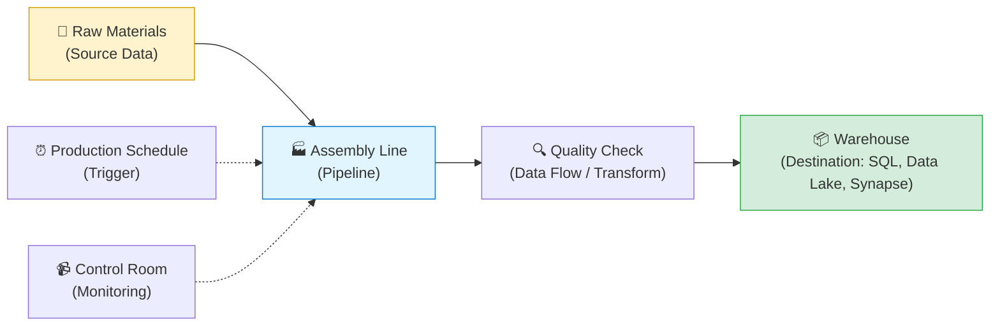
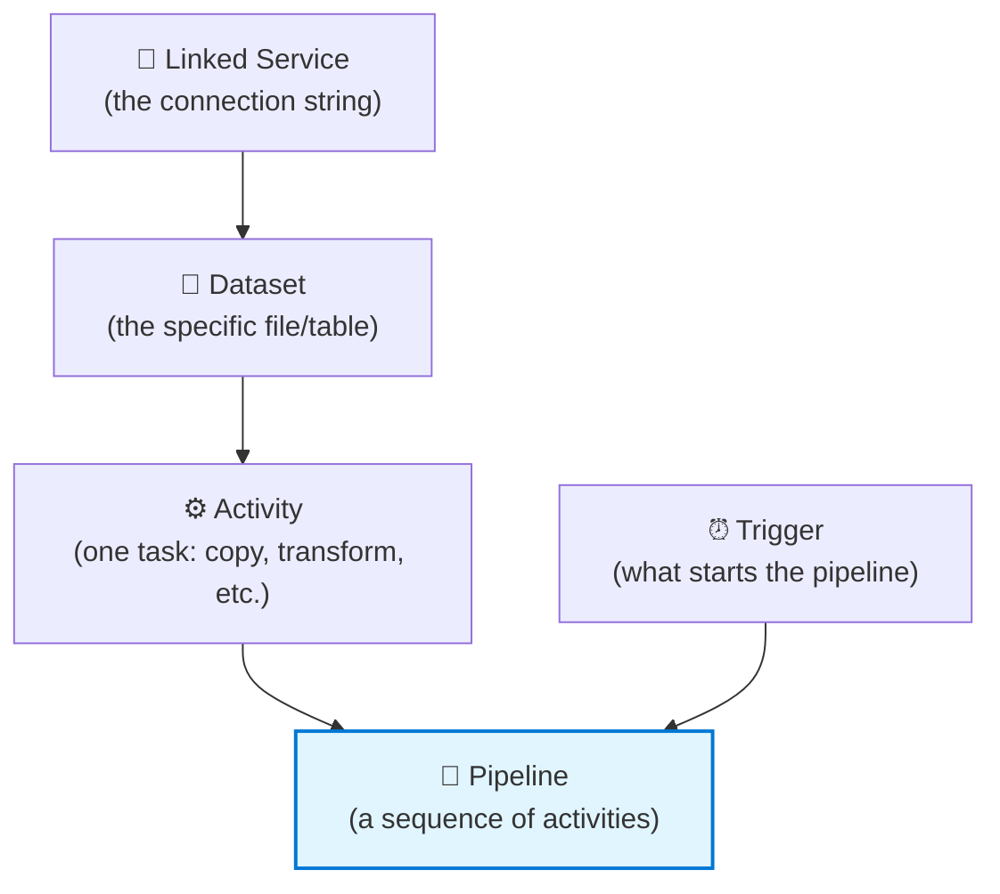

[⬅️ Back to Index](00-README.md) · Page 1 of 10

# 📖 01. Introduction to Azure Data Factory

## 🤔 What problem does ADF actually solve?

Imagine a company that has:

- 🧾 Sales data sitting in an on-premises SQL Server
- ☁️ Marketing data in Salesforce
- 📁 Log files landing in Azure Blob Storage every hour
- 📊 A finance team that needs all of it combined into one clean report every morning at 6 AM

Someone has to **move** that data, **clean/reshape** it, and make sure it happens **on a schedule, reliably, every single day** — without a human manually running scripts.

That "someone" is Azure Data Factory. It's Microsoft's cloud-based **data integration and orchestration service**.

> 💡 **Simple definition:** ADF is a tool for building automated pipelines that move and transform data from Point A to Point B — with no (or minimal) code.

## 🏭 The "factory" analogy

The name is literal. Think of a physical factory:

- **Raw materials** = your source data (databases, files, APIs, SaaS apps)
- **The assembly line** = a **pipeline**, the sequence of steps
- **Quality checks / reshaping** = **data flows** (transformations)
- **The warehouse** = your destination (a database, a data lake, a reporting tool)
- **The production schedule** = **triggers**, which decide *when* things run
- **The control room** = **monitoring**, where you watch everything and catch failures

## 🧠 Why not just write a Python script?

You *could*. Many people do, for small jobs. ADF becomes worth it when you need:

| Need | Why ADF helps |
|---|---|
| 🔌 90+ connectors (SQL, SAP, Salesforce, Oracle, REST APIs, S3, etc.) | No custom connector code to write and maintain |
| 🖱️ Low-code / visual authoring | Non-programmers can build pipelines |
| 📈 Scale to huge volumes | Fully managed compute, scales automatically |
| ⏰ Built-in scheduling | No need for a separate cron server |
| 🔁 Retry logic, dependencies, alerts | Built into the pipeline designer |
| 🔒 Enterprise security | Managed identities, private endpoints, Azure AD integration |
| 🧪 CI/CD via Git | Version control and safe promotion Dev → Test → Prod |

## 🌍 Real-world use cases

- 🛒 **Retail:** Nightly pipeline pulls POS sales data from 500 stores into a central warehouse for next-morning dashboards
- 🏥 **Healthcare:** Ingest and anonymize patient records from multiple hospital systems into a compliant data lake
- 🏦 **Finance:** Pull transaction data hourly, run fraud-detection transformations, load into a reporting database
- 📱 **SaaS companies:** Combine product usage data + billing data + support tickets into one analytics layer

## 🆚 ADF vs. similar tools (quick orientation)

| Tool | Best known for |
|---|---|
| **Azure Data Factory** | Cloud-native orchestration + data movement, low-code |
| **SSIS (SQL Server Integration Services)** | The on-premises predecessor; ADF can actually *run* existing SSIS packages via Azure-SSIS Integration Runtime |
| **Azure Databricks** | Heavy-duty big data processing with Spark, code-first (Python/Scala/SQL) |
| **Azure Synapse Pipelines** | Same pipeline engine as ADF, bundled inside Synapse Analytics workspace |
| **Microsoft Fabric Data Factory** | The newest evolution — same concepts, unified with Fabric's analytics platform |

> 🎯 **Key takeaway:** ADF doesn't usually *do the heavy transformation itself* — it **orchestrates**. It tells other services (SQL, Spark, Databricks) what to do and when, and it moves data between them. Its own "Data Flow" feature (page 5) *can* do transformations too, but its superpower is coordination at scale.

## 🧩 The five big ideas (previewed)

You'll meet these in detail on the next page, but here's the mental map:

| Term | One-line meaning |
|---|---|
| **Linked Service** | "How do I connect?" — credentials + endpoint for a data store |
| **Dataset** | "What data, specifically?" — a table, file, or folder |
| **Activity** | "What action?" — Copy, Lookup, Execute Pipeline, ForEach, etc. |
| **Pipeline** | A group of activities working toward one goal |
| **Trigger** | What kicks the pipeline off — schedule, event, or manual |

---

## 🎯 Recap

- ADF is a **managed, low-code orchestration service** for moving and transforming data
- Think **factory**: raw materials → assembly line → quality check → warehouse, on a schedule, watched by a control room
- It shines when you need many connectors, scale, scheduling, and safe deployment — not necessarily for a single one-off script

## 🙋 Quick self-check

1. What's the difference between a Linked Service and a Dataset?
2. Name two reasons a team might choose ADF over a custom Python script.
3. What does "orchestration" mean in the context of ADF?

*(Answers become obvious after Page 2 — no peeking required!)*

---

⬅️ [Back to Index](00-README.md) | ➡️ Next: [02. Core Components](02-core-components.md)
