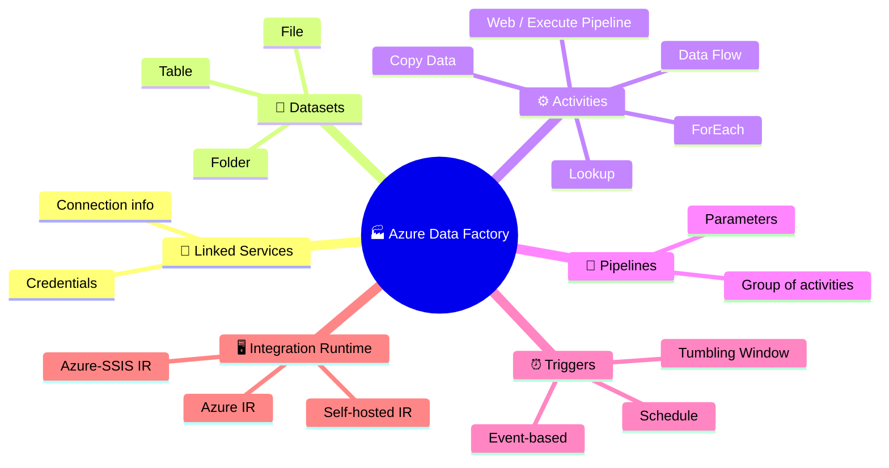
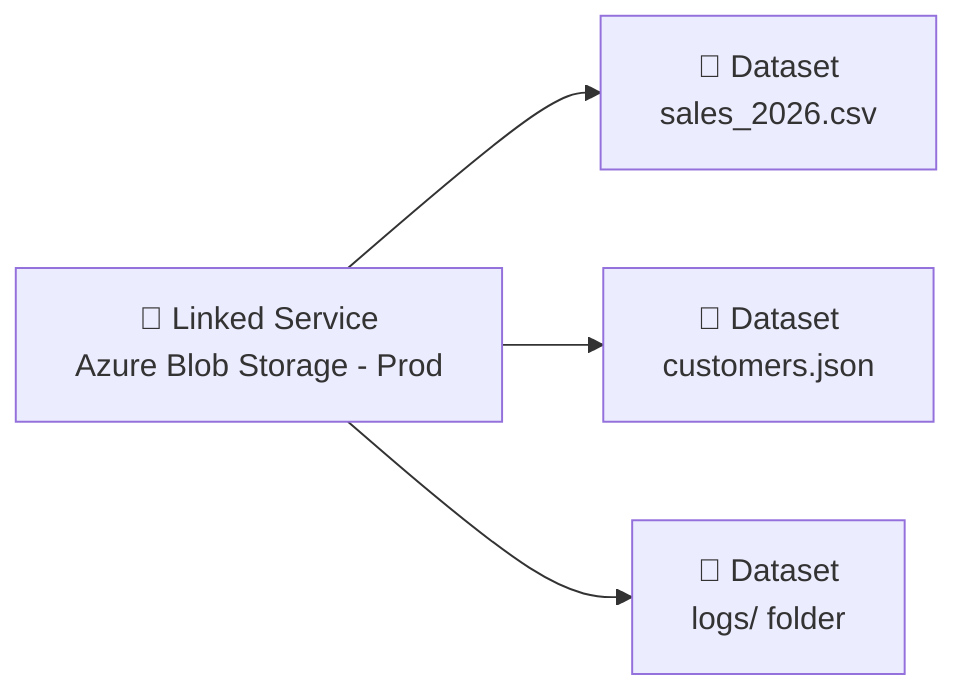
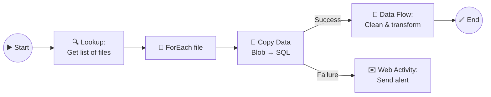
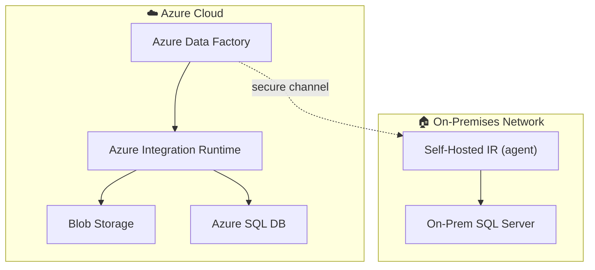
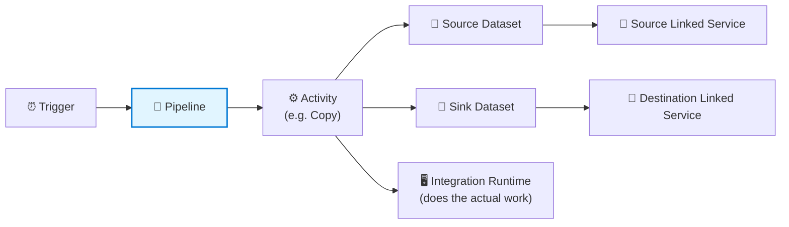

[⬅️ Back to Index](00-README.md) · Page 2 of 10

# 🧩 02. Core Components of Azure Data Factory

Every ADF pipeline is built from the same handful of Lego bricks. Learn these six well and everything else in ADF is just combinations of them.

## 1️⃣ Linked Services — "How do I connect?"

A **Linked Service** is essentially a connection string with credentials attached. It tells ADF *where* a data store lives and *how* to authenticate to it.

> 💡 Analogy: it's the equivalent of saving a Wi-Fi password on your phone — once saved, anything on your phone can use that network without you retyping the password.

**Examples:** "Azure Blob Storage - Prod", "SQL Server - OnPrem Sales DB", "Salesforce - Marketing Org"

📸 *Screenshot: Management hub → Linked services → New, showing the connector gallery with 90+ icons (SQL, Blob, Salesforce, Snowflake, REST, etc.)*

## 2️⃣ Datasets — "What data, specifically?"

A **Dataset** points to a specific piece of data *inside* a Linked Service — a table, a file, a folder, or a query result.

> 💡 Analogy: if the Linked Service is the Wi-Fi password, the Dataset is the specific website you're visiting on that network.

**Example:** Linked Service = "Azure Blob Storage - Prod" → Dataset = "the `sales_2026.csv` file inside the `raw` container"

## 3️⃣ Activities — "What action happens?"

An **Activity** is a single task inside a pipeline. There are three families:

| Family | Examples | Purpose |
|---|---|---|
| 🚚 **Data movement** | Copy Data | Move data from source to destination |
| 🔀 **Data transformation** | Data Flow, Databricks Notebook, Stored Procedure, HDInsight Hive | Reshape or process data |
| 🧭 **Control flow** | ForEach, If Condition, Lookup, Wait, Web, Execute Pipeline, Set Variable | Add logic, branching, and looping |

📸 *Screenshot: ADF Studio's Activities pane on the left, showing the category tree (Move & Transform, Azure Data Explorer, Batch Service, Databricks, General, etc.) that you drag onto the canvas*

## 4️⃣ Pipelines — "The whole recipe"

A **Pipeline** groups activities into a logical unit of work. Activities can run in **sequence** or in **parallel**, and you can chain outcomes ("if Copy succeeds, run Notebook; if it fails, send an email").

> 💡 A pipeline can also **call another pipeline** (Execute Pipeline activity) — this is how teams keep large workflows modular, like functions calling other functions.

## 5️⃣ Triggers — "What starts it?"

| Trigger type | Fires when... |
|---|---|
| ⏰ **Schedule** | A fixed time/recurrence (e.g., every day at 6 AM) |
| 🪟 **Tumbling Window** | Fixed, non-overlapping time slices with built-in backfill/retry (e.g., process each hour's data exactly once) |
| ⚡ **Event-based** | A file lands (or is deleted) in Blob Storage / Data Lake |
| 🖱️ **Manual** | You click "Trigger now" or call the REST API/SDK |

## 6️⃣ Integration Runtime (IR) — "Where does the work actually execute?"

The IR is the compute that powers activities. There are three kinds — full deep-dive on [Page 7](07-integration-runtime.md), but here's the preview:

| IR type | Used for |
|---|---|
| ☁️ **Azure IR** | Fully managed, serverless — for cloud-to-cloud data movement and Data Flow execution |
| 🏠 **Self-hosted IR** | An agent you install on-premises (or in a VM) — needed to reach on-prem/private-network data |
| 🧰 **Azure-SSIS IR** | Lifts and shifts existing SQL Server Integration Services packages into Azure |

## 🧵 Putting it all together

Here's how the six pieces relate, end to end:

## 📛 Where you'll see these in the ADF Studio UI

📸 *Screenshot: ADF Studio's left-hand "Author" navigation tree, showing folders for Pipelines, Datasets, Data flows, and (under the wrench icon) the Manage hub containing Linked services, Integration runtimes, and Triggers*

| UI Location | What lives there |
|---|---|
| ✏️ **Author** tab | Pipelines, Datasets, Data flows |
| ⚙️ **Manage** tab | Linked services, Integration runtimes, Triggers, Git config |
| 📊 **Monitor** tab | Pipeline runs, trigger runs, alerts |

---

## 🎯 Recap

- **Linked Service** = connection · **Dataset** = specific data · **Activity** = one task
- **Pipeline** = a sequence of activities · **Trigger** = what starts it · **IR** = where it runs
- These six concepts combine to form every ADF solution, from the simplest one-file copy to enterprise-scale orchestration

⚠️ **Common beginner mix-up:** People often confuse a Dataset with a Linked Service. Remember: **Linked Service = the door, Dataset = the specific room behind that door.**

---

⬅️ [Previous: Introduction](01-introduction-to-adf.md) | ⬆️ [Index](00-README.md) | ➡️ Next: [03. Getting Started](03-getting-started.md)
