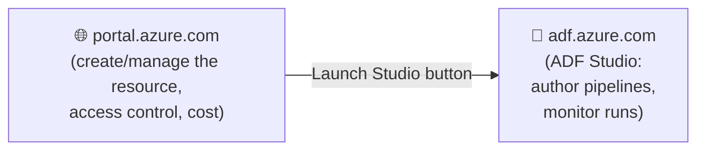

[⬅️ Back to Index](00-README.md) · Page 3 of 10

# 🚀 03. Getting Started — Create Your First ADF Instance

Time to leave theory behind. In this page you'll create a real Azure Data Factory resource in the Azure Portal.

## ✅ Before you start

- [ ] An Azure subscription ([free trial works fine](https://azure.microsoft.com/free/))
- [ ] Permission to create resources (Owner/Contributor role on a resource group)
- [ ] 10 minutes

## 🛠️ Step 1 — Sign in to the Azure Portal

Go to [portal.azure.com](https://portal.azure.com) and sign in.

📸 *Screenshot: The Azure Portal home screen with the search bar at the top*

## 🛠️ Step 2 — Search for "Data Factory"

Type **"Data factories"** into the top search bar and select it from the results.

📸 *Screenshot: Search results dropdown showing "Data factories" service under Services*

## 🛠️ Step 3 — Click "Create"

You'll land on the Data Factories overview blade. Click **+ Create**.

## 🛠️ Step 4 — Fill in the Basics tab

| Field | What to enter | Why |
|---|---|---|
| **Subscription** | Your Azure subscription | Billing scope |
| **Resource group** | Create new, e.g. `rg-adf-learning` | Groups related resources so you can delete everything at once later |
| **Region** | Pick one close to you, e.g. `East US` | Affects latency and where metadata is stored |
| **Name** | Must be globally unique, e.g. `adf-yourname-demo01` | This becomes part of your factory's URL |
| **Version** | V2 (V1 is legacy — always pick V2) | V2 is the current, actively developed version |

📸 *Screenshot: "Create Data Factory" blade — Basics tab with Subscription, Resource group, Region, Name, and Version fields filled in*

⚠️ **Common mistake:** Forgetting the name must be globally unique across *all* of Azure — if `adf-demo` is taken, try `adf-demo-yourinitials`.

## 🛠️ Step 5 — Git configuration tab (optional for now)

You can skip this during initial setup and configure Git later — we'll cover this properly in [Page 9: CI/CD & Git Integration](09-cicd-git-integration.md). For now, select **"Configure Git later."**

## 🛠️ Step 6 — Networking tab

Leave default (**Public endpoint**) unless your organization requires a Managed Virtual Network or Private Endpoint. Beginners: leave as-is.

## 🛠️ Step 7 — Review + Create

Click **Review + create**, wait for validation to pass ✅, then click **Create**.

📸 *Screenshot: "Validation passed" screen with the Create button, followed by the deployment progress screen ("Deployment is in progress")*

Deployment typically takes 1–2 minutes.

## 🛠️ Step 8 — Open ADF Studio

Once deployment completes, click **Go to resource**, then click the big **"Launch Studio"** / **"Open Azure Data Factory Studio"** button.

📸 *Screenshot: The Data Factory resource overview page in the Azure Portal, showing the "Open Azure Data Factory Studio" tile*

This opens **ADF Studio** — a separate web app (at `adf.azure.com`) that's the actual authoring environment. The Azure Portal page you were just on is only for managing the *resource itself* (billing, access control, networking) — all pipeline building happens in Studio.

## 🗺️ A tour of ADF Studio

When Studio opens, you'll see a left-hand navigation rail with these icons:

📸 *Screenshot: ADF Studio's left sidebar showing the five main icons: Home, Author (pencil), Monitor (speedometer), Manage (toolbox), Learning center*

| Icon | Name | What it's for |
|---|---|---|
| 🏠 | **Home** | Quick links: New pipeline, ingest wizard, templates |
| ✏️ | **Author** | Build pipelines, datasets, and data flows (this is where you'll spend most of your time) |
| 📊 | **Monitor** | View pipeline run history, success/failure, duration |
| 🧰 | **Manage** | Linked services, Integration runtimes, Triggers, Git config, Access control |
| 🎓 | **Learning center** | Built-in tutorials and templates |

## 🎯 Recap

- ADF resources are created in the **Azure Portal**, but you author pipelines in the separate **ADF Studio** web app
- Always use **V2**
- Git configuration can be deferred until you're ready (Page 9)
- The five Studio icons — Home, Author, Monitor, Manage, Learning center — map directly to the concepts from Page 2

---

⬅️ [Previous: Core Components](02-core-components.md) | ⬆️ [Index](00-README.md) | ➡️ Next: [04. Build Your First Pipeline](04-build-first-pipeline.md)
