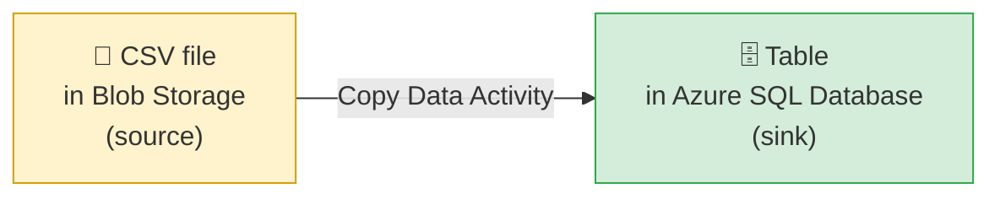
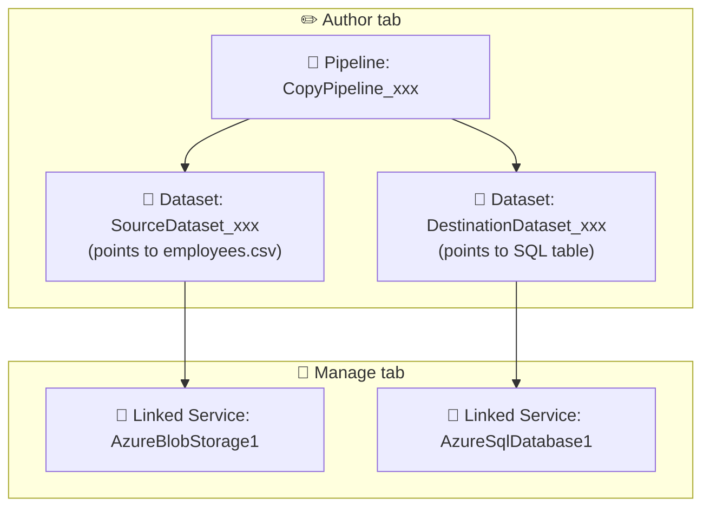

[⬅️ Back to Index](00-README.md) · Page 4 of 10

# 🛠️ 04. Build Your First Pipeline — Copy Data from Blob Storage to SQL

We're going to build the "Hello World" of ADF: **copy a CSV file from Azure Blob Storage into an Azure SQL Database table.**

## 🎯 What we're building

## ✅ Prerequisites

- [ ] An ADF instance (Page 3)
- [ ] An Azure Storage account with a container containing a sample CSV (e.g., `sample-data/employees.csv`)
- [ ] An Azure SQL Database with an empty target table, or permission to auto-create one

> 💡 No storage account yet? In the Portal, search **"Storage accounts" → Create**, then inside it create a **Container**, and upload any CSV with a header row (e.g., `id,name,department,salary`).

## 🛠️ Step 1 — Open the Copy Data tool (the easy way)

ADF gives beginners a guided wizard. In ADF Studio, go to **Home → Ingest** (or the **"Copy Data tool"** shortcut).

📸 *Screenshot: ADF Studio Home page showing the "Ingest" tile alongside "Create pipeline," "Create data flow," and "Configure SSIS integration runtime"*

> 💡 We're using the wizard first because it auto-generates the Linked Services, Datasets, and Pipeline for you — perfect for seeing how the pieces from Page 2 fit together in real output. After this, we'll also show the manual/canvas way.

## 🛠️ Step 2 — Configure the source

1. Task type: **Built-in copy task**, run **Once now**
2. Source type: **Azure Blob Storage**
3. Click **+ New connection**, fill in your Storage account name and authentication (Account key is simplest for learning)

📸 *Screenshot: "New connection (Azure Blob Storage)" panel with fields for Name, Authentication method (Account key/SAS/Managed Identity), Storage account selection*

4. Browse to your container/file (e.g., `sample-data/employees.csv`)
5. Preview the data to confirm ADF is reading it correctly

📸 *Screenshot: File format settings panel with a live data preview table showing the CSV's columns and rows*

## 🛠️ Step 3 — Configure the destination (sink)

1. Destination type: **Azure SQL Database**
2. **+ New connection**, provide server name, database, and SQL authentication
3. Choose **"Auto create table"** or map to an existing table
4. Review the **column mapping** — ADF tries to auto-match source columns to destination columns by name; adjust manually if needed

📸 *Screenshot: Column mapping grid showing source column names on the left mapped with arrows to destination column names and data types on the right*

## 🛠️ Step 4 — Settings and review

- Leave fault tolerance and performance settings at default for now
- Review the summary screen — this shows exactly which Linked Services and Datasets will be created

📸 *Screenshot: Summary screen listing "Source: AzureBlobStorage1," "Destination: AzureSqlDatabase1," and the generated pipeline name before clicking Next/Finish*

## 🛠️ Step 5 — Run it!

Click **Next**, then the wizard deploys and triggers the pipeline immediately. You'll land on a deployment progress screen.

📸 *Screenshot: "Deployment complete" screen with a green checkmark and a link to "Monitor" the run*

## 🛠️ Step 6 — Verify the result

Click through to **Monitor**. You should see a pipeline run with status **Succeeded** ✅, and you can click into it to see rows read/written, duration, and throughput.

📸 *Screenshot: Monitor → Pipeline runs list, showing one row with a green "Succeeded" status badge, duration, and "Rows read / Rows written" counts*

Then check your SQL table — the data should be there.

## 🔍 What actually got created

Go to the **Author** tab. You'll now see, generated automatically by the wizard:

Click into the pipeline canvas — you'll see a single **Copy data** activity box. Click it, and look at its tabs:

📸 *Screenshot: Pipeline canvas with one "Copy data" activity box selected, and its configuration panel below showing tabs: General, Source, Sink, Mapping, Settings, User properties*

| Tab | What it configures |
|---|---|
| **General** | Activity name, timeout, retry count |
| **Source** | Which dataset, any query/filter |
| **Sink** | Destination dataset, write behavior (insert/upsert) |
| **Mapping** | Column-to-column mapping (same as the wizard step) |
| **Settings** | Fault tolerance, degree of copy parallelism, data integration units |

## 🛠️ Bonus: build the same pipeline manually (the "real" way)

The wizard is great for learning, but in practice you'll often build pipelines from a blank canvas:

1. **Author → Pipelines → New pipeline**
2. Drag a **Copy data** activity from the Activities pane onto the canvas
3. On the **Source** tab, click **+ New** to create/select a dataset
4. On the **Sink** tab, do the same for the destination
5. Click **Debug** (▶️) to test-run without publishing
6. Click **Publish all** to save your changes permanently to the factory

📸 *Screenshot: Empty pipeline canvas with the Activities pane on the left (search box + categorized activity list) and the top toolbar showing Validate, Debug, Add trigger, and Publish all buttons*

⚠️ **Common mistake:** Clicking **Debug** runs the pipeline for testing but does **not** save it. You must click **Publish all** to persist your work — many beginners lose changes by closing the browser before publishing.

## 🎯 Recap

- The **Ingest wizard** is the fastest way to learn, since it builds all four artifact types (Linked Service ×2, Dataset ×2, Pipeline) for you
- A **Copy data** activity has 5 key tabs: General, Source, Sink, Mapping, Settings
- **Debug** = test run (not saved) · **Publish all** = permanently save your work
- Always check the **Monitor** tab after a run to confirm success and see row counts

---

⬅️ [Previous: Getting Started](03-getting-started.md) | ⬆️ [Index](00-README.md) | ➡️ Next: [05. Data Flows](05-data-flows.md)
