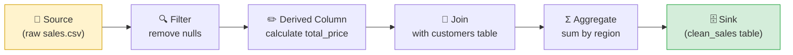
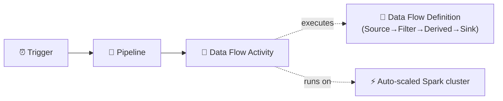

[⬅️ Back to Index](00-README.md) · Page 5 of 10

# 🔀 05. Data Flows — Transforming Data Without Code

Copying data is step one. Usually you also need to **clean, filter, join, or reshape** it. That's what **Mapping Data Flows** are for.

## 💡 What is a Data Flow?

A visual, drag-and-drop canvas for building transformation logic. Under the hood, ADF translates your visual design into a **Spark job** and runs it on a scaled-out cluster — but you never have to write Spark code yourself.

> 💡 Analogy: if the Copy activity is a delivery truck (moves boxes from A to B), a Data Flow is the factory floor where boxes get opened, sorted, relabeled, and repacked before shipping.



## 🧩 Common transformation blocks

| Icon | Transformation | What it does |
|---|---|---|
| 📄 | **Source** | Where the data flow reads from |
| 🔍 | **Filter** | Keep only rows matching a condition |
| ✏️ | **Derived Column** | Add/modify a column with an expression |
| 🔗 | **Join** | Combine two data streams on a key |
| Σ | **Aggregate** | Group by + sum/count/avg |
| 🔀 | **Conditional Split** | Route rows to different branches based on a condition |
| 🔎 | **Lookup** | Enrich rows with data from another source |
| 🧹 | **Select** | Rename or drop columns |
| ↕️ | **Sort** | Order rows |
| 🎯 | **Sink** | Where the data flow writes to |

## 🛠️ Step-by-step: build a simple Data Flow

### Step 1 — Create a new Data Flow

**Author → Data flows → New data flow**

📸 *Screenshot: Data Flow canvas — an empty gray grid with a large "+" Add Source box in the center and the transformation palette icon in the top-right toolbar*

### Step 2 — Add a Source

Click **Add Source**, name it, and point it to a dataset (e.g., the `employees.csv` dataset from Page 4).

Turn on **Data flow debug** (top toggle) so you can see a live data preview as you build — this spins up a temporary Spark cluster (takes ~5–7 minutes to warm up, so start it early).

📸 *Screenshot: Top toolbar showing the "Data flow debug" toggle switch (off/on) with a cluster status indicator once it's warming up*

### Step 3 — Add a Filter transformation

Click the **+** icon on the bottom-right of the Source box → **Filter**. Write an expression like:

```
salary > 50000
```

📸 *Screenshot: Filter transformation configuration panel with an expression builder text box and a "Data preview" tab at the bottom showing rows that pass/fail the filter*

### Step 4 — Add a Derived Column

Click **+** → **Derived Column**. Create a new column, e.g.:

```
annual_bonus = salary * 0.1
```

### Step 5 — Add a Sink

Click **+** → **Sink**. Point it to a destination dataset (a new SQL table, e.g. `employees_with_bonus`).

📸 *Screenshot: Full data flow canvas showing four connected boxes left-to-right: Source → Filter → Derived Column → Sink, each with a small icon and name label*

### Step 6 — Use it inside a Pipeline

A Data Flow can't run standalone — it must be called by a **Data Flow activity** inside a pipeline.

1. **Author → Pipelines → New pipeline**
2. Drag a **Data flow** activity onto the canvas
3. On its **Settings** tab, select the data flow you just built
4. **Debug** to test, then **Publish all**



## 🆚 Data Flow vs. Copy Activity — when to use which?

| Scenario | Use |
|---|---|
| Just moving data, no changes needed | 🚚 Copy Activity |
| Filtering, joining, aggregating, pivoting | 🔀 Data Flow |
| Need row-level custom logic + very complex transforms | 🧪 Databricks Notebook activity instead |
| Format conversion only (CSV → Parquet) | 🚚 Copy Activity (has built-in format conversion) |

## 💰 A note on cost

Data Flows run on Spark clusters, which are billed by the vCore-hour while active. For learning, **turn off Data Flow debug** when you're done working, and consider setting a **Time to live (TTL)** on the debug cluster so it doesn't stay warm (and billing) unnecessarily.

⚠️ **Common mistake:** Leaving Data Flow debug mode on overnight — it keeps a cluster running and billing until it's manually turned off or times out.

## 🎯 Recap

- **Data Flows** = visual transformation logic, executed as Spark under the hood
- Built from chained transformation blocks: Source → (Filter/Join/Derived Column/Aggregate/...) → Sink
- Must be invoked by a **Data Flow activity** inside a pipeline — they don't run on their own
- Use Copy Activity for pure movement; use Data Flows when you need real transformation logic

---

⬅️ [Previous: Build Your First Pipeline](04-build-first-pipeline.md) | ⬆️ [Index](00-README.md) | ➡️ Next: [06. Triggers & Scheduling](06-triggers-scheduling.md)
