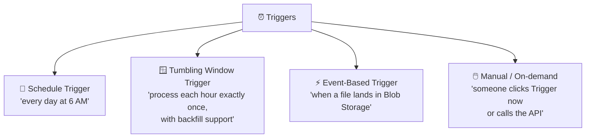
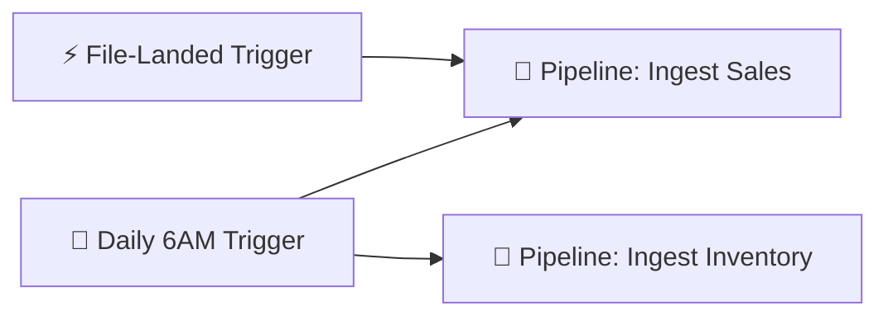
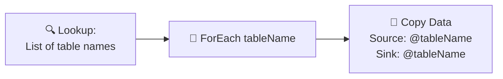

[⬅️ Back to Index](00-README.md) · Page 6 of 10

# ⏰ 06. Triggers & Scheduling — Making Pipelines Run Automatically

So far you've clicked "Debug" or "Trigger now" manually. In real life, pipelines need to run **by themselves**, on a schedule or in response to an event.

## 🗂️ The four trigger types



### 📅 Schedule Trigger

The simplest and most common. Fires on a recurring wall-clock schedule.

- "Every day at 06:00 AM UTC"
- "Every Monday at 09:00"
- "Every 15 minutes"

📸 *Screenshot: New Trigger panel with Type = "Schedule," Start date, Time zone dropdown, Recurrence (e.g., "Every 1 Day"), and Advanced recurrence options*

**When to use:** Most day-to-day batch jobs — nightly loads, weekly reports.

### 🪟 Tumbling Window Trigger

Like a schedule trigger, but with superpowers for **time-series processing**:

- Each window is a fixed, **non-overlapping** slice of time (e.g., hourly)
- Built-in **dependency chaining** between windows (window 2 won't start until window 1 succeeds, if configured)
- Built-in **retry** and **backfill** — if you add this trigger after the fact, it can automatically "catch up" on past windows

```mermaid
gantt
    dateFormat  HH:mm
    title Tumbling Window: Hourly Processing
    section Windows
    Window 00:00-01:00 (done)   :done, w1, 00:00, 1h
    Window 01:00-02:00 (done)   :done, w2, 01:00, 1h
    Window 02:00-03:00 (running):active, w3, 02:00, 1h
    Window 03:00-04:00 (waiting):w4, 03:00, 1h
```

**When to use:** IoT/telemetry pipelines, financial data reconciliation, anything where "exactly once, in order, per time slice" matters and you need automatic backfill.

### ⚡ Event-Based Trigger

Fires in near real-time in response to a **Blob Storage event** — a file being created or deleted.

📸 *Screenshot: New Trigger panel with Type = "Event," Storage account picker, Container/Blob path filter (e.g., `/incoming/{*}.csv`), and Event checkboxes for "Blob created" / "Blob deleted"*

**When to use:** "As soon as a vendor drops today's file into our Data Lake, kick off ingestion" — no polling, no fixed schedule needed.

### 🖱️ Manual / On-demand

Triggered by a person clicking **Trigger now** in Studio, or programmatically via REST API, PowerShell, or the Azure CLI/SDK. Useful for ad-hoc runs, testing, or kicking off pipelines from external systems (like an Azure Function or Logic App).

## 🛠️ Step-by-step: attach a Schedule Trigger to a pipeline

1. Open your pipeline in **Author**
2. Click **Add trigger** (top toolbar) → **New/Edit**
3. Click **+ New**
4. Set Type = **Schedule**, Recurrence = **Every 1 Day**, Start time = tomorrow at 06:00
5. Click **OK**, then **Publish all** (triggers only take effect once published!)

📸 *Screenshot: "Add trigger" dropdown menu showing options "New/Edit" and "Trigger now," followed by the trigger configuration dialog*

⚠️ **Common mistake:** Creating a trigger but forgetting to **Publish all** — an unpublished trigger will never actually fire.

## 🔗 One trigger, multiple pipelines

A single trigger can kick off several pipelines at once, and one pipeline can have multiple triggers attached.



## 🧮 Parameterizing pipelines for reuse

Instead of building 10 nearly-identical pipelines (one per source table), you can build **one parameterized pipeline** and pass different values in via the trigger or a `ForEach` loop.



This is one of the biggest "aha" moments for ADF beginners — parameters + ForEach let a handful of pipelines handle hundreds of tables.

## 🎯 Recap

| Trigger | Best for |
|---|---|
| 📅 Schedule | Regular, calendar-based jobs |
| 🪟 Tumbling Window | Time-series data needing backfill & strict ordering |
| ⚡ Event | React instantly to new/deleted files |
| 🖱️ Manual | Ad-hoc runs, testing, external orchestration |

- Triggers must be **published** to take effect
- Parameters + ForEach = reusable pipelines instead of copy-pasted duplicates

---

⬅️ [Previous: Data Flows](05-data-flows.md) | ⬆️ [Index](00-README.md) | ➡️ Next: [07. Integration Runtime Deep Dive](07-integration-runtime.md)
