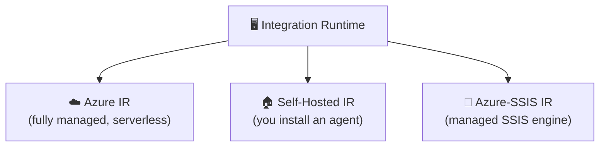
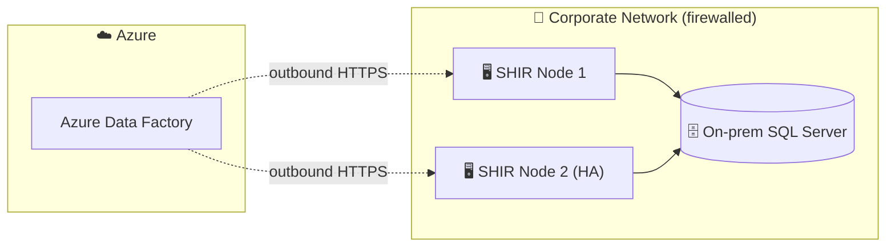
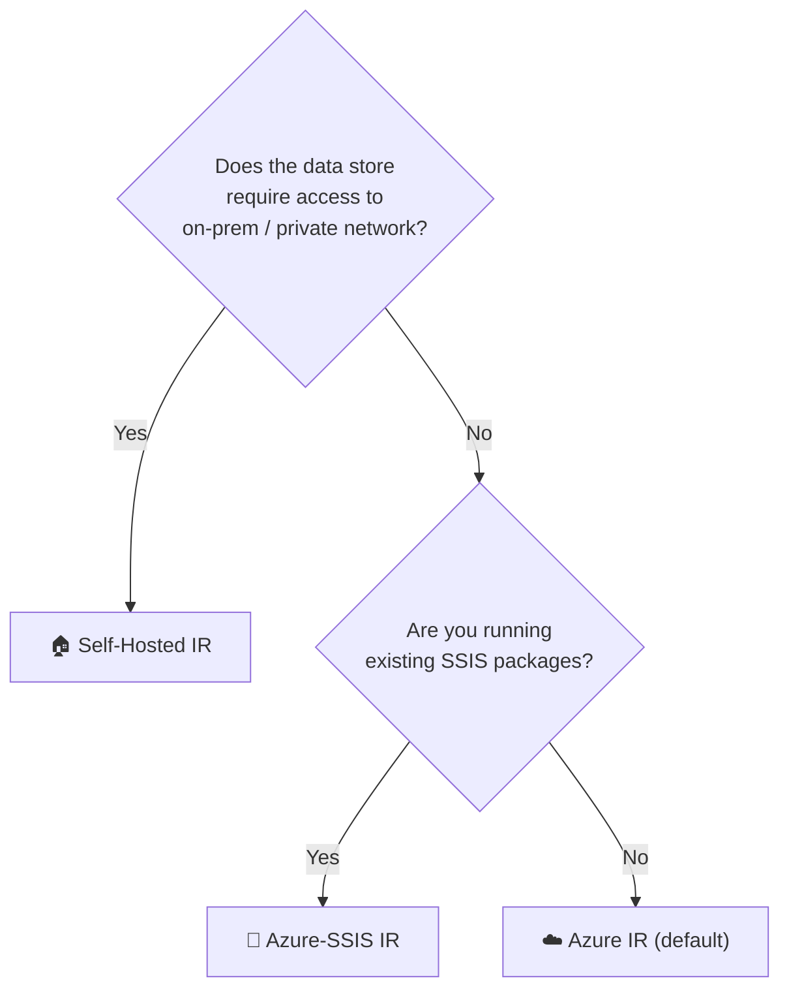

[⬅️ Back to Index](00-README.md) · Page 7 of 10

# 🖥️ 07. Integration Runtime Deep Dive

We previewed this on Page 2 — now let's go deeper, because **choosing the right Integration Runtime (IR)** is one of the most common real-world design decisions in ADF.

## 💡 What is an Integration Runtime, really?

The IR is the **compute infrastructure** ADF uses to actually execute activities: connecting to data stores, moving data, running Data Flow Spark jobs, or dispatching SSIS packages. The pipeline definition is just metadata — the IR is the muscle.

> 💡 Analogy: the pipeline is the recipe; the Integration Runtime is the kitchen and the chef actually cooking it.

## 🗂️ The three types

### ☁️ Azure Integration Runtime

- Fully managed by Microsoft — no installation, auto-scales
- Used for **cloud-to-cloud** data movement and **Data Flow** execution
- You can choose a **region** and a **compute size** (for Data Flows: Core count and compute type — General Purpose, Memory Optimized, Compute Optimized)

📸 *Screenshot: Manage → Integration runtimes → AutoResolveIntegrationRuntime details panel showing Type = Azure, Region = Auto Resolve*

### 🏠 Self-Hosted Integration Runtime (SHIR)

- A lightweight agent (a Windows/Linux service) **you install** on a machine that has network access to your on-premises or private-network data
- Needed whenever ADF must reach data that isn't reachable from the public internet — an on-prem SQL Server, a database behind a firewall, a private VNet resource
- Can be scaled out across multiple machines for high availability and throughput (a "node cluster")

**🛠️ Setup overview:**
1. In ADF Studio: **Manage → Integration runtimes → New → Self-Hosted**
2. Name it, then copy one of the two **authentication keys** shown
3. Download and install the Self-Hosted IR software on your on-prem machine
4. Paste the key during installation to register the node
5. Status flips to **"Running"** once connected

📸 *Screenshot: New Integration Runtime wizard on the "Self-Hosted" setup step, showing Authentication Key 1/Key 2 with a "Copy" button and a link to download the Microsoft Integration Runtime installer*

⚠️ **Common mistake:** Installing the SHIR on a machine with unreliable uptime (like someone's personal laptop). It should live on a server/VM that's always on — if the node goes offline, every pipeline that depends on it fails.

### 🧰 Azure-SSIS Integration Runtime

- Purpose-built to **lift-and-shift existing SSIS packages** into Azure without rewriting them
- Spins up a dedicated VM cluster (billed while running — many teams start/stop it on a schedule to save cost)
- Runs `.dtsx` packages stored in the SSIS Catalog (SSISDB) hosted in Azure SQL Database/Managed Instance

**When to use:** You have years of existing SSIS investment and want cloud scalability without a full rebuild.

## 🧭 Decision guide

## 💰 Cost notes

| IR type | Billing model |
|---|---|
| ☁️ Azure IR | Pay-per-use — billed for actual data movement (DIU-hours) or Data Flow (vCore-hours) |
| 🏠 Self-Hosted IR | The IR itself is free — you pay for the VM/machine it runs on |
| 🧰 Azure-SSIS IR | Billed hourly while the node cluster is running, regardless of whether jobs are executing — **stop it when idle** |

## 🎯 Recap

- The IR is the compute that actually executes your pipeline's work
- **Azure IR** = default, serverless, cloud-to-cloud
- **Self-Hosted IR** = your own agent, required for on-prem/private data
- **Azure-SSIS IR** = managed engine for existing SSIS packages
- Match the IR to where your data lives — this is a very common interview and design question

---

⬅️ [Previous: Triggers & Scheduling](06-triggers-scheduling.md) | ⬆️ [Index](00-README.md) | ➡️ Next: [08. Monitoring & Troubleshooting](08-monitoring.md)
