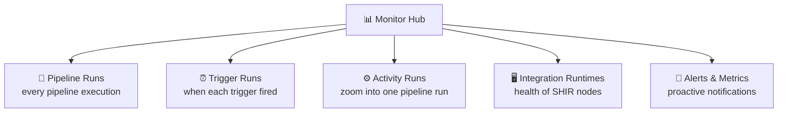
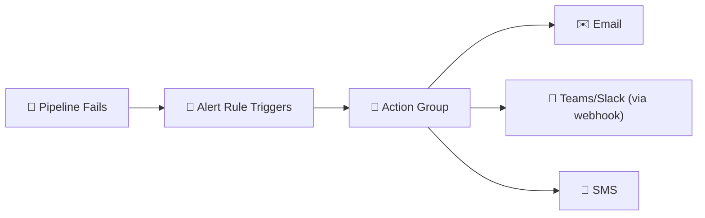
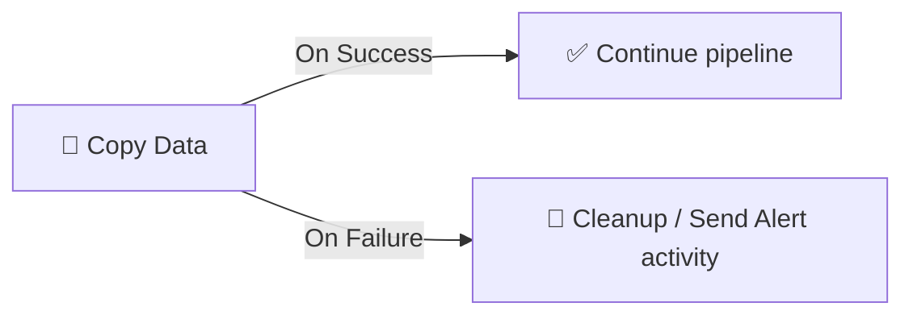

[⬅️ Back to Index](00-README.md) · Page 8 of 10

# 📊 08. Monitoring & Troubleshooting

Building a pipeline is half the job — the other half is knowing **when it breaks and why**. This is the "control room" from our factory analogy.

## 🗺️ The Monitor tab

Open ADF Studio → **Monitor** (speedometer icon). You'll find several views:

📸 *Screenshot: Monitor → Pipeline runs table with columns: Pipeline name, Run start, Duration, Status (colored badge), Triggered by*

## 🚦 Reading run status

| Status | Meaning |
|---|---|
| 🟢 **Succeeded** | All activities completed successfully |
| 🔴 **Failed** | At least one activity failed (and wasn't caught by error handling) |
| 🟡 **In Progress** | Still running |
| ⚪ **Cancelled** | Manually stopped |
| 🟠 **Queued** | Waiting for available Integration Runtime capacity |

## 🛠️ Debugging a failed pipeline run — step by step

### Step 1 — Click into the failed run

From the Pipeline runs list, click the pipeline name (not the status badge) to see the activity-level graph.

📸 *Screenshot: Pipeline run detail view — a Gantt-style graph of activities with the failed one highlighted in red, and hover tooltips showing duration*

### Step 2 — Read the error message

Click the little "i" (info) or the activity box itself. The **Error** column/panel shows the actual failure — often surprisingly specific.

📸 *Screenshot: Activity run details panel showing Error message text, e.g., "ErrorCode=SqlOperationFailed...Login failed for user..."*

### Step 3 — Check activity-level inputs/outputs

Every activity run has an **Input** and **Output** JSON you can inspect — incredibly useful for seeing exactly what parameters were passed.

📸 *Screenshot: Input/Output tab showing raw JSON of the activity's runtime parameters and results*

## 🔎 Common failure causes (and fixes)

| Symptom | Likely cause | Fix |
|---|---|---|
| 🔑 "Login failed" | Wrong credentials, expired secret, firewall blocking IP | Check Linked Service credentials; add ADF's IP range to firewall allowlist |
| ⏱️ "Timeout" | Long-running query, undersized IR | Increase activity timeout; check Data Flow compute size |
| 📛 "Path not found" | File moved/renamed, wrong container | Verify Dataset path; check upstream process actually wrote the file |
| 🧬 "Schema mismatch" | Source columns changed | Re-import schema in the Dataset/Data Flow, adjust mapping |
| 🔌 "Cannot connect to SHIR" | Self-hosted IR node offline | Check the machine, restart the Integration Runtime service |
| 💸 Data Flow very slow | Cluster too small, "no partitioning" | Increase core count, review partitioning strategy |

## 🔔 Setting up Alerts

Don't wait for someone to notice a red status manually — configure proactive alerts.

1. **Monitor → Alerts & metrics → New alert rule**
2. Choose the metric (e.g., "Failed pipeline runs")
3. Set a threshold and action group (email, SMS, webhook, Teams/Slack via Logic App)

📸 *Screenshot: New alert rule panel with Target criteria (Pipeline name, Failure type), Alert logic (threshold), and Action group selection*

## 🧯 Built-in resiliency features to know

| Feature | What it does |
|---|---|
| 🔁 **Retry policy** (per activity) | Automatically re-attempt N times with a delay before marking failed |
| ⛔ **Timeout** | Kill a stuck activity after a set duration instead of hanging forever |
| 🧩 **Fault tolerance** (Copy activity) | Skip and log incompatible rows instead of failing the whole copy |
| 🌳 **Try/Catch pattern** | Use activity dependency conditions (Upon Failure) to route to cleanup/alert activities |

## 📈 Beyond ADF Studio: Azure Monitor integration

For enterprise scale, pipeline logs and metrics can be sent to **Azure Monitor / Log Analytics**, letting you build custom dashboards, run KQL queries across months of history, and integrate with existing ops tooling — something the Studio's built-in Monitor view (which retains ~45 days by default) isn't designed for long-term.

## 🎯 Recap

- The **Monitor** hub is your control room — Pipeline runs, Trigger runs, and Activity-level detail
- Always check the specific **error message** and **Input/Output JSON** before guessing at a fix
- Build in resiliency: retries, timeouts, fault tolerance, and failure-path activities
- Set up **Alerts** so failures reach a human proactively, not just when someone checks the portal

---

⬅️ [Previous: Integration Runtime](07-integration-runtime.md) | ⬆️ [Index](00-README.md) | ➡️ Next: [09. CI/CD & Git Integration](09-cicd-git-integration.md)
