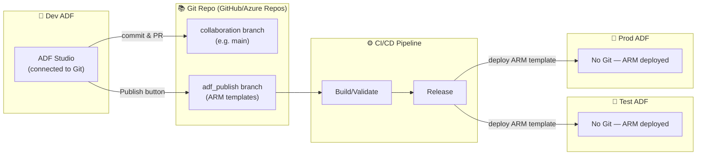
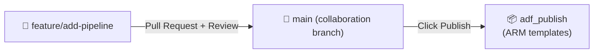
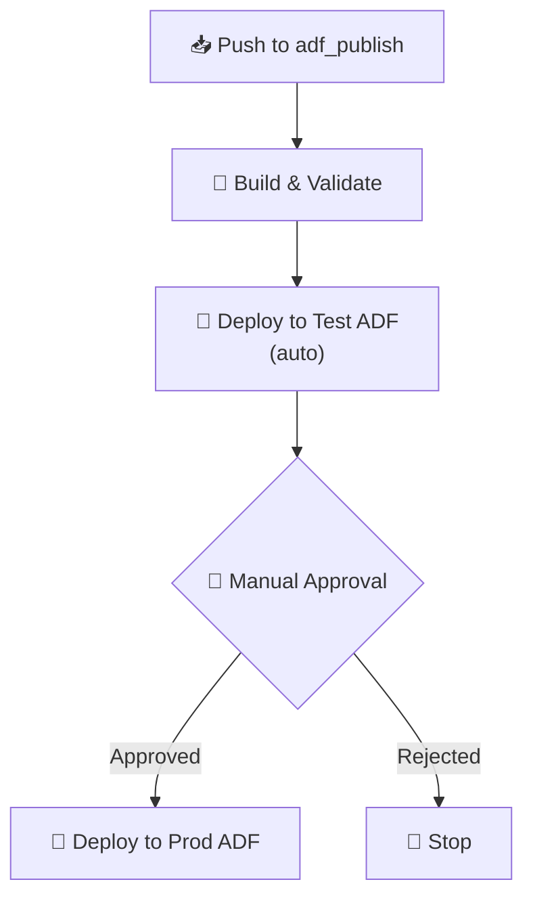

[⬅️ Back to Index](00-README.md) · Page 9 of 10

# 🔁 09. CI/CD & Git Integration — Dev → Test → Prod, Safely

So far we've been editing directly in one ADF instance. In real teams, you need **version control**, **collaboration**, and a **safe path to promote changes** across environments. That's what this page covers.

## 💡 Why Git matters for ADF

Without Git, every change is live immediately, there's no history, no code review, and no easy rollback. With Git:

- ✅ Every change is a commit with history and authorship
- ✅ Multiple developers can work in separate feature branches
- ✅ Pull requests enable code review before changes reach production
- ✅ You get a clean path to promote validated pipelines from Dev → Test → Prod

## 🗺️ The big picture architecture

> 🎯 **Key mental model:** Only your **Dev** factory is connected to Git and used for live authoring. **Test** and **Prod** factories are *not* Git-connected — they receive changes via **ARM template deployment**, driven by a CI/CD pipeline (Azure DevOps or GitHub Actions).

## 🛠️ Step 1 — Connect your Dev factory to Git

**Manage → Git configuration → Configure**

| Field | Example |
|---|---|
| Repository type | GitHub / Azure DevOps Git |
| Git repository | `your-org/adf-pipelines-repo` |
| Collaboration branch | `main` |
| Root folder | `/` |
| Import existing resource | Yes (imports current pipelines into the repo) |

📸 *Screenshot: Git configuration panel with Repository type dropdown, Azure Active Directory/GitHub account selector, Git repository name, and Collaboration branch fields*

## 🌳 How authoring changes once Git is connected

1. Studio now shows a **branch selector** at the top — you work in a **feature branch**, not directly on `main`
2. Changes auto-save to that branch as you work (no more losing work if the browser crashes!)
3. When ready, open a **Pull Request** to merge into the collaboration branch — this is your code review gate
4. Only after merging to the collaboration branch, click **Publish** — this generates/updates ARM templates in the special `adf_publish` branch

📸 *Screenshot: Top toolbar of ADF Studio when Git-connected, showing branch dropdown (e.g. "feature/add-sales-pipeline"), "Pull request" button, and "Publish" button*

⚠️ **Common mistake:** Confusing "merging to main" with "publishing." Merging updates the *source* branch; **Publish** is a separate, explicit action that generates the deployable ARM template. Forgetting to publish means your merged changes never actually deploy anywhere.

## 🛠️ Step 2 — Automate deployment with a CI/CD pipeline

Typical flow using **Azure DevOps Pipelines** or **GitHub Actions**:

1. **Trigger:** A push/merge to the `adf_publish` branch
2. **Build stage:** Validate the ARM template package
3. **Release stage:** Deploy the ARM template to the Test factory using the ADF deployment task (or `az deployment group create`), passing environment-specific parameters (connection strings, etc. via a parameters file or Key Vault)
4. **Approval gate:** A human approves before the same template deploys to Prod
5. **Deploy to Prod**

## 🔑 Handling environment-specific values (parameterization)

You don't want your Prod SQL connection string sitting in Dev's source code. ADF supports **global parameters** and an **ARM template parameters file** so the same template deploys differently per environment:

| Parameter | Dev value | Test value | Prod value |
|---|---|---|---|
| `SqlServerName` | `dev-sql-server` | `test-sql-server` | `prod-sql-server` |
| `StorageAccountName` | `devstorage01` | `teststorage01` | `prodstorage01` |

📸 *Screenshot: Manage → ARM template → Edit parameter configuration, showing the JSON mapping of which properties become deployment parameters*

> 💡 Best practice: store secrets (passwords, keys) in **Azure Key Vault**, and reference them from Linked Services via Key Vault–backed secrets — never hardcode credentials in the pipeline JSON.

## 🎯 Recap

- Only **Dev** is Git-connected; **Test/Prod** receive changes via ARM template deployment
- Flow: feature branch → Pull Request → merge to collaboration branch → **Publish** (generates ARM in `adf_publish`) → CI/CD deploys to Test → approval → deploy to Prod
- Parameterize environment-specific values; keep secrets in Key Vault
- "Merged" ≠ "Published" ≠ "Deployed" — three distinct steps, easy to mix up as a beginner

---

⬅️ [Previous: Monitoring](08-monitoring.md) | ⬆️ [Index](00-README.md) | ➡️ Next: [10. Best Practices & Interview Prep](10-best-practices-interview-prep.md)
