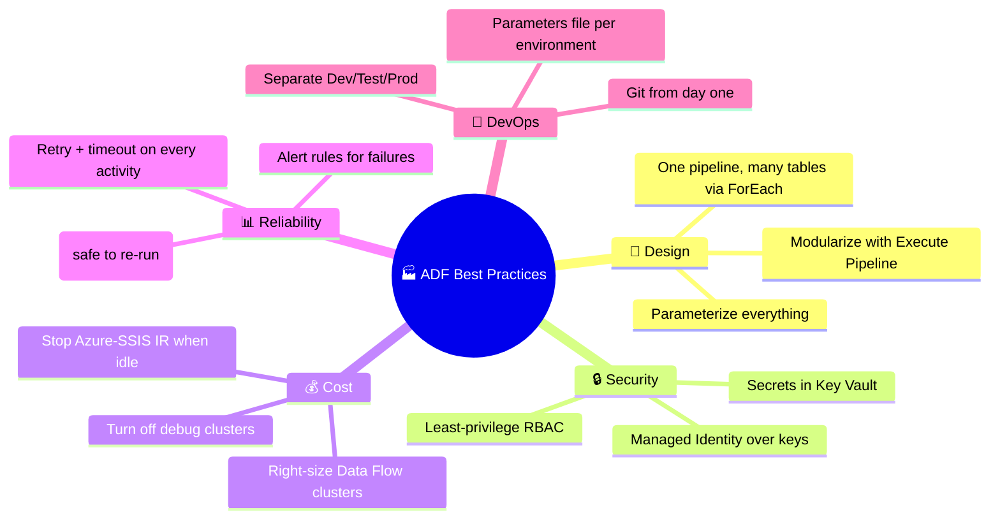

[⬅️ Back to Index](00-README.md) · Page 10 of 10

# 🎯 10. Best Practices & Interview Prep

You've built pipelines, transformed data, scheduled runs, monitored failures, and set up CI/CD. This final page consolidates everything into patterns to reuse — and questions to expect if you're interviewing.

## ✅ Best practices checklist

### 🧱 Design

- **Parameterize** pipelines and datasets instead of hardcoding table/file names — one generic pipeline + a `ForEach` loop beats 50 near-duplicate pipelines
- **Modularize** with the **Execute Pipeline** activity — break large workflows into smaller, reusable, independently testable pipelines
- Keep pipelines **idempotent** — running the same pipeline twice for the same input shouldn't create duplicate data (use upsert/merge logic, not blind insert)

### 🔒 Security

- Prefer **Managed Identity** authentication over storing account keys/passwords wherever the connector supports it
- Store secrets in **Azure Key Vault**; reference them from Linked Services
- Apply **least-privilege RBAC** — grant only the roles a service/person actually needs (e.g., `Data Factory Contributor` vs `Owner`)
- Use **Private Endpoints** / Managed VNet for pipelines touching sensitive data, so traffic never crosses the public internet

### 💰 Cost control

- Right-size **Data Flow** compute (don't default to the largest cluster "just in case")
- Turn off **Data Flow debug mode** when not actively developing
- Schedule **Azure-SSIS IR** to start/stop automatically instead of running 24/7
- Use **Copy Activity** instead of Data Flow when no real transformation is needed (cheaper, faster)

### 📊 Reliability

- Set a sensible **retry count + interval** on activities prone to transient failures (network calls, API calls)
- Set explicit **timeouts** so a stuck activity doesn't silently hang for hours
- Build **failure-path activities** (alerting, cleanup) using "Upon Failure" dependency conditions
- Configure **Alert rules** so failures reach a human, not just a dashboard nobody's watching

### 🔁 DevOps

- Connect to **Git from day one**, even for small projects — free version history and rollback
- Keep **Dev/Test/Prod** as separate ADF instances, promoted via ARM template CI/CD, not manual copy-paste
- Use a **parameters file** so the same ARM template deploys correctly to each environment

---

## 💼 Common interview questions & concise answers

**Q1: What's the difference between a Linked Service and a Dataset?**
> A Linked Service defines the *connection* (endpoint + credentials) to a data store. A Dataset points to a *specific* piece of data within that store (a table, file, or folder).

**Q2: What's the difference between the Copy activity and a Mapping Data Flow?**
> Copy activity moves data with minimal/no transformation and runs on the Integration Runtime directly. Data Flows perform actual transformation logic (joins, aggregations, filters) and execute as Spark jobs on a scaled cluster.

**Q3: What is a Self-Hosted Integration Runtime and when do you need one?**
> An agent you install on a machine with network access to on-premises or private-network data stores. Needed whenever ADF must reach data that isn't publicly reachable from Azure's managed compute.

**Q4: How do you handle secrets in ADF pipelines?**
> Store them in Azure Key Vault and reference them from Linked Services via Key Vault–backed secrets, rather than hardcoding credentials.

**Q5: How does ADF support CI/CD?**
> Dev factory is Git-connected; developers work in feature branches, merge via pull request, then Publish generates ARM templates into the `adf_publish` branch. A CI/CD pipeline (Azure DevOps/GitHub Actions) deploys those ARM templates to Test and Prod with environment-specific parameters.

**Q6: What's a Tumbling Window trigger, and how is it different from a Schedule trigger?**
> Tumbling Window creates fixed, non-overlapping time slices with built-in state tracking, dependency chaining between windows, and automatic backfill/retry — ideal for time-series processing where "exactly once, per interval" matters. A Schedule trigger is simpler and stateless — it just fires at a recurrence, without that windowing/backfill machinery.

**Q7: How would you make a single pipeline copy 50 different tables?**
> Use a Lookup activity (or parameter array) to get the list of table names, feed it into a ForEach activity, and inside the loop use a parameterized Copy activity referencing `@item().tableName` for source/sink.

**Q8: How do you debug a failed pipeline run?**
> Open Monitor → click into the failed run → inspect the failed activity's error message and Input/Output JSON → cross-reference against common causes (auth, timeout, path, schema, connectivity).

**Q9: What is the difference between ADF and Azure Synapse Pipelines / Fabric Data Factory?**
> They share the same underlying pipeline engine. Synapse Pipelines are the same capability bundled inside a Synapse Analytics workspace alongside SQL pools and Spark pools. Microsoft Fabric Data Factory is the newest evolution, unified inside the Fabric platform with additional AI-assisted features.

**Q10: What are Global Parameters used for?**
> Factory-wide parameters (defined once, referenced by any pipeline) — commonly used to hold environment-specific values like environment name or default resource names, and they get overridden per environment during ARM template deployment.

---

## 🗺️ Where to go next

- 🏗️ Build a multi-stage pipeline: Copy → Data Flow → Stored Procedure → Notify
- 🔀 Practice the **ForEach + parameterized Copy** pattern against a set of tables
- 🔁 Set up a real Git-connected Dev factory and walk through a full PR → Publish → deploy cycle
- 📊 Explore **Azure Monitor / Log Analytics** integration for long-term pipeline observability
- 🧪 Try **Wrangling Data Flows** (Power Query–style, spreadsheet-like transformations) as an alternative to Mapping Data Flows
- 📘 Official docs for anything that changes after this guide was written: [learn.microsoft.com/azure/data-factory](https://learn.microsoft.com/en-us/azure/data-factory/)

---

## 🎉 You made it!

You now understand ADF's core building blocks, can build and run a real pipeline, transform data visually, schedule and monitor it, and ship changes safely through Dev/Test/Prod. That's a genuinely solid foundation — the rest is repetition and exposure to new connectors/scenarios.

---

⬅️ [Previous: CI/CD & Git Integration](09-cicd-git-integration.md) | ⬆️ [Back to Index](00-README.md)
