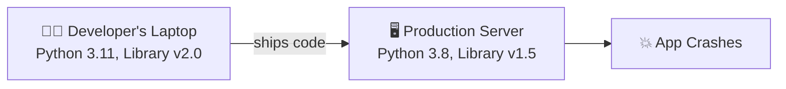
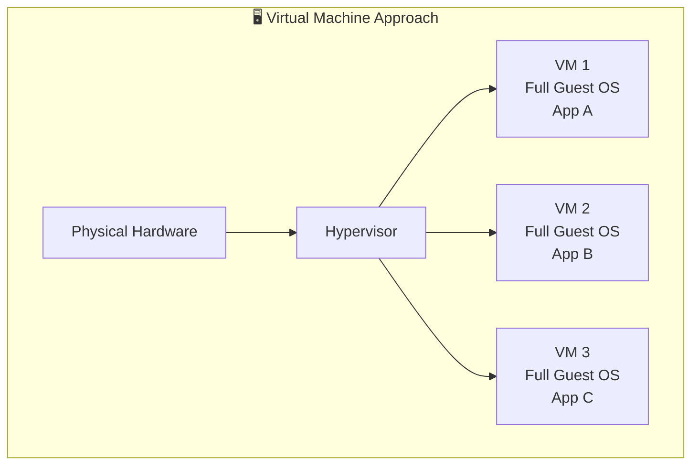
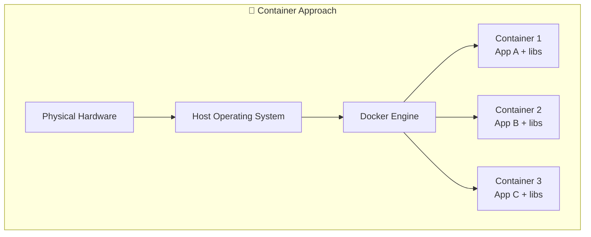
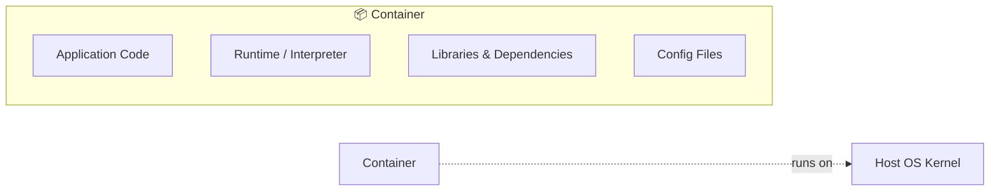
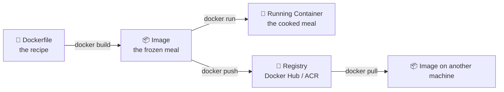

# Chapter 01 — 🌱 Introduction to Containers

> **Goal of this chapter:** Understand *why* containers exist, how they differ from virtual machines, and get Docker installed and running on your machine.

⬅️ [Back to Index](./README.md) | ➡️ Next: [Docker Fundamentals](./02-docker-fundamentals.md)

---

## 🤔 1.1 The Problem: "It works on my machine!"

Every developer has heard (or said) this sentence:

> "But it works on my machine!" 🤷

Here's why that happens:



Your app depends on:
- A specific **language runtime** version (Python, Node, Java...)
- Specific **library/package** versions
- **OS-level** settings and files
- **Environment variables**, config files, secrets

If any of these differ between your laptop, your teammate's laptop, and the production server — things break.

**Containers solve this by packaging the app AND its entire environment together**, so it behaves identically everywhere.

---

## 🏠 1.2 Virtual Machines vs Containers

Before containers, the standard solution was **Virtual Machines (VMs)**.





### 📊 Side-by-side comparison

| Feature | 🖥️ Virtual Machine | 🐳 Container |
|---|---|---|
| **What it virtualizes** | Entire hardware + OS | Just the application layer (shares host OS kernel) |
| **Size** | Gigabytes (has its own OS) | Megabytes (no OS needed) |
| **Boot time** | Minutes | Milliseconds to seconds |
| **Isolation level** | Very strong (separate kernel) | Process-level (shares kernel, but isolated) |
| **Resource usage** | Heavy | Lightweight |
| **Portability** | Less portable | Extremely portable |
| **Analogy** | A whole separate house 🏠 | A separate apartment in the same building 🏢 |

> 💡 **Simple analogy:** A VM is like buying a whole new house for every guest. A container is like giving each guest their own apartment in the same building — they share the building's foundation (OS kernel) but have completely separate, locked living spaces.

---

## 📦 1.3 What Exactly Is a Container?

A **container** is a lightweight, standalone, executable package that includes:

- ✅ Your application code
- ✅ Runtime (e.g., Node.js, Python, Java)
- ✅ System libraries
- ✅ Configuration files
- ✅ Environment variables

...all bundled together, isolated from everything else on the machine.



---

## 🐳 1.4 Where Does Docker Fit In?

**Docker** is the most popular *tool* for creating, running, and managing containers. Think of it this way:

| Concept | Analogy |
|---|---|
| 📄 **Dockerfile** | The *recipe* — instructions to build a dish |
| 📦 **Image** | The *frozen meal* — a ready-to-cook package built from the recipe |
| 🧊 **Container** | The *cooked meal on your plate* — a running instance of the image |
| 🏪 **Registry (Docker Hub)** | The *supermarket* — where you store and get frozen meals |



We'll dive deep into each of these in the next chapters.

---

## 💻 1.5 Installing Docker

### Windows / Mac
1. Download **Docker Desktop**: https://www.docker.com/get-started
2. Run the installer and follow the prompts.
3. Restart your computer if asked.

### Linux (Ubuntu example)
```bash
# Update package list
sudo apt-get update

# Install Docker using the official convenience script
curl -fsSL https://get.docker.com -o get-docker.sh
sudo sh get-docker.sh

# Allow your user to run docker without sudo
sudo usermod -aG docker $USER
newgrp docker
```

### ✅ Verify installation

```bash
docker --version
docker run hello-world
```

If successful, you'll see a friendly message starting with:
```
Hello from Docker!
This message shows that your installation appears to be working correctly.
```

🎉 **Congratulations — you just ran your first container!**

---

## 🧠 1.6 Key Terms Recap

| Term | Meaning |
|---|---|
| **Image** | A read-only template/blueprint for a container |
| **Container** | A running (or stopped) instance of an image |
| **Dockerfile** | Text file with instructions to build an image |
| **Registry** | A place to store and share images (e.g., Docker Hub) |
| **Engine** | The background service that builds/runs containers |

---

## 🎯 Try It Yourself

1. Install Docker Desktop (or Docker Engine on Linux).
2. Run `docker run hello-world` and read the output message carefully — it actually explains the pull → create → run flow!
3. Run `docker version` and `docker info` — explore what information they show.

---

## 🩹 Common Errors

| Error | Cause | Fix |
|---|---|---|
| `Cannot connect to the Docker daemon` | Docker isn't running | Start Docker Desktop / run `sudo systemctl start docker` |
| `permission denied while trying to connect to Docker socket` | User not in `docker` group (Linux) | `sudo usermod -aG docker $USER` then log out/in |
| `docker: command not found` | Docker not installed / not in PATH | Reinstall Docker Desktop, restart terminal |

---

⬅️ [Back to Index](./README.md) | ➡️ Next: [Docker Fundamentals](./02-docker-fundamentals.md)
