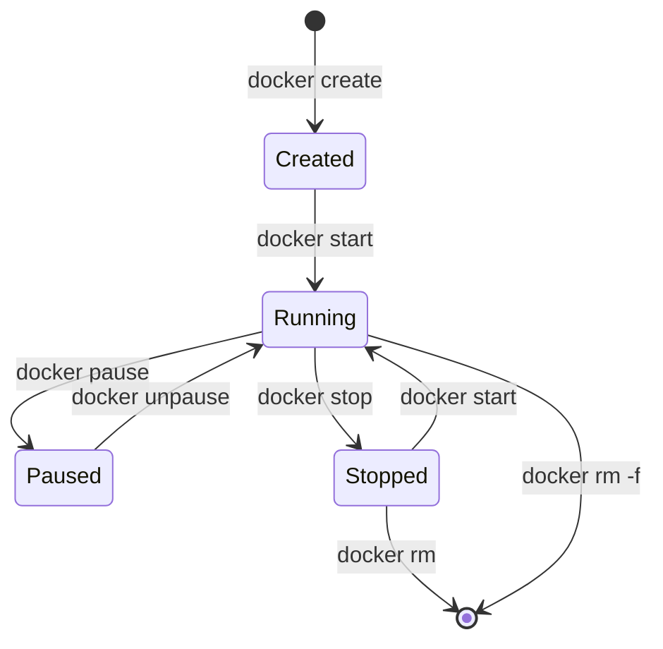
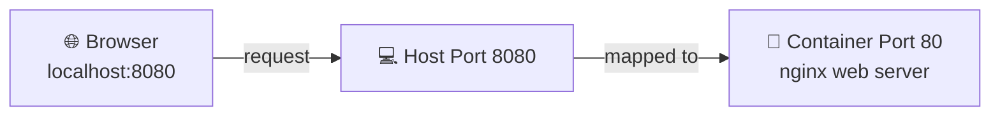
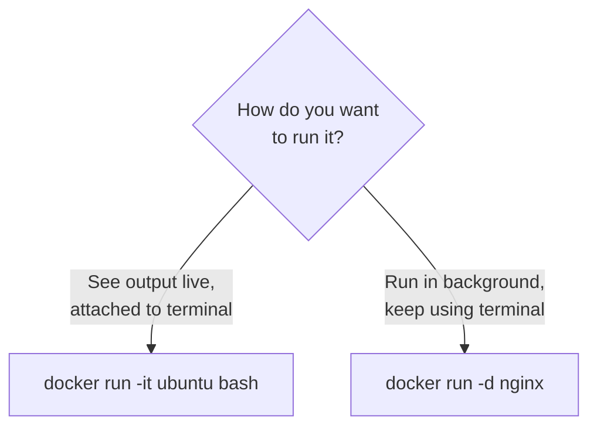
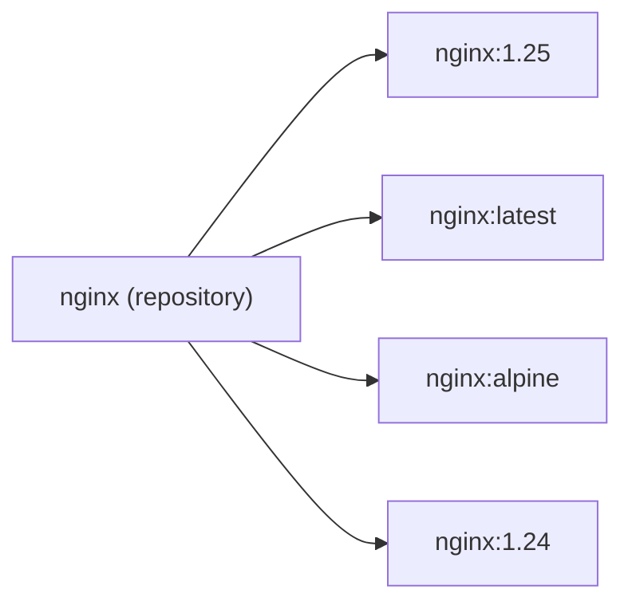

# Chapter 02 — 🐳 Docker Fundamentals

> **Goal of this chapter:** Learn the core Docker commands you'll use every single day, by actually running containers.

⬅️ [Previous: Introduction to Containers](./01-introduction-to-containers.md) | 🏠 [Index](./README.md) | ➡️ Next: [Dockerfiles & Images](./03-dockerfile-and-images.md)

---

## 🔄 2.1 The Docker Container Lifecycle



Every container goes through this lifecycle. Let's practice each stage.

---

## ▶️ 2.2 Running Your First Real Container

```bash
docker run -d -p 8080:80 --name my-nginx nginx
```

Let's break this command down piece by piece:

| Flag | Meaning |
|---|---|
| `docker run` | Create + start a new container |
| `-d` | **Detached** mode — run in background |
| `-p 8080:80` | **Port mapping** — host port 8080 → container port 80 |
| `--name my-nginx` | Give the container a friendly name |
| `nginx` | The image to use (pulled from Docker Hub automatically) |



Now open your browser to `http://localhost:8080` — you'll see the Nginx welcome page! 🎉

---

## 📋 2.3 Essential Commands Cheat Sheet

### 🔍 Inspecting

```bash
# List running containers
docker ps

# List ALL containers (including stopped)
docker ps -a

# List local images
docker images

# See detailed info about a container
docker inspect my-nginx

# View logs
docker logs my-nginx

# Follow logs live (like `tail -f`)
docker logs -f my-nginx
```

### ⏯️ Controlling containers

```bash
# Stop a running container (graceful shutdown)
docker stop my-nginx

# Start a stopped container
docker start my-nginx

# Restart a container
docker restart my-nginx

# Pause / unpause (freezes processes)
docker pause my-nginx
docker unpause my-nginx

# Remove a container (must be stopped, or use -f)
docker rm my-nginx
docker rm -f my-nginx
```

### 🧹 Cleaning up

```bash
# Remove an image
docker rmi nginx

# Remove all stopped containers
docker container prune

# Remove everything unused (containers, images, networks) — careful!
docker system prune -a
```

---

## 🖥️ 2.4 Getting a Shell Inside a Container

This is one of the most useful debugging skills:

```bash
docker exec -it my-nginx bash
```

| Flag | Meaning |
|---|---|
| `exec` | Run a command inside a *running* container |
| `-i` | Interactive (keep STDIN open) |
| `-t` | Allocate a pseudo-terminal (makes it feel like a real shell) |
| `bash` | The command to run (some minimal images use `sh` instead) |

Once inside, you can explore:
```bash
ls /usr/share/nginx/html
cat /etc/os-release
exit   # leave the container shell
```

> 💡 If `bash` isn't available (common in slim images like `alpine`), try `sh` instead.

---

## 🏃 2.5 Interactive vs Detached Mode



```bash
# Interactive: drops you straight into a shell inside a fresh Ubuntu container
docker run -it ubuntu bash

# Detached: runs in the background, returns your terminal immediately
docker run -d nginx
```

---

## 🏷️ 2.6 Image Tags — Choosing Versions

Images can have **tags** — think of them as version labels.

```bash
docker run nginx:1.25       # specific version
docker run nginx:latest     # most recent (default if no tag given)
docker run nginx:alpine     # lightweight Alpine-Linux-based build
```



> ⚠️ **Best practice:** Avoid `:latest` in production. It's unpredictable — pin an exact version so builds are reproducible.

---

## 📊 2.7 Monitoring Resource Usage

```bash
docker stats
```

Shows a live-updating table of CPU %, memory usage, network I/O, per container — like `top`, but for containers.

---

## 🎯 Try It Yourself

1. Run `docker run -d -p 8080:80 --name my-nginx nginx` and visit `http://localhost:8080`.
2. Run `docker exec -it my-nginx bash`, then `cd /usr/share/nginx/html` and `ls`.
3. Edit `index.html` inside the container using `echo "Hello Docker!" > index.html`, refresh your browser.
4. Stop, then start the container again — is your change still there? Why?
5. Remove the container with `docker rm -f my-nginx`.

> 🧠 **Question to ponder:** After step 5, is your change to `index.html` gone forever? (Hint: we'll explain this with **volumes** in Chapter 05!)

---

## 🩹 Common Errors

| Error | Cause | Fix |
|---|---|---|
| `port is already allocated` | Another process/container is using that host port | Use a different host port: `-p 8081:80` |
| `Error: No such container` | Wrong container name/ID, or already removed | Check with `docker ps -a` |
| Container exits immediately | The main process finished (containers stop when their main process stops) | Check `docker logs <name>`; make sure the image runs a long-lived process |

---

⬅️ [Previous: Introduction to Containers](./01-introduction-to-containers.md) | 🏠 [Index](./README.md) | ➡️ Next: [Dockerfiles & Images](./03-dockerfile-and-images.md)
