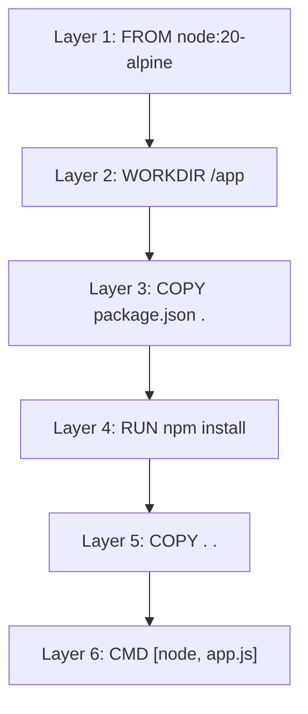
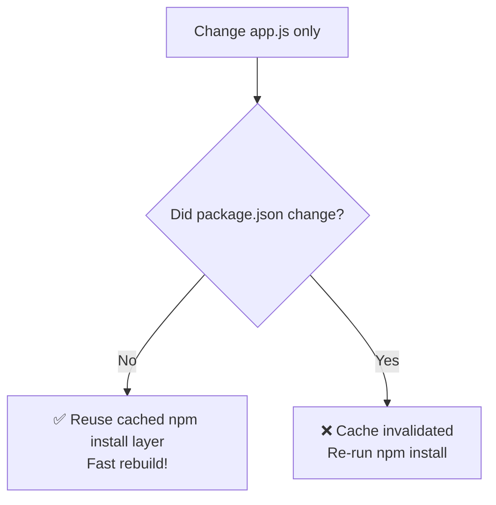
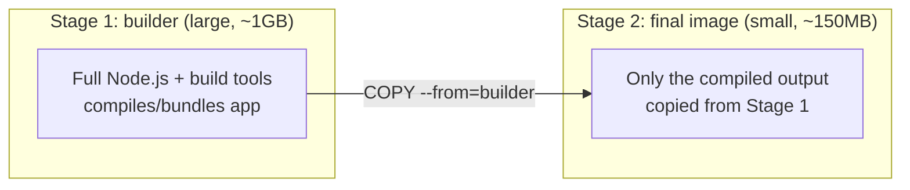

# Chapter 03 — 📄 Dockerfiles & Building Your Own Images

> **Goal of this chapter:** Write your own `Dockerfile` and build a custom image for a real application.

⬅️ [Previous: Docker Fundamentals](./02-docker-fundamentals.md) | 🏠 [Index](./README.md) | ➡️ Next: [Docker Compose](./04-docker-compose.md)

---

## 📄 3.1 What Is a Dockerfile?

A **Dockerfile** is a plain text file containing step-by-step instructions for building an image — like a recipe.


---

## 🍳 3.2 Your First Dockerfile

Let's containerize a simple Node.js app.

**Project structure:**
```
my-app/
├── Dockerfile
├── package.json
└── app.js
```

**`app.js`:**
```javascript
const http = require('http');

const server = http.createServer((req, res) => {
  res.writeHead(200, { 'Content-Type': 'text/plain' });
  res.end('Hello from my containerized app! 🐳\n');
});

server.listen(3000, () => console.log('Server running on port 3000'));
```

**`package.json`:**
```json
{
  "name": "my-app",
  "version": "1.0.0",
  "main": "app.js",
  "scripts": { "start": "node app.js" }
}
```

**`Dockerfile`:**
```dockerfile
# 1️⃣ Start from an official base image
FROM node:20-alpine

# 2️⃣ Set the working directory inside the container
WORKDIR /app

# 3️⃣ Copy dependency files first (for caching benefits — see 3.5)
COPY package.json .

# 4️⃣ Install dependencies
RUN npm install

# 5️⃣ Copy the rest of the application code
COPY . .

# 6️⃣ Document which port the app listens on
EXPOSE 3000

# 7️⃣ The command that runs when the container starts
CMD ["node", "app.js"]
```

---

## 🧱 3.3 Dockerfile Instructions Explained

| Instruction | Purpose | Example |
|---|---|---|
| `FROM` | Base image to build on top of | `FROM node:20-alpine` |
| `WORKDIR` | Sets the working directory for following commands | `WORKDIR /app` |
| `COPY` | Copies files from your machine into the image | `COPY . .` |
| `ADD` | Like `COPY`, but can also fetch URLs/extract archives | `ADD app.tar.gz /app` |
| `RUN` | Executes a command **at build time** (creates a new image layer) | `RUN npm install` |
| `CMD` | Default command **at container start** (can be overridden) | `CMD ["node", "app.js"]` |
| `ENTRYPOINT` | Like `CMD` but harder to override — defines the "main" executable | `ENTRYPOINT ["python"]` |
| `EXPOSE` | Documents the port the app uses (doesn't actually publish it) | `EXPOSE 3000` |
| `ENV` | Sets environment variables | `ENV NODE_ENV=production` |
| `ARG` | Build-time-only variable | `ARG VERSION=1.0` |
| `USER` | Switch to a non-root user (security best practice) | `USER node` |

> 💡 **CMD vs ENTRYPOINT:** Think of `ENTRYPOINT` as the fixed verb and `CMD` as the default arguments. You'll mostly just use `CMD` when starting out.

---

## 🏗️ 3.4 Building and Running Your Image

```bash
# Build the image (the "." means "Dockerfile is in the current directory")
docker build -t my-app:1.0 .

# Run a container from it
docker run -d -p 3000:3000 --name my-app-container my-app:1.0

# Test it
curl http://localhost:3000
```

`-t my-app:1.0` **tags** the image with a name and version.

---

## 🧅 3.5 Understanding Image Layers & Caching

Every instruction in a Dockerfile creates a new **layer**. Docker caches layers to speed up rebuilds.



**Why we `COPY package.json .` *before* `COPY . .`:**

If you change your app code but *not* your dependencies, Docker can **reuse the cached `npm install` layer** instead of re-running it — making rebuilds much faster.



> ⚠️ **Anti-pattern:** If you `COPY . .` before `RUN npm install`, *any* code change invalidates the cache and forces a full reinstall every time.

---

## 🪶 3.6 Multi-Stage Builds (Smaller, Production-Ready Images)

Multi-stage builds let you use one image to *build* your app and a smaller image to *run* it — keeping the final image lean.

```dockerfile
# ---- Stage 1: Build ----
FROM node:20 AS builder
WORKDIR /app
COPY package.json .
RUN npm install
COPY . .
RUN npm run build

# ---- Stage 2: Production ----
FROM node:20-alpine
WORKDIR /app
COPY --from=builder /app/dist ./dist
COPY --from=builder /app/node_modules ./node_modules
CMD ["node", "dist/app.js"]
```



**Result:** Your final image only contains what's needed to *run* the app, not the compilers and dev tools used to *build* it.

---

## 🏷️ 3.7 Tagging & Pushing to Docker Hub

```bash
# Log in
docker login

# Tag the image with your Docker Hub username
docker tag my-app:1.0 yourusername/my-app:1.0

# Push it
docker push yourusername/my-app:1.0

# Anyone can now pull and run it
docker pull yourusername/my-app:1.0
docker run -d -p 3000:3000 yourusername/my-app:1.0
```

---

## 📏 3.8 Dockerfile Best Practices

| ✅ Do | ❌ Avoid |
|---|---|
| Use small base images (`alpine`, `slim`) | Using bulky `ubuntu`/`debian` images unnecessarily |
| Copy dependency files before source code | Copying everything before installing dependencies |
| Use `.dockerignore` to exclude `node_modules`, `.git` | Accidentally including huge irrelevant files |
| Pin specific versions (`node:20.11-alpine`) | Using `latest` in production |
| Combine `RUN` commands with `&&` to reduce layers | Many separate `RUN apt-get install` lines |
| Run as a non-root `USER` | Running everything as root |

**`.dockerignore` example:**
```
node_modules
.git
.env
*.log
Dockerfile
```

---

## 🎯 Try It Yourself

1. Create the `my-app` folder with the 3 files shown above.
2. Build it: `docker build -t my-app:1.0 .`
3. Run it and confirm `curl http://localhost:3000` works.
4. Change the message in `app.js`, rebuild, and notice the `npm install` layer gets **cached** (fast rebuild).
5. Add a `.dockerignore` file excluding `node_modules`.
6. **Bonus:** Convert this into a multi-stage build.

---

## 🩹 Common Errors

| Error | Cause | Fix |
|---|---|---|
| `COPY failed: no such file or directory` | Wrong path, or file excluded by `.dockerignore` | Check paths are relative to the build context |
| Build works but `npm install` reruns every time | `COPY . .` placed before dependency install | Reorder: copy `package.json` first |
| `permission denied` inside container | Running as non-root without proper file ownership | Use `COPY --chown=node:node . .` |
| Image is huge (GBs) | Using a full OS base image, not cleaning build tools | Switch to `alpine`/`slim`, use multi-stage builds |

---

⬅️ [Previous: Docker Fundamentals](./02-docker-fundamentals.md) | 🏠 [Index](./README.md) | ➡️ Next: [Docker Compose](./04-docker-compose.md)
