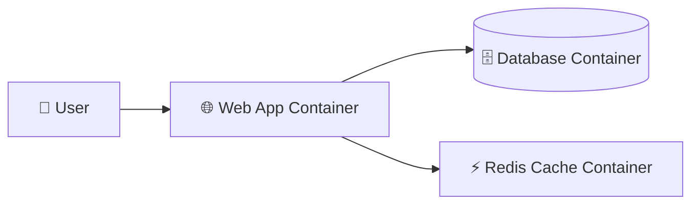
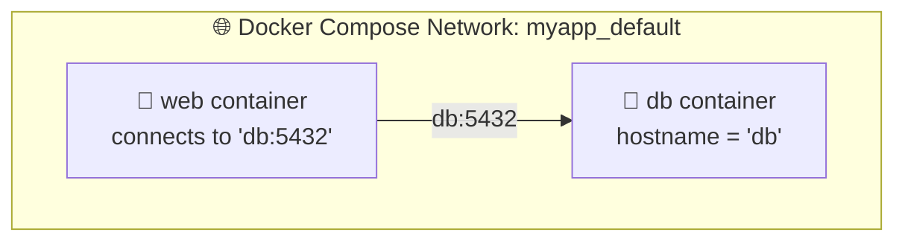
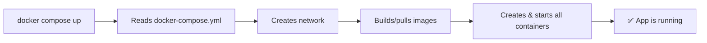

# Chapter 04 — 🧩 Docker Compose (Multi-Container Apps)

> **Goal of this chapter:** Run a full application stack (web app + database) with a single command using Docker Compose.

⬅️ [Previous: Dockerfiles & Images](./03-dockerfile-and-images.md) | 🏠 [Index](./README.md) | ➡️ Next: [Networking & Volumes](./05-docker-networking-volumes.md)

---

## 🤔 4.1 Why Docker Compose?

Real applications rarely consist of just one container. A typical web app needs:



Running these manually means multiple long `docker run` commands, remembering networks, volumes, environment variables... 😵

**Docker Compose** lets you define your **entire multi-container application in one YAML file**, then start everything with:

```bash
docker compose up
```

---

## 📝 4.2 Anatomy of a `docker-compose.yml`

```yaml
version: "3.9"

services:
  web:
    build: .
    ports:
      - "3000:3000"
    environment:
      - DATABASE_URL=postgres://user:pass@db:5432/mydb
    depends_on:
      - db
    volumes:
      - .:/app

  db:
    image: postgres:16-alpine
    environment:
      - POSTGRES_USER=user
      - POSTGRES_PASSWORD=pass
      - POSTGRES_DB=mydb
    volumes:
      - db-data:/var/lib/postgresql/data
    ports:
      - "5432:5432"

volumes:
  db-data:
```

### 🔍 Breaking it down

| Key | Meaning |
|---|---|
| `services:` | Each container you want to run |
| `build: .` | Build from the Dockerfile in this directory |
| `image:` | Use a pre-built image instead of building |
| `ports:` | `"HOST:CONTAINER"` port mapping |
| `environment:` | Environment variables passed into the container |
| `depends_on:` | Start order (does *not* wait for the app inside to be "ready", just for the container to start) |
| `volumes:` | Persist or mount data (covered fully in Chapter 05) |
| `volumes:` (top-level) | Named volumes shared across services |

---

## 🌐 4.3 How Services Talk to Each Other

Compose automatically creates a private network where **each service can reach the others by service name** — like magic DNS!



Notice in the example above, the web service connects to the database using `db:5432` — **not** `localhost:5432`. `db` is simply the *service name* from the YAML file, and Compose's internal DNS resolves it automatically.

---

## ▶️ 4.4 Running It

```bash
# Build (if needed) and start everything, in the foreground
docker compose up

# Start in the background (detached)
docker compose up -d

# View running services
docker compose ps

# View logs from all services
docker compose logs -f

# View logs from just one service
docker compose logs -f web

# Stop everything
docker compose down

# Stop AND remove volumes (⚠️ deletes data!)
docker compose down -v
```



---

## 🔁 4.5 Scaling a Service Locally

```bash
docker compose up -d --scale web=3
```

This spins up **3 replicas** of the `web` service. (Note: for real load-balanced scaling across replicas you generally need a reverse proxy in front, or... Kubernetes — foreshadowing Chapter 06! 😉)

---

## 🧪 4.6 Full Example: Node.js + Redis Counter App

**`app.js`:**
```javascript
const express = require('express');
const redis = require('redis');

const app = express();
const client = redis.createClient({ url: 'redis://cache:6379' });
client.connect();

app.get('/', async (req, res) => {
  const visits = await client.incr('visits');
  res.send(`This page has been visited ${visits} times! 🎉\n`);
});

app.listen(3000, () => console.log('App running on port 3000'));
```

**`Dockerfile`:**
```dockerfile
FROM node:20-alpine
WORKDIR /app
COPY package.json .
RUN npm install
COPY . .
CMD ["node", "app.js"]
```

**`docker-compose.yml`:**
```yaml
version: "3.9"

services:
  web:
    build: .
    ports:
      - "3000:3000"
    depends_on:
      - cache

  cache:
    image: redis:7-alpine
```

```bash
docker compose up -d
curl http://localhost:3000    # "This page has been visited 1 times!"
curl http://localhost:3000    # "This page has been visited 2 times!"
```

🎉 Two containers, working together, started with one command!

---

## 🎯 Try It Yourself

1. Build the Node.js + Redis example above.
2. Run `docker compose up -d`, then refresh `http://localhost:3000` a few times.
3. Run `docker compose logs -f cache` — watch Redis logs in real time.
4. Run `docker compose down` then `docker compose up -d` again — did the visit counter reset? Why?
5. **Bonus:** Add a named volume to persist Redis data across restarts.

---

## 🩹 Common Errors

| Error | Cause | Fix |
|---|---|---|
| `service "db" refers to undefined network` | Typo in `docker-compose.yml` | Validate YAML indentation (YAML is whitespace-sensitive!) |
| App can't connect to `db:5432` | App started before DB was ready | Add retry logic in your app, or use a wait-for script/healthcheck |
| `port is already allocated` | Host port already in use | Change the host-side port, e.g. `"3001:3000"` |
| Changes to code not reflected | No volume mount, or image not rebuilt | Add `volumes: - .:/app` for dev, or `docker compose up --build` |

---

⬅️ [Previous: Dockerfiles & Images](./03-dockerfile-and-images.md) | 🏠 [Index](./README.md) | ➡️ Next: [Networking & Volumes](./05-docker-networking-volumes.md)
