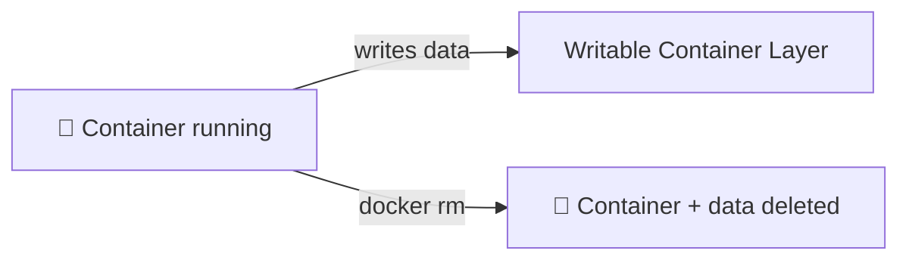
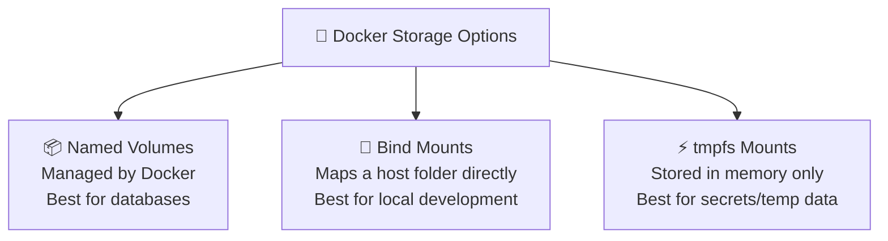
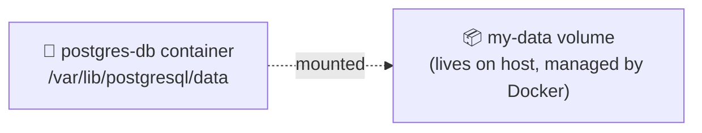
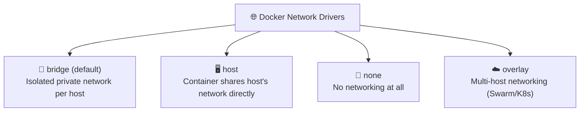
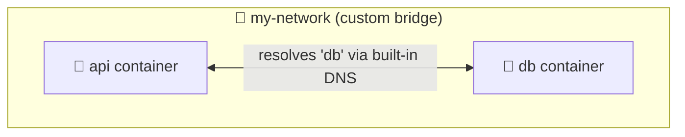
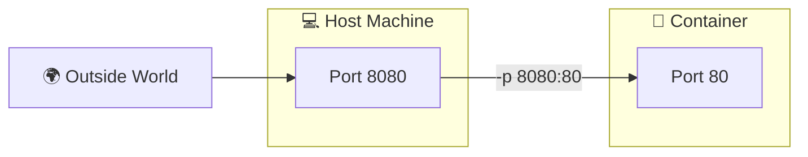

# Chapter 05 — 🌐 Docker Networking & 💾 Volumes

> **Goal of this chapter:** Understand how containers talk to each other and the outside world, and how to persist data beyond a container's lifetime.

⬅️ [Previous: Docker Compose](./04-docker-compose.md) | 🏠 [Index](./README.md) | ➡️ Next: [Kubernetes Introduction](./06-kubernetes-introduction.md)

---

## 💾 Part A — Volumes (Persisting Data)

### 🤔 5.1 The Problem: Containers Are Ephemeral

By default, when you delete a container, **all data written inside it is lost forever**.



This is fine for stateless apps, but **databases, uploaded files, and logs** need to survive container restarts and even container *deletion*.

### 🗄️ 5.2 Types of Docker Storage



| Type | Where data lives | Use case |
|---|---|---|
| **Named Volume** | Managed by Docker (`/var/lib/docker/volumes/...`) | Databases, persistent app data |
| **Bind Mount** | Any folder on your host machine | Local development (live code reload) |
| **tmpfs** | RAM only, never written to disk | Sensitive/temporary data |

### 📦 5.3 Using Named Volumes

```bash
# Create a volume
docker volume create my-data

# Use it in a container
docker run -d --name postgres-db \
  -e POSTGRES_PASSWORD=secret \
  -v my-data:/var/lib/postgresql/data \
  postgres:16-alpine

# List volumes
docker volume ls

# Inspect a volume
docker volume inspect my-data

# Remove a volume
docker volume rm my-data
```



**Test persistence:**
```bash
docker rm -f postgres-db     # delete the container
docker run -d --name postgres-db-2 -v my-data:/var/lib/postgresql/data postgres:16-alpine
# Data is still there! The volume outlived the container. 🎉
```

### 📁 5.4 Using Bind Mounts (Great for Development)

```bash
docker run -d -p 3000:3000 \
  -v "$(pwd)":/app \
  --name dev-app \
  my-app:1.0
```

This maps your **current folder on the host** directly into `/app` inside the container. Edit a file locally → it instantly changes inside the running container. Perfect for local dev with hot-reload tools like `nodemon`.

| | Named Volume | Bind Mount |
|---|---|---|
| Managed by | Docker | You (any host path) |
| Best for | Production data | Local development |
| Portable across machines | ✅ Yes | ❌ No (host-path dependent) |

---

## 🌐 Part B — Networking

### 5.5 Docker Network Types



By default, every container joins the default **bridge** network — but containers on the *default* bridge can't resolve each other by name. That's why we create **custom** bridge networks.

### 5.6 Creating a Custom Network

```bash
# Create a network
docker network create my-network

# Run containers attached to it
docker run -d --name api --network my-network my-api:1.0
docker run -d --name db --network my-network postgres:16-alpine

# Now 'api' can reach 'db' using the hostname "db"!
docker exec -it api ping db
```



> 💡 This is exactly what Docker Compose does automatically for you behind the scenes — that's why services in `docker-compose.yml` could reach each other by name in Chapter 04!

### 5.7 Port Publishing Recap



- `-p 8080:80` → **publishes** the port so it's reachable from outside Docker (your browser, other computers).
- `EXPOSE 80` in a Dockerfile is just **documentation** — it doesn't publish anything by itself.
- Containers on the **same custom network** can talk to each other on their internal ports *without* any `-p` flag at all.

### 5.8 Useful Networking Commands

```bash
docker network ls                     # list all networks
docker network inspect my-network     # see connected containers, subnet, etc.
docker network connect my-network some-container   # attach a running container to a network
docker network disconnect my-network some-container
docker network rm my-network
```

---

## 🎯 Try It Yourself

1. Create a named volume and run a Postgres container using it. Insert some data (use `docker exec -it postgres-db psql -U postgres`).
2. Delete the container, start a new one with the *same volume*, and confirm your data survived.
3. Create a custom network, attach two containers to it, and `ping` one from the other by name.
4. Try a bind mount: run an nginx container with `-v $(pwd)/html:/usr/share/nginx/html` and edit a local `index.html` file — refresh the browser to see live changes.

---

## 🩹 Common Errors

| Error | Cause | Fix |
|---|---|---|
| Data disappears after `docker rm` | No volume was used — data was only in the container's writable layer | Use `-v volumename:/path/in/container` |
| `ping: db: Name or service not known` | Containers are on the *default* bridge network (no auto-DNS) | Use a custom network: `docker network create` |
| Bind mount shows empty folder | Wrong absolute path, or Docker Desktop file-sharing not enabled for that drive | Check Docker Desktop → Settings → Resources → File Sharing |
| `Bind for 0.0.0.0:5432 failed: port is already allocated` | Another process (maybe a local Postgres install) already uses that port | Change host port: `-p 5433:5432` |

---

## 🏁 Part 1 Complete!

You now understand Docker end-to-end: containers, images, Dockerfiles, Compose, volumes, and networking. Time to scale up to **orchestrating hundreds of containers across many machines** — welcome to Kubernetes! ☸️

⬅️ [Previous: Docker Compose](./04-docker-compose.md) | 🏠 [Index](./README.md) | ➡️ Next: [Kubernetes Introduction](./06-kubernetes-introduction.md)
