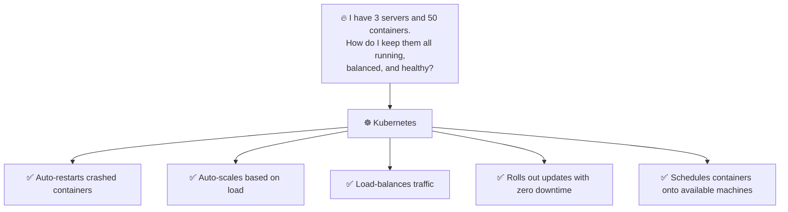
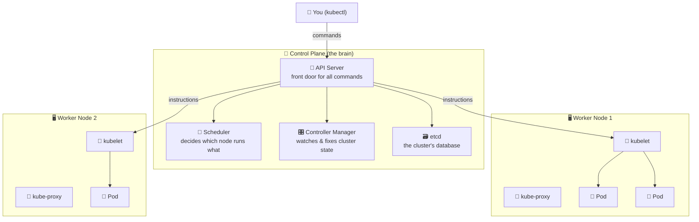
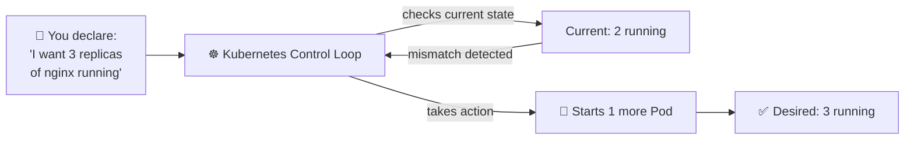
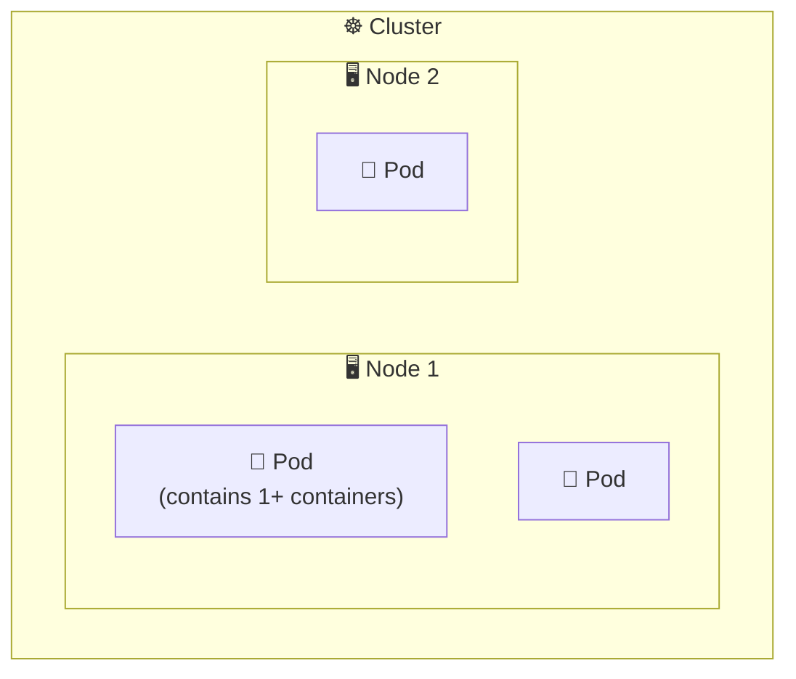

# Chapter 06 — ☸️ Kubernetes Introduction

> **Goal of this chapter:** Understand what problem Kubernetes solves, learn its architecture, and set up a local cluster.

⬅️ [Previous: Networking & Volumes](./05-docker-networking-volumes.md) | 🏠 [Index](./README.md) | ➡️ Next: [Core Kubernetes Objects](./07-kubernetes-core-objects.md)

---

## 🤔 6.1 Why Do We Need Kubernetes If We Have Docker?

Docker is great for running containers on **one machine**. But real production systems need:

- 🔁 **Self-healing** — if a container crashes, restart it automatically
- 📈 **Scaling** — run 50 copies of your app during a traffic spike, 2 during quiet hours
- ⚖️ **Load balancing** — spread traffic across many container replicas
- 🖥️ **Multi-machine orchestration** — run containers across a *cluster* of servers, not just one
- 🔄 **Zero-downtime deployments** — roll out new versions without taking the app offline
- 🗂️ **Configuration & secret management** at scale

Doing all this manually with plain Docker commands doesn't scale. **Kubernetes (K8s)** is a container **orchestrator** that automates all of this.

> 💡 **"K8s"** — the "8" replaces the 8 letters between the "K" and the "s" in "Kubernetes". Pronounced "koo-ber-net-eez", from the Greek word for "helmsman/pilot".



---

## 🏛️ 6.2 Kubernetes Architecture



### 🧩 Component roles

| Component | Role | Analogy |
|---|---|---|
| **API Server** | Entry point for all requests (`kubectl` talks to this) | The receptionist 🚪 |
| **etcd** | Stores the entire cluster's state (key-value database) | The filing cabinet 🗃️ |
| **Scheduler** | Decides *which* node a new Pod should run on | The dispatcher 📅 |
| **Controller Manager** | Continuously checks: "Is reality matching the desired state?" and fixes drift | The supervisor 👀 |
| **kubelet** | Agent on each worker node; makes sure containers are running as instructed | The on-site foreman 🤖 |
| **kube-proxy** | Handles networking rules so traffic reaches the right Pod | The traffic cop 🔀 |
| **Container Runtime** | Actually runs the containers (containerd, CRI-O) | The engine ⚙️ |

---

## 🎯 6.3 The Core Idea: Declarative, Desired State

You don't tell Kubernetes *how* to do something step-by-step. You **declare what you want**, and Kubernetes continuously works to make reality match.



This is called a **reconciliation loop**, and it runs constantly. If a Pod crashes, Kubernetes notices the mismatch (2 instead of 3) and automatically starts a replacement. **This is the foundation of Kubernetes' self-healing.**

---

## 📦 6.4 Nodes, Pods, and Clusters — The Basic Vocabulary



| Term | Meaning |
|---|---|
| **Cluster** | A set of machines (nodes) running Kubernetes together |
| **Node** | A single machine (VM or physical) in the cluster |
| **Pod** | The smallest deployable unit — wraps one or more tightly-coupled containers |
| **Control Plane** | The "brain" that manages the whole cluster |
| **Worker Node** | Where your actual application Pods run |

> 💡 A Pod is usually just **one container**, but can hold multiple containers that must share storage/network (a "sidecar" pattern) — more on this in Chapter 07.

---

## 💻 6.5 Setting Up a Local Cluster

You don't need a cloud account to learn Kubernetes! Use **Minikube** to run a real cluster on your laptop.

### Install kubectl (the CLI to talk to any Kubernetes cluster)
```bash
# macOS
brew install kubectl

# Windows (via Chocolatey)
choco install kubernetes-cli

# Linux
curl -LO "https://dl.k8s.io/release/$(curl -L -s https://dl.k8s.io/release/stable.txt)/bin/linux/amd64/kubectl"
sudo install -o root -g root -m 0755 kubectl /usr/local/bin/kubectl
```

### Install Minikube
```bash
# macOS
brew install minikube

# Windows (via Chocolatey)
choco install minikube

# Linux
curl -LO https://storage.googleapis.com/minikube/releases/latest/minikube-linux-amd64
sudo install minikube-linux-amd64 /usr/local/bin/minikube
```

### Start your cluster
```bash
minikube start

# Verify
kubectl cluster-info
kubectl get nodes
```

Expected output:
```
NAME       STATUS   ROLES           AGE   VERSION
minikube   Ready    control-plane   30s   v1.30.0
```

🎉 **You now have a real, working Kubernetes cluster running on your laptop!**

---

## 🧭 6.6 Your First `kubectl` Commands

```bash
kubectl get nodes             # list all nodes in the cluster
kubectl get pods              # list all pods in the current namespace
kubectl get pods -A           # list pods across ALL namespaces
kubectl cluster-info          # show cluster endpoint info
kubectl version                # client and server versions
minikube dashboard            # opens a visual web dashboard 🎨
```

---

## 🎯 Try It Yourself

1. Install `kubectl` and `minikube`.
2. Run `minikube start` and wait for it to finish.
3. Run `kubectl get nodes` — confirm your node shows `Ready`.
4. Run `minikube dashboard` and explore the visual UI in your browser.
5. Run `kubectl get pods -A` — notice system Pods already running (like `coredns`, `kube-proxy`) — these are part of the control plane machinery you just learned about!

---

## 🩹 Common Errors

| Error | Cause | Fix |
|---|---|---|
| `minikube start` fails with driver error | No virtualization backend (Docker/VirtualBox/Hyperkit) available | Install Docker Desktop first; Minikube can use it as a driver: `minikube start --driver=docker` |
| `kubectl: command not found` | Not installed or not in PATH | Reinstall and restart terminal |
| `The connection to the server ... was refused` | Cluster not started, or `kubectl` pointing at wrong context | Run `minikube start`; check `kubectl config current-context` |
| Slow start on first run | Downloading Kubernetes images for the first time | Be patient, this only happens once (cached afterward) |

---

⬅️ [Previous: Networking & Volumes](./05-docker-networking-volumes.md) | 🏠 [Index](./README.md) | ➡️ Next: [Core Kubernetes Objects](./07-kubernetes-core-objects.md)
