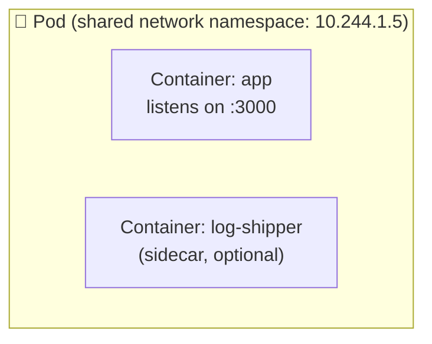
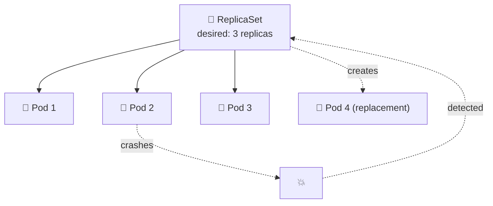
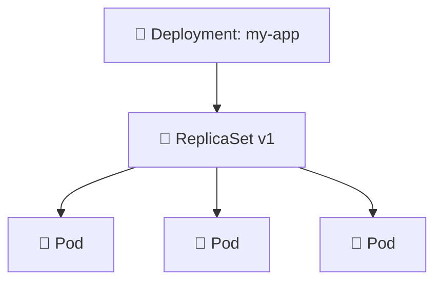
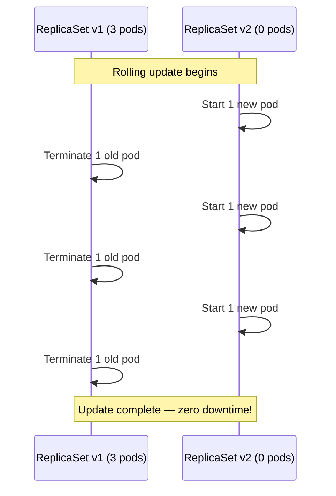
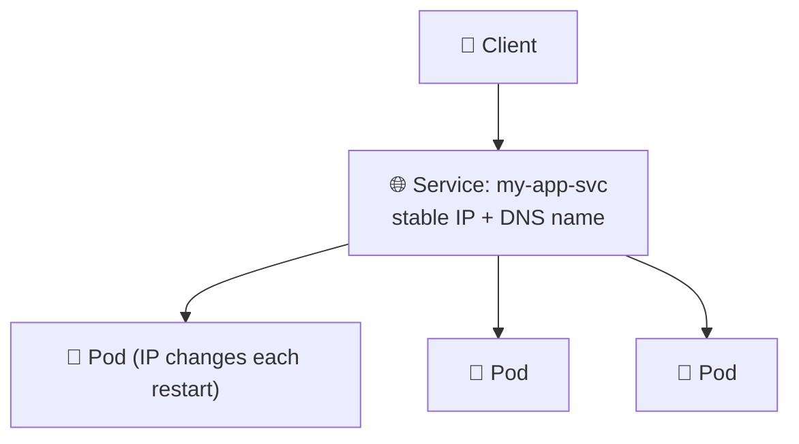
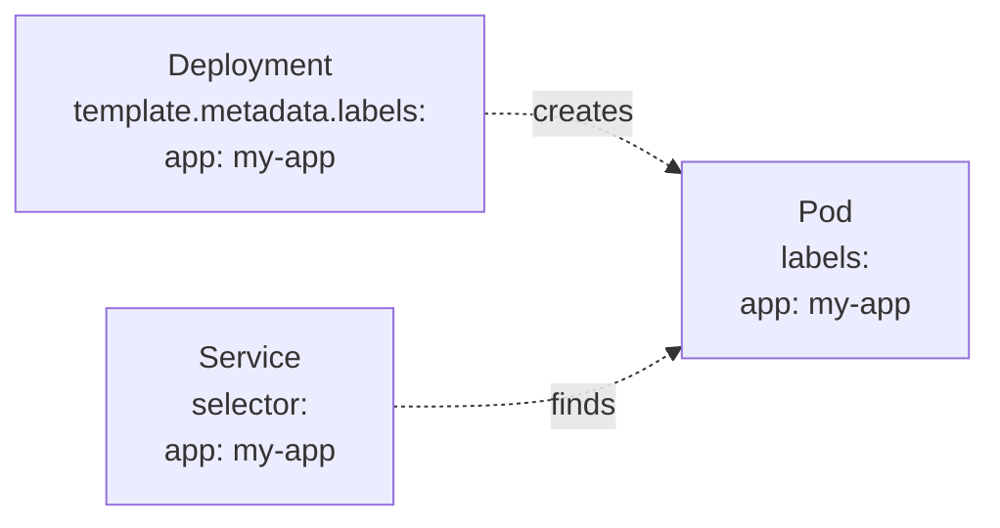
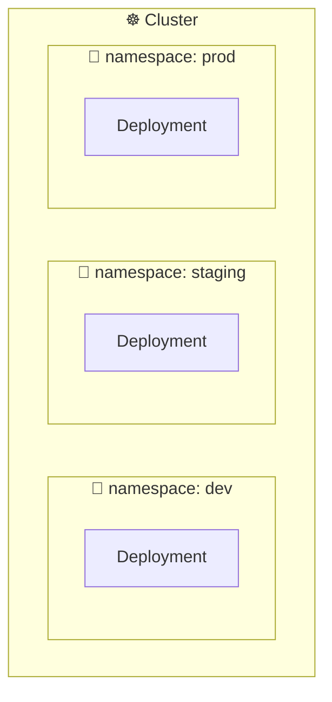

# Chapter 07 — 🧱 Core Kubernetes Objects (Pods, ReplicaSets, Deployments, Services)

> **Goal of this chapter:** Learn the building blocks you'll use in almost every Kubernetes manifest, and deploy your first app.

⬅️ [Previous: Kubernetes Introduction](./06-kubernetes-introduction.md) | 🏠 [Index](./README.md) | ➡️ Next: [Config, Secrets & Storage](./08-kubernetes-config-secrets-storage.md)

---

## 🧊 7.1 Pods — The Smallest Deployable Unit

A **Pod** wraps one or more containers that share networking and storage.
In other word : A **pod** is the smallest unit of compute that you can create and manage in K8s.
The Pod contains one or more containers in it and they shared same network workspace, allowing them to communicate with each other using localhost.




**`pod.yaml`:**
```yaml
apiVersion: v1
kind: Pod
metadata:
  name: my-first-pod
  labels:
    app: my-app
spec:
  containers:
    - name: web
      image: nginx:1.25-alpine
      ports:
        - containerPort: 80
```

```bash
kubectl apply -f pod.yaml
kubectl get pods
kubectl describe pod my-first-pod
kubectl logs my-first-pod
kubectl delete pod my-first-pod
```

> ⚠️ **In practice, you almost never create bare Pods directly.** If a Pod dies, it's gone — nothing recreates it. That's what **Deployments** are for.

---

## 🧬 7.2 ReplicaSets — Keeping N Copies Running

A **ReplicaSet** ensures a specified number of identical Pod replicas are always running.



You'll rarely write ReplicaSets by hand either — **Deployments manage ReplicaSets for you**, which is the next (and most important!) object.

---

## 🚀 7.3 Deployments — What You'll Actually Use

A **Deployment** manages ReplicaSets and Pods, and adds:
- Rolling updates (zero-downtime deploys)
- Rollback to previous versions
- Declarative scaling



**`deployment.yaml`:**
```yaml
apiVersion: apps/v1
kind: Deployment
metadata:
  name: my-app
  labels:
    app: my-app
spec:
  replicas: 3
  selector:
    matchLabels:
      app: my-app
  template:
    metadata:
      labels:
        app: my-app
    spec:
      containers:
        - name: web
          image: nginx:1.25-alpine
          ports:
            - containerPort: 80
          resources:
            requests:
              cpu: "100m"
              memory: "64Mi"
            limits:
              cpu: "250m"
              memory: "128Mi"
```

### 🔍 Key fields explained

| Field | Meaning |
|---|---|
| `spec.replicas` | How many Pod copies you want |
| `spec.selector.matchLabels` | How the Deployment finds "its" Pods |
| `spec.template` | The Pod blueprint (a Pod spec nested inside!) |
| `resources.requests` | Minimum resources guaranteed to the container |
| `resources.limits` | Maximum resources the container can use |

```bash
kubectl apply -f deployment.yaml
kubectl get deployments
kubectl get pods -l app=my-app
kubectl scale deployment my-app --replicas=5
kubectl rollout status deployment my-app
```

### 🔄 Rolling Updates

```bash
# Update the image version
kubectl set image deployment/my-app web=nginx:1.26-alpine

# Watch the rollout happen
kubectl rollout status deployment my-app

# Something went wrong? Roll back instantly
kubectl rollout undo deployment my-app

# See rollout history
kubectl rollout history deployment my-app
```



---

## 🌐 7.4 Services — Stable Networking for Pods

Pods are **ephemeral** — they get new IP addresses every time they're recreated. A **Service** gives you one stable address/DNS name that automatically load-balances across all matching Pods.



**`service.yaml`:**
```yaml
apiVersion: v1
kind: Service
metadata:
  name: my-app-svc
spec:
  selector:
    app: my-app
  ports:
    - protocol: TCP
      port: 80
      targetPort: 80
  type: ClusterIP
```

> 💡 Notice `spec.selector` matches `app: my-app` — the *same label* used in the Deployment's Pod template. This is how the Service knows which Pods to send traffic to.

```bash
kubectl apply -f service.yaml
kubectl get services
kubectl describe service my-app-svc
```

We'll cover the different **Service types** (`ClusterIP`, `NodePort`, `LoadBalancer`) in depth in Chapter 09.

---

## 🏷️ 7.5 Labels & Selectors — How Everything Connects



Labels are simple key-value pairs attached to objects. **Selectors** use them to group and target resources. This loose coupling is the glue that holds the whole system together.

```bash
kubectl get pods --show-labels
kubectl get pods -l app=my-app
kubectl label pod my-first-pod environment=dev
```

---

## 📄 7.6 Namespaces — Organizing Your Cluster

Namespaces let you logically separate resources (e.g., `dev`, `staging`, `prod`) within one cluster.

```bash
kubectl create namespace dev
kubectl get namespaces
kubectl apply -f deployment.yaml -n dev
kubectl get pods -n dev
```



---

## 🎯 Try It Yourself

1. Apply `deployment.yaml` and `service.yaml` from this chapter.
2. Run `kubectl get pods -o wide` — notice each Pod has its own IP.
3. Delete one Pod manually (`kubectl delete pod <name>`) — watch the Deployment recreate it automatically within seconds.
4. Scale to 5 replicas, then back to 2.
5. Change the image tag and watch a rolling update happen live with `kubectl get pods -w`.
6. Create a `dev` namespace and redeploy everything into it.

---

## 🩹 Common Errors

| Error | Cause | Fix |
|---|---|---|
| Pod stuck in `Pending` | No node has enough resources, or scheduling constraints unmet | `kubectl describe pod <name>` to see the event reason |
| Pod stuck in `ImagePullBackOff` | Wrong image name/tag, or private registry needs auth | Check the image name; create an `imagePullSecret` if private |
| Pod `CrashLoopBackOff` | The container's process keeps exiting/erroring | `kubectl logs <pod> --previous` to see why it crashed |
| Service has no endpoints | Selector labels don't match Pod labels | Compare `spec.selector` on the Service to `metadata.labels` on the Pods |

---

⬅️ [Previous: Kubernetes Introduction](./06-kubernetes-introduction.md) | 🏠 [Index](./README.md) | ➡️ Next: [Config, Secrets & Storage](./08-kubernetes-config-secrets-storage.md)
