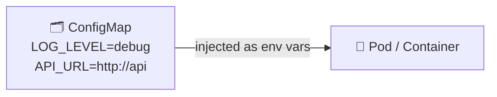
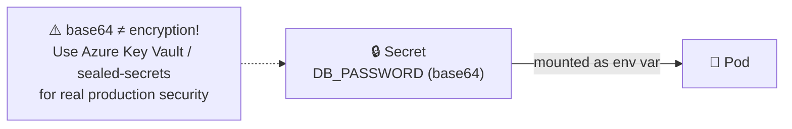
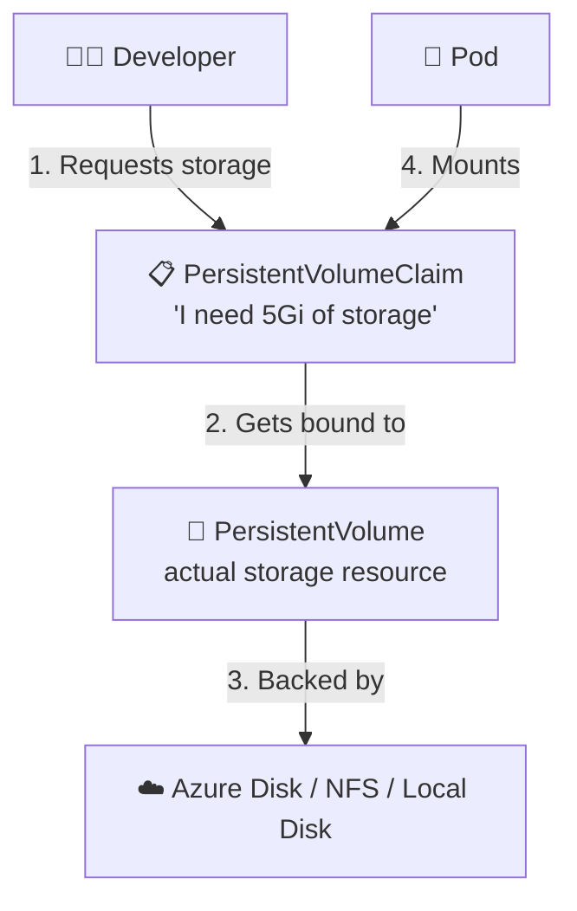

# Chapter 08 — 🔐 ConfigMaps, Secrets & Storage in Kubernetes

> **Goal of this chapter:** Learn how to externalize configuration, handle sensitive data safely, and persist data for stateful apps.

⬅️ [Previous: Core Kubernetes Objects](./07-kubernetes-core-objects.md) | 🏠 [Index](./README.md) | ➡️ Next: [Networking & Ingress](./09-kubernetes-networking-ingress.md)

---

## 🗂️ 8.1 ConfigMaps — Externalizing Configuration

Hardcoding config values inside your container image is a bad idea — you'd need to rebuild the image for every environment. **ConfigMaps** let you inject configuration as environment variables or files, separate from your app code.



**`configmap.yaml`:**
```yaml
apiVersion: v1
kind: ConfigMap
metadata:
  name: app-config
data:
  LOG_LEVEL: "debug"
  API_URL: "http://api-service:8080"
```

### Using it in a Deployment

```yaml
spec:
  containers:
    - name: web
      image: my-app:1.0
      envFrom:
        - configMapRef:
            name: app-config
```

Or inject just one specific key:
```yaml
env:
  - name: LOG_LEVEL
    valueFrom:
      configMapKeyRef:
        name: app-config
        key: LOG_LEVEL
```

```bash
kubectl apply -f configmap.yaml
kubectl get configmaps
kubectl describe configmap app-config
```

---

## 🔒 8.2 Secrets — Sensitive Data

**Secrets** work like ConfigMaps but are meant for sensitive values (passwords, API keys, tokens). Values are base64-encoded (⚠️ *not encrypted by default* — treat access to Secrets as sensitive!).

```yaml
apiVersion: v1
kind: Secret
metadata:
  name: db-secret
type: Opaque
data:
  DB_USER: YWRtaW4=        # base64 for "admin"
  DB_PASSWORD: c3VwZXJzZWNyZXQ=   # base64 for "supersecret"
```

**Easier way — let kubectl encode it for you:**
```bash
kubectl create secret generic db-secret \
  --from-literal=DB_USER=admin \
  --from-literal=DB_PASSWORD=supersecret
```

### Using a Secret in a Deployment

```yaml
spec:
  containers:
    - name: web
      image: my-app:1.0
      envFrom:
        - secretRef:
            name: db-secret
```



> ⚠️ **Important:** Base64 is just an *encoding*, not encryption. Anyone with cluster access can decode it. For real production secrets, use a proper secret manager — in AKS, that's **Azure Key Vault** integrated via the Secrets Store CSI Driver (covered in Chapter 12).

### ConfigMap vs Secret

| | ConfigMap | Secret |
|---|---|---|
| Purpose | Non-sensitive config | Sensitive data |
| Encoding | Plain text | Base64 (not encrypted by default) |
| Example use | Log level, feature flags, URLs | Passwords, API keys, TLS certs |

---

## 💾 8.3 Storage — Volumes, PersistentVolumes, PersistentVolumeClaims

Just like Docker, Kubernetes Pods lose their data when they die — unless you attach persistent storage.



| Concept | Meaning |
|---|---|
| **PersistentVolume (PV)** | A piece of actual storage in the cluster (provisioned by admin, or dynamically by a StorageClass) |
| **PersistentVolumeClaim (PVC)** | A request for storage by a user/Pod ("I need 5Gi, ReadWriteOnce") |
| **StorageClass** | Defines *how* storage is dynamically provisioned (e.g., "Azure Premium SSD") |

### Example: PVC + Pod

**`pvc.yaml`:**
```yaml
apiVersion: v1
kind: PersistentVolumeClaim
metadata:
  name: my-app-pvc
spec:
  accessModes:
    - ReadWriteOnce
  resources:
    requests:
      storage: 5Gi
```

**Using it in a Deployment:**
```yaml
spec:
  containers:
    - name: db
      image: postgres:16-alpine
      volumeMounts:
        - name: data
          mountPath: /var/lib/postgresql/data
  volumes:
    - name: data
      persistentVolumeClaim:
        claimName: my-app-pvc
```

```bash
kubectl apply -f pvc.yaml
kubectl get pvc
kubectl get pv
```

### 🔑 Access Modes

| Mode | Meaning |
|---|---|
| `ReadWriteOnce` (RWO) | Mounted read-write by **one** node at a time |
| `ReadOnlyMany` (ROX) | Mounted read-only by many nodes |
| `ReadWriteMany` (RWX) | Mounted read-write by many nodes simultaneously |

> 💡 In AKS, PVCs are typically fulfilled automatically by **Azure Disk** (RWO) or **Azure Files** (RWX) StorageClasses — no manual PV creation needed. More in Chapter 11.

---

## 🎯 Try It Yourself

1. Create a ConfigMap with a couple of key-value pairs and inject it into a Pod's environment variables. Verify with `kubectl exec <pod> -- env`.
2. Create a Secret using `kubectl create secret generic`, then decode a value: `kubectl get secret db-secret -o jsonpath='{.data.DB_PASSWORD}' | base64 -d`.
3. Create a PVC and mount it into a Postgres Pod. Insert data, delete the Pod, recreate it with the same PVC — confirm data survives.

---

## 🩹 Common Errors

| Error | Cause | Fix |
|---|---|---|
| PVC stuck `Pending` | No StorageClass available / no default StorageClass | Check `kubectl get storageclass`; specify `storageClassName` explicitly |
| Env var shows empty/missing | Wrong `key` name in `configMapKeyRef` | Double check exact key spelling (case-sensitive) |
| `error: secrets "db-secret" already exists` | Trying to recreate an existing Secret | `kubectl delete secret db-secret` first, or use `kubectl apply` with a YAML file |
| App can't decode config | Forgot Secrets are base64, tried to use raw value directly | Decode with `base64 -d`, or rely on Kubernetes to inject it decoded via env vars (which it does automatically) |

---

⬅️ [Previous: Core Kubernetes Objects](./07-kubernetes-core-objects.md) | 🏠 [Index](./README.md) | ➡️ Next: [Networking & Ingress](./09-kubernetes-networking-ingress.md)
