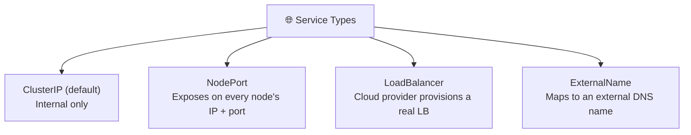
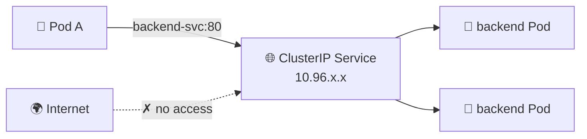
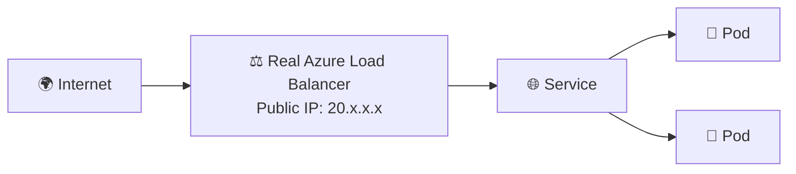
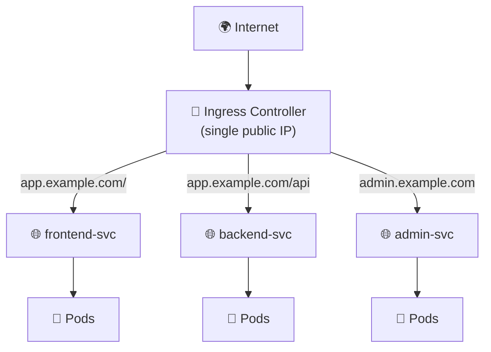

# Chapter 09 — 🌍 Kubernetes Networking & Ingress

> **Goal of this chapter:** Understand the different Service types and how to expose multiple apps to the internet through one entry point using Ingress.

⬅️ [Previous: Config, Secrets & Storage](./08-kubernetes-config-secrets-storage.md) | 🏠 [Index](./README.md) | ➡️ Next: [Scaling & Health Checks](./10-kubernetes-scaling-healthchecks.md)

---

## 🌐 9.1 Service Types



### 1️⃣ ClusterIP (default) — Internal-Only

```yaml
apiVersion: v1
kind: Service
metadata:
  name: backend-svc
spec:
  type: ClusterIP
  selector:
    app: backend
  ports:
    - port: 80
      targetPort: 8080
```



Only reachable **from inside the cluster**. Perfect for internal microservices (e.g., a backend API that only the frontend needs to reach).

### 2️⃣ NodePort — Basic External Access

```yaml
apiVersion: v1
kind: Service
metadata:
  name: frontend-svc
spec:
  type: NodePort
  selector:
    app: frontend
  ports:
    - port: 80
      targetPort: 3000
      nodePort: 30080   # range: 30000-32767
```


Opens a specific port (30000-32767) on **every node's IP**. Rarely used directly in production — mostly a building block for `LoadBalancer` and useful for local testing.

### 3️⃣ LoadBalancer — Cloud-Provisioned Public IP

```yaml
apiVersion: v1
kind: Service
metadata:
  name: frontend-svc
spec:
  type: LoadBalancer
  selector:
    app: frontend
  ports:
    - port: 80
      targetPort: 3000
```



On a cloud provider like Azure, this automatically provisions a **real cloud load balancer with a public IP**. This is what you'll use most often on AKS for exposing a service directly. (⚠️ One `LoadBalancer` Service = one cloud load balancer = one public IP = 💰 cost per Service — this is where Ingress becomes valuable.)

---

## 🚪 9.2 Ingress — One Smart Entry Point for Everything

Imagine you have 5 different apps/APIs. Using `LoadBalancer` for each means **5 separate public IPs and 5 cloud load balancers** — wasteful and hard to manage.

**Ingress** lets you route traffic to many different Services based on **hostname or URL path**, through a **single** entry point.



### Step 1: Install an Ingress Controller

An Ingress *resource* (the YAML) does nothing by itself — you need a running **Ingress Controller** (like NGINX Ingress) to actually implement the routing rules.

```bash
# Minikube has a built-in addon
minikube addons enable ingress

# Or install NGINX Ingress Controller via Helm (any cluster, including AKS)
helm repo add ingress-nginx https://kubernetes.github.io/ingress-nginx
helm install my-ingress ingress-nginx/ingress-nginx
```

### Step 2: Define Ingress Rules

**`ingress.yaml`:**
```yaml
apiVersion: networking.k8s.io/v1
kind: Ingress
metadata:
  name: my-app-ingress
  annotations:
    nginx.ingress.kubernetes.io/rewrite-target: /
spec:
  ingressClassName: nginx
  rules:
    - host: myapp.local
      http:
        paths:
          - path: /
            pathType: Prefix
            backend:
              service:
                name: frontend-svc
                port:
                  number: 80
          - path: /api
            pathType: Prefix
            backend:
              service:
                name: backend-svc
                port:
                  number: 80
```

```bash
kubectl apply -f ingress.yaml
kubectl get ingress
```

For local testing with Minikube, add an entry to your hosts file mapping `myapp.local` to `minikube ip`.

---

## 🔒 9.3 TLS / HTTPS with Ingress

```yaml
spec:
  tls:
    - hosts:
        - myapp.example.com
      secretName: myapp-tls-secret
  rules:
    - host: myapp.example.com
      http:
        paths:
          - path: /
            pathType: Prefix
            backend:
              service:
                name: frontend-svc
                port:
                  number: 80
```

The `myapp-tls-secret` is a Kubernetes Secret containing your TLS certificate + key. In production, tools like **cert-manager** automate fetching free certificates from Let's Encrypt automatically.

---

## 🧭 9.4 Kubernetes DNS — How Services Find Each Other

Every Service automatically gets a DNS name inside the cluster:

```
<service-name>.<namespace>.svc.cluster.local
```


Within the **same namespace**, you can just use the short name:
```bash
curl http://backend-svc
```

Across namespaces, include the namespace:
```bash
curl http://backend-svc.backend.svc.cluster.local
```

---

## 📊 9.5 Summary Comparison

| Type | Scope | Use Case |
|---|---|---|
| **ClusterIP** | Internal only | Microservice-to-microservice communication |
| **NodePort** | Any node's IP + fixed port | Quick local testing, or as a building block |
| **LoadBalancer** | Public IP, one per Service | Directly exposing a single critical service |
| **Ingress** | Public IP, shared across many Services | Production-grade routing for multiple apps/paths under one IP |

---

## 🎯 Try It Yourself

1. Deploy the `my-app` Deployment + a `ClusterIP` Service from Chapter 07.
2. Enable the Minikube ingress addon and create an `Ingress` resource routing `myapp.local` to your Service.
3. Add `myapp.local` to your hosts file (pointing at `minikube ip`) and browse to it.
4. Add a second Deployment + Service, and route `/api` to it through the same Ingress.

---

## 🩹 Common Errors

| Error | Cause | Fix |
|---|---|---|
| Ingress shows no `ADDRESS` | Ingress Controller not installed/running | `minikube addons enable ingress` or install via Helm |
| `404` from Ingress | Path/host doesn't match rules, or `pathType` misconfigured | Double-check `host` and `path` match your request exactly |
| Works with ClusterIP test but not via Ingress | Wrong Service `port.number`, or Service selector doesn't match Pods | `kubectl describe ingress` and `kubectl describe svc` to trace it |
| `default backend - 404` | No rule matched the incoming host/path | Confirm you're hitting the correct hostname; check `/etc/hosts` |

---

⬅️ [Previous: Config, Secrets & Storage](./08-kubernetes-config-secrets-storage.md) | 🏠 [Index](./README.md) | ➡️ Next: [Scaling & Health Checks](./10-kubernetes-scaling-healthchecks.md)
