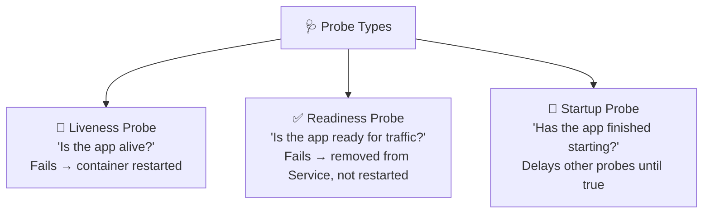
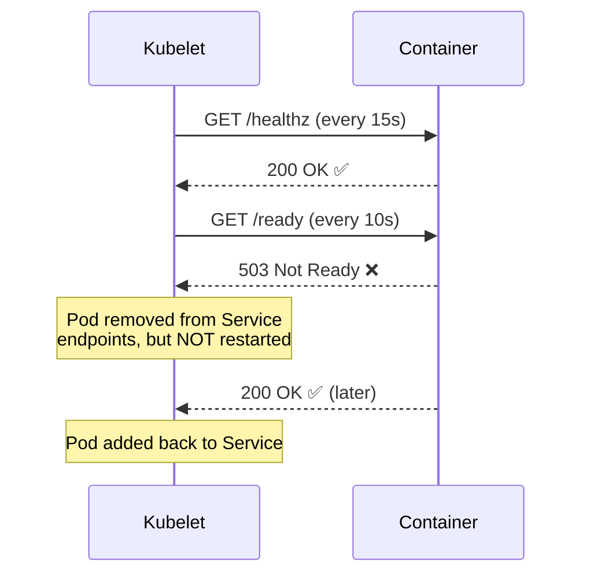
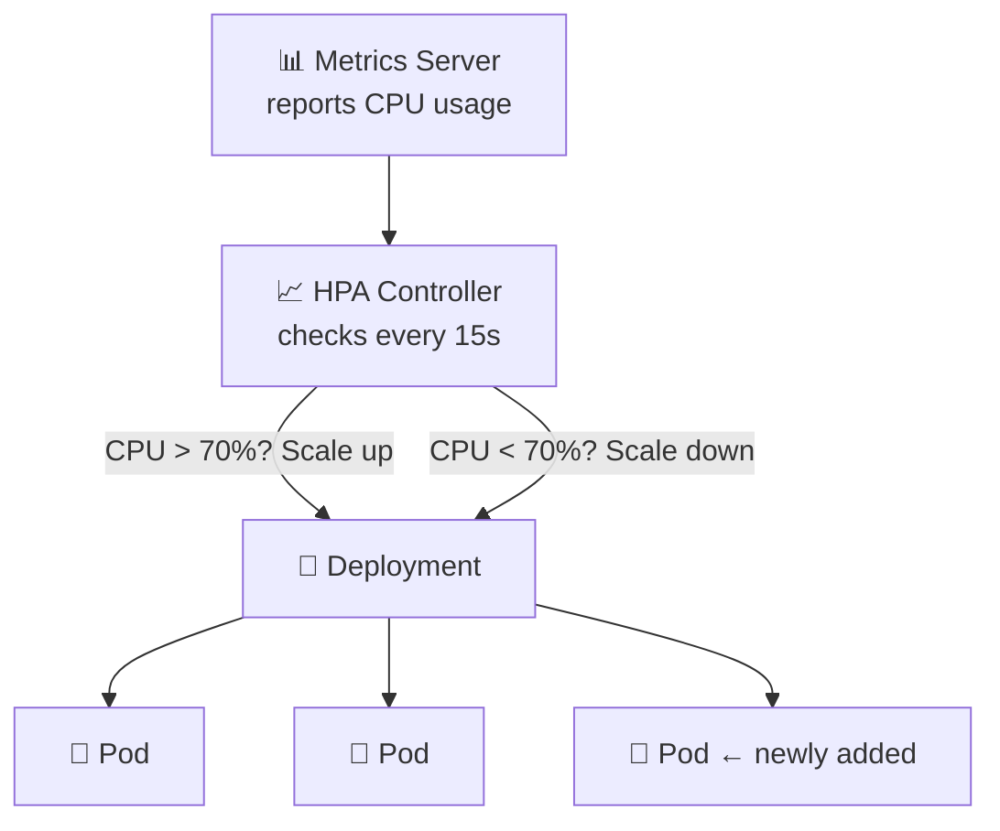
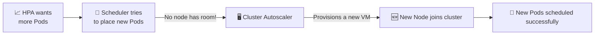
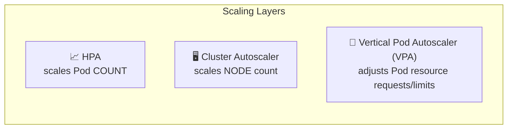

# Chapter 10 — 📈 Scaling & Health Checks

> **Goal of this chapter:** Make your apps self-healing and able to automatically scale under load.

⬅️ [Previous: Networking & Ingress](./09-kubernetes-networking-ingress.md) | 🏠 [Index](./README.md) | ➡️ Next: [AKS Getting Started](./11-aks-getting-started.md)

---

## 🩺 10.1 Health Checks (Probes)

Kubernetes needs to know: *"Is this container actually healthy, and is it ready to receive traffic?"* Probes answer that.



### 💓 Liveness Probe — "Should I restart this container?"

```yaml
livenessProbe:
  httpGet:
    path: /healthz
    port: 3000
  initialDelaySeconds: 10
  periodSeconds: 15
  failureThreshold: 3
```

If `/healthz` fails 3 times in a row, Kubernetes **kills and restarts** the container.

### ✅ Readiness Probe — "Should traffic be sent here?"

```yaml
readinessProbe:
  httpGet:
    path: /ready
    port: 3000
  initialDelaySeconds: 5
  periodSeconds: 10
```

If this fails, the Pod is **removed from the Service's load-balancing pool** (traffic stops going to it) — but the container is **not** restarted. Useful when an app is temporarily busy (e.g., reconnecting to a database).

### 🚦 Startup Probe — For Slow-Starting Apps

```yaml
startupProbe:
  httpGet:
    path: /healthz
    port: 3000
  failureThreshold: 30
  periodSeconds: 10
```

Gives a slow app up to 300 seconds (30 × 10s) to start before liveness/readiness probes even begin checking — prevents Kubernetes from killing a container that just needs more time to boot.

### Full Example in a Deployment

```yaml
apiVersion: apps/v1
kind: Deployment
metadata:
  name: my-app
spec:
  replicas: 3
  selector:
    matchLabels:
      app: my-app
  template:
    metadata:
      labels:
        app: my-app
    spec:
      containers:
        - name: web
          image: my-app:1.0
          ports:
            - containerPort: 3000
          livenessProbe:
            httpGet:
              path: /healthz
              port: 3000
            initialDelaySeconds: 10
            periodSeconds: 15
          readinessProbe:
            httpGet:
              path: /ready
              port: 3000
            initialDelaySeconds: 5
            periodSeconds: 10
```



---

## 📈 10.2 Horizontal Pod Autoscaler (HPA)

The **HPA** automatically increases/decreases the number of Pod replicas based on observed metrics like CPU or memory usage.



### Prerequisite: Metrics Server

```bash
# Minikube
minikube addons enable metrics-server

# AKS — usually already enabled; verify with:
kubectl get deployment metrics-server -n kube-system
```

### Define the HPA

**`hpa.yaml`:**
```yaml
apiVersion: autoscaling/v2
kind: HorizontalPodAutoscaler
metadata:
  name: my-app-hpa
spec:
  scaleTargetRef:
    apiVersion: apps/v1
    kind: Deployment
    name: my-app
  minReplicas: 2
  maxReplicas: 10
  metrics:
    - type: Resource
      resource:
        name: cpu
        target:
          type: Utilization
          averageUtilization: 70
```

Or quickly via CLI:
```bash
kubectl autoscale deployment my-app --cpu-percent=70 --min=2 --max=10
```

```bash
kubectl get hpa
kubectl describe hpa my-app-hpa
```

> ⚠️ **Important:** For CPU-based autoscaling to work, your Deployment **must** define `resources.requests.cpu` — the HPA calculates percentage utilization relative to the requested amount.

---

## 🖥️ 10.3 Cluster Autoscaler — Scaling the Nodes Themselves

HPA scales **Pods**. But what if there's no room left on any node for new Pods? The **Cluster Autoscaler** adds/removes entire **nodes** (VMs) based on demand.



We'll enable this directly on AKS in **Chapter 11** — it's a one-line setting there since Azure manages the underlying VMs for you.



---

## 🔁 10.4 Rolling Update Strategy — Fine-Tuning Zero-Downtime Deploys

```yaml
spec:
  strategy:
    type: RollingUpdate
    rollingUpdate:
      maxUnavailable: 1   # max pods that can be down during update
      maxSurge: 1         # max extra pods allowed above desired count
```



```mermaid
gantt
    dateFormat X
    axisFormat %s
    title Rolling Update Timeline (3 replicas, maxSurge=1, maxUnavailable=1)
    section Old (v1)
    Pod 1 running :done, 0, 3
    Pod 2 running :done, 0, 5
    Pod 3 running :done, 0, 7
    section New (v2)
    Pod 1 starting :active, 1, 3
    Pod 2 starting :active, 3, 5
    Pod 3 starting :active, 5, 7
```

| Field | Meaning |
|---|---|
| `maxUnavailable` | How many Pods can be unavailable during the rollout (absolute number or %) |
| `maxSurge` | How many *extra* Pods can be created above the desired count during rollout |

---

## 🎯 Try It Yourself

1. Add `livenessProbe` and `readinessProbe` to a Deployment (you can fake `/healthz` in a simple Node/Express app).
2. Deliberately make `/ready` return `503` — watch `kubectl get endpoints` show the Pod removed from the Service.
3. Enable metrics-server, create an HPA with `minReplicas: 2, maxReplicas: 5`.
4. Generate CPU load (`kubectl run -it load-generator --image=busybox -- /bin/sh -c "while true; do wget -q -O- http://my-app-svc; done"`) and watch `kubectl get hpa -w` scale up in real time.
5. Stop the load generator and watch it scale back down (takes a few minutes due to a cooldown period).

---

## 🩹 Common Errors

| Error | Cause | Fix |
|---|---|---|
| HPA shows `<unknown>` for targets | Metrics server not installed/running | `minikube addons enable metrics-server` |
| Pod restarts constantly (`CrashLoopBackOff`) after adding probes | `initialDelaySeconds` too short for a slow-starting app | Increase `initialDelaySeconds` or add a `startupProbe` |
| HPA never scales up | No `resources.requests.cpu` set on containers | Add explicit CPU requests to the Deployment spec |
| Rolling update seems stuck | New Pods failing readiness probe | `kubectl describe pod <new-pod>` to see why it's not passing |

---

## 🏁 Part 2 Complete!

You now understand core Kubernetes concepts deeply enough to run resilient, self-healing, auto-scaling applications. Time to take this to the cloud with **Azure Kubernetes Service**! ☁️

⬅️ [Previous: Networking & Ingress](./09-kubernetes-networking-ingress.md) | 🏠 [Index](./README.md) | ➡️ Next: [AKS Getting Started](./11-aks-getting-started.md)
