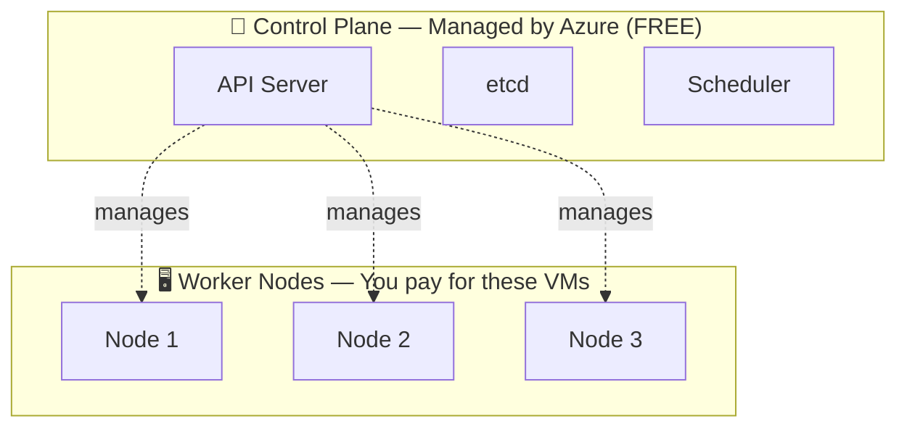
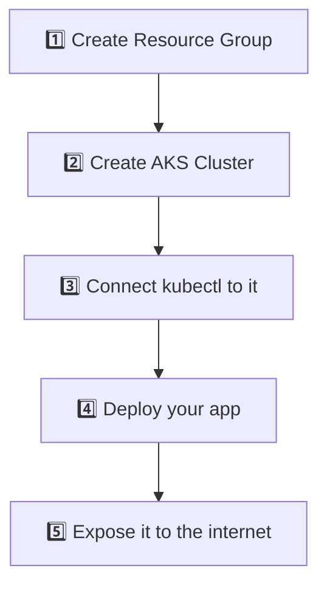
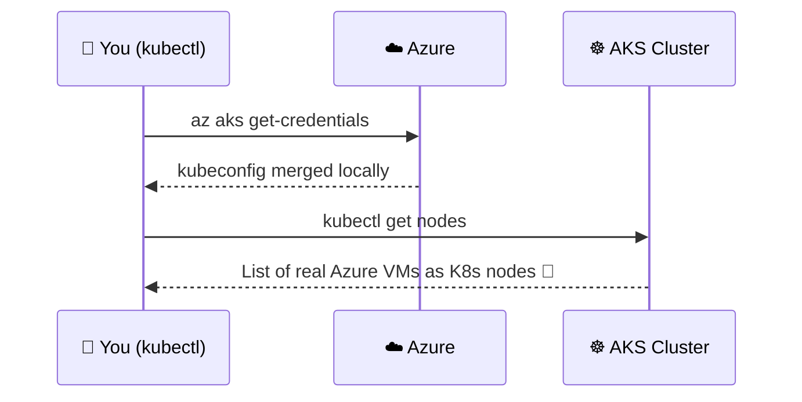
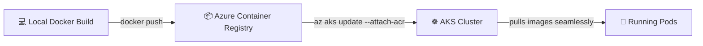
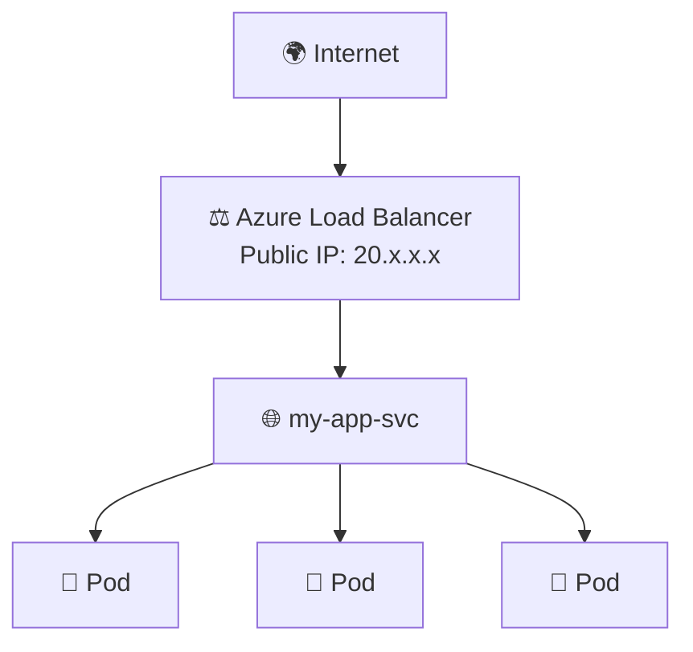

# Chapter 11 — ☁️ AKS Getting Started (Azure Kubernetes Service)

> **Goal of this chapter:** Create a real Kubernetes cluster on Azure and deploy your application to it.

⬅️ [Previous: Scaling & Health Checks](./10-kubernetes-scaling-healthchecks.md) | 🏠 [Index](./README.md) | ➡️ Next: [AKS Advanced, Monitoring & CI/CD](./12-aks-advanced-cicd-monitoring.md)

---

## ☁️ 11.1 What Is AKS, Exactly?

**Azure Kubernetes Service (AKS)** is a **managed** Kubernetes offering — Azure runs and maintains the **control plane** for you (API server, etcd, scheduler), completely **free of charge**. You only pay for the **worker nodes** (VMs) and other resources you use.



| Self-Managed Kubernetes | AKS (Managed) |
|---|---|
| You install/patch/upgrade the control plane | Azure handles it automatically |
| You manage etcd backups & HA | Azure manages this |
| More control, more operational burden | Less operational burden, faster to get started |
| Free (minus infrastructure costs) | Control plane free; pay only for worker nodes & extras |

---

## 🧰 11.2 Prerequisites

```bash
# Install Azure CLI (macOS)
brew install azure-cli

# Windows: download installer from
# https://aka.ms/installazurecliwindows

# Linux
curl -sL https://aka.ms/InstallAzureCLIDeb | sudo bash

# Verify
az --version

# Log in
az login
```

---

## 🏗️ 11.3 Creating Your First AKS Cluster



### Step 1: Create a Resource Group

A **Resource Group** is a logical container for related Azure resources.

```bash
az group create --name myAKSResourceGroup --location eastus
```

### Step 2: Create the AKS Cluster

```bash
az aks create \
  --resource-group myAKSResourceGroup \
  --name myAKSCluster \
  --node-count 2 \
  --node-vm-size Standard_B2s \
  --enable-managed-identity \
  --generate-ssh-keys
```

| Flag | Meaning |
|---|---|
| `--node-count 2` | Start with 2 worker node VMs |
| `--node-vm-size` | VM size/type for the nodes |
| `--enable-managed-identity` | Lets AKS securely access other Azure resources (recommended) |
| `--generate-ssh-keys` | Auto-generates SSH keys for node access |

⏳ This takes several minutes — Azure is provisioning real infrastructure behind the scenes.

### Step 3: Connect `kubectl` to Your AKS Cluster

```bash
az aks get-credentials --resource-group myAKSResourceGroup --name myAKSCluster
```

This merges AKS connection details into your local `~/.kube/config`, so `kubectl` now talks to your **real cloud cluster** instead of Minikube.

```bash
kubectl get nodes
kubectl cluster-info
```



---

## 📦 11.4 Azure Container Registry (ACR) — Your Private Image Store

Instead of pushing images to public Docker Hub, use **ACR** for private, Azure-integrated image storage.

```bash
# Create a registry
az acr create --resource-group myAKSResourceGroup --name myacrregistry123 --sku Basic

# Log in to it
az acr login --name myacrregistry123

# Tag & push your image
docker tag my-app:1.0 myacrregistry123.azurecr.io/my-app:1.0
docker push myacrregistry123.azurecr.io/my-app:1.0

# Attach ACR to AKS so the cluster can pull images without extra auth setup
az aks update --name myAKSCluster --resource-group myAKSResourceGroup --attach-acr myacrregistry123
```



---

## 🚀 11.5 Deploying Your App to AKS

The beauty of Kubernetes: **the exact same YAML files from Chapters 07-10 work here unchanged.**

**`deployment.yaml`:**
```yaml
apiVersion: apps/v1
kind: Deployment
metadata:
  name: my-app
spec:
  replicas: 3
  selector:
    matchLabels:
      app: my-app
  template:
    metadata:
      labels:
        app: my-app
    spec:
      containers:
        - name: web
          image: myacrregistry123.azurecr.io/my-app:1.0
          ports:
            - containerPort: 3000
          resources:
            requests:
              cpu: "100m"
              memory: "128Mi"
            limits:
              cpu: "250m"
              memory: "256Mi"
```

**`service.yaml`:**
```yaml
apiVersion: v1
kind: Service
metadata:
  name: my-app-svc
spec:
  type: LoadBalancer
  selector:
    app: my-app
  ports:
    - port: 80
      targetPort: 3000
```

```bash
kubectl apply -f deployment.yaml
kubectl apply -f service.yaml

# Watch until EXTERNAL-IP is assigned (takes 1-2 minutes)
kubectl get service my-app-svc --watch
```

Once you see a real **EXTERNAL-IP**, visit it in your browser — your app is now live on the internet, served from Azure! 🎉



---

## 🖼️ 11.6 Visualizing Your Cluster

```bash
# Azure's official dashboard-like view
az aks browse --resource-group myAKSResourceGroup --name myAKSCluster

# Or install the Kubernetes Dashboard, or use Lens/K9s desktop apps
```

You can also explore your cluster visually in the **Azure Portal** → your AKS resource → **Workloads** / **Services and ingresses** tabs.

---

## 💰 11.7 Cost Awareness

| Resource | Cost |
|---|---|
| AKS control plane (Free tier) | $0 |
| AKS control plane (Standard/Uptime SLA tier) | Per-hour charge, for production SLA guarantees |
| Worker node VMs | Standard Azure VM pricing (pay for what you provision) |
| LoadBalancer Service | Azure Load Balancer + public IP charges |
| ACR | Storage + tier-based pricing |

> 💡 **Always clean up learning clusters** to avoid surprise charges:
> ```bash
> az group delete --name myAKSResourceGroup --yes --no-wait
> ```
> Deleting the Resource Group deletes the cluster, node VMs, load balancers, and everything inside it.

---

## 🎯 Try It Yourself

1. Create an AKS cluster with `az aks create` (use the smallest/cheapest VM size while learning, e.g., `Standard_B2s`).
2. Create an ACR, push an image you built in Chapter 03, and attach it to your cluster.
3. Deploy your Deployment + `LoadBalancer` Service and access it via its public IP.
4. Scale it: `kubectl scale deployment my-app --replicas=5`.
5. **When done learning, delete the resource group** to avoid ongoing charges!

---

## 🩹 Common Errors

| Error | Cause | Fix |
|---|---|---|
| `az: command not found` | Azure CLI not installed | Install via the links in 11.2 |
| `AADSTS...` login errors | Session expired / wrong tenant | `az login` again; use `az account set --subscription <id>` if you have multiple subscriptions |
| `ImagePullBackOff` from ACR | ACR not attached to AKS | `az aks update --attach-acr <registry-name>` |
| `EXTERNAL-IP` stuck on `<pending>` | Still provisioning (normal for 1-2 min), or subscription quota limits | Wait; check `az vm list-usage` for quota issues |
| Forgot to delete resources, got billed | Learning clusters left running | Always `az group delete` when done; consider setting up budget alerts in Azure Cost Management |

---

⬅️ [Previous: Scaling & Health Checks](./10-kubernetes-scaling-healthchecks.md) | 🏠 [Index](./README.md) | ➡️ Next: [AKS Advanced, Monitoring & CI/CD](./12-aks-advanced-cicd-monitoring.md)
