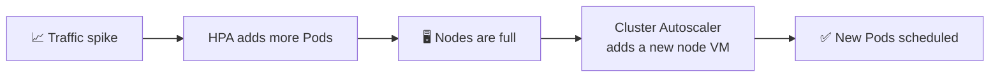
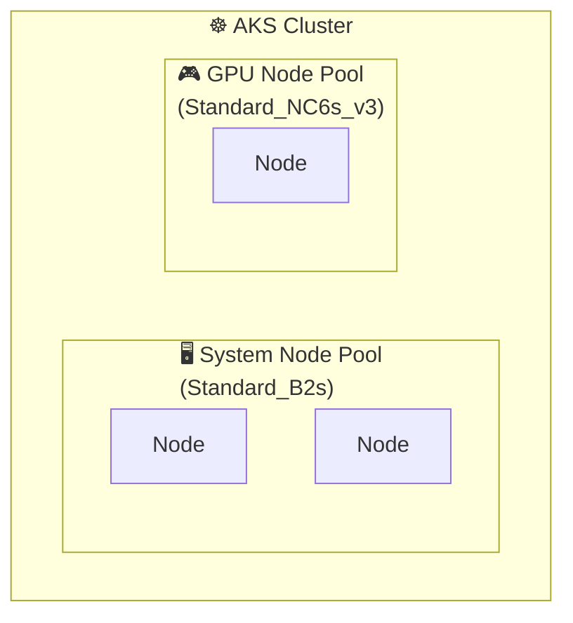
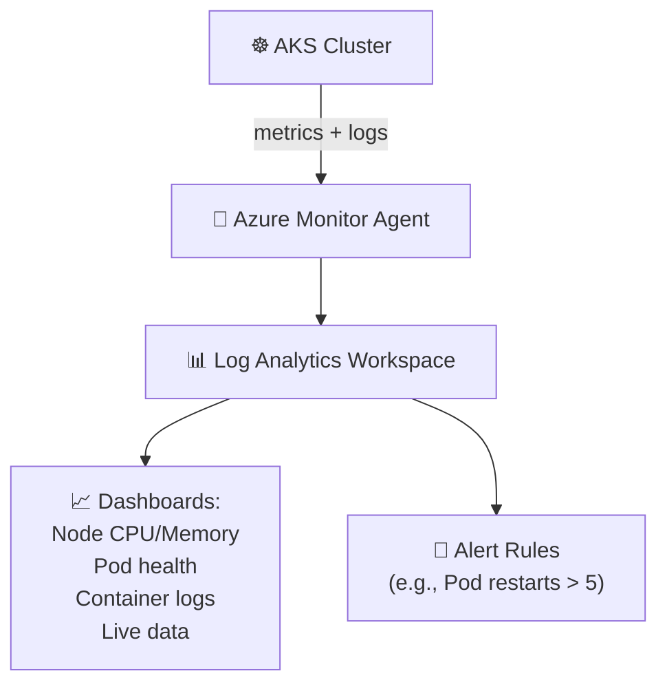
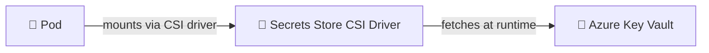
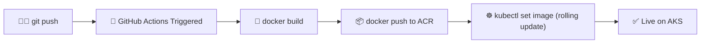
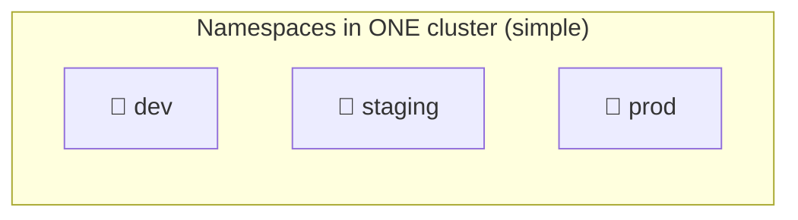
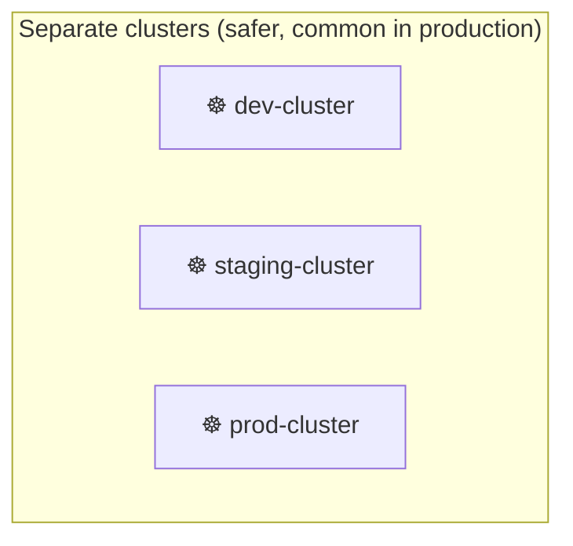

# Chapter 12 — 🚀 AKS Advanced: Autoscaling, Monitoring & CI/CD

> **Goal of this chapter:** Make your AKS cluster production-ready with autoscaling, observability, and an automated deployment pipeline.

⬅️ [Previous: AKS Getting Started](./11-aks-getting-started.md) | 🏠 [Index](./README.md) | ➡️ Next: [Capstone Project](./13-capstone-project.md)

---

## 🖥️ 12.1 Enabling the Cluster Autoscaler on AKS

Remember the **Cluster Autoscaler** from Chapter 10 (adds/removes whole *nodes*)? On AKS, it's built in:

```bash
az aks update \
  --resource-group myAKSResourceGroup \
  --name myAKSCluster \
  --enable-cluster-autoscaler \
  --min-count 1 \
  --max-count 5
```



Combined with an **HPA** on your Deployment (Chapter 10), you get **two layers of automatic scaling**: Pods scale first, and if there's no room, the underlying VM count scales too.

---

## 🗂️ 12.2 Node Pools — Separating Workload Types

AKS lets you create multiple **node pools** — groups of nodes with different VM sizes, for different workload needs (e.g., a cheap pool for general apps, a GPU pool for ML workloads).

```bash
az aks nodepool add \
  --resource-group myAKSResourceGroup \
  --cluster-name myAKSCluster \
  --name gpupool \
  --node-count 1 \
  --node-vm-size Standard_NC6s_v3 \
  --node-taints sku=gpu:NoSchedule
```



Use `nodeSelector` or `tolerations` in your Pod spec to control which pool a workload lands on.

---

## 📊 12.3 Monitoring with Azure Monitor & Container Insights

```bash
az aks enable-addons \
  --resource-group myAKSResourceGroup \
  --name myAKSCluster \
  --addons monitoring
```

This deploys metrics/logging agents into your cluster that ship data to **Azure Monitor Container Insights**, giving you:



View it in the **Azure Portal** → your AKS cluster → **Insights** tab, or query logs directly:

```kusto
ContainerLogV2
| where PodName == "my-app-xxxxx"
| order by TimeGenerated desc
| take 100
```

### 📈 Prometheus + Grafana (open-source alternative)

Many teams also run Prometheus/Grafana inside the cluster via Helm for deeper, open-source metrics visualization:

```bash
helm repo add prometheus-community https://prometheus-community.github.io/helm-charts
helm install kube-prometheus prometheus-community/kube-prometheus-stack
```

---

## 🔐 12.4 Secrets the Right Way — Azure Key Vault Integration

Recall Chapter 08's warning about Secrets only being base64-encoded. On AKS, use the **Secrets Store CSI Driver** to pull secrets directly from **Azure Key Vault** at runtime — never stored in `etcd` as plain Kubernetes Secrets at all.

```bash
az aks enable-addons \
  --resource-group myAKSResourceGroup \
  --name myAKSCluster \
  --addons azure-keyvault-secrets-provider
```



**`SecretProviderClass` example:**
```yaml
apiVersion: secrets-store.csi.x-k8s.io/v1
kind: SecretProviderClass
metadata:
  name: azure-kv-provider
spec:
  provider: azure
  parameters:
    usePodIdentity: "false"
    useVMManagedIdentity: "true"
    userAssignedIdentityID: "<identity-client-id>"
    keyvaultName: "my-keyvault"
    objects: |
      array:
        - |
          objectName: DbPassword
          objectType: secret
    tenantId: "<tenant-id>"
```

---

## 🔄 12.5 CI/CD — GitHub Actions to AKS

Let's automate: **push code → build image → push to ACR → deploy to AKS**, with zero manual steps.



**`.github/workflows/deploy.yml`:**
```yaml
name: Build and Deploy to AKS

on:
  push:
    branches: [main]

env:
  ACR_NAME: myacrregistry123
  IMAGE_NAME: my-app
  RESOURCE_GROUP: myAKSResourceGroup
  CLUSTER_NAME: myAKSCluster

jobs:
  build-and-deploy:
    runs-on: ubuntu-latest
    steps:
      - name: Checkout code
        uses: actions/checkout@v4

      - name: Azure Login
        uses: azure/login@v2
        with:
          creds: ${{ secrets.AZURE_CREDENTIALS }}

      - name: Build and push image to ACR
        run: |
          az acr login --name ${{ env.ACR_NAME }}
          docker build -t ${{ env.ACR_NAME }}.azurecr.io/${{ env.IMAGE_NAME }}:${{ github.sha }} .
          docker push ${{ env.ACR_NAME }}.azurecr.io/${{ env.IMAGE_NAME }}:${{ github.sha }}

      - name: Set AKS context
        uses: azure/aks-set-context@v4
        with:
          resource-group: ${{ env.RESOURCE_GROUP }}
          cluster-name: ${{ env.CLUSTER_NAME }}

      - name: Deploy new image (rolling update)
        run: |
          kubectl set image deployment/my-app \
            web=${{ env.ACR_NAME }}.azurecr.io/${{ env.IMAGE_NAME }}:${{ github.sha }}
          kubectl rollout status deployment/my-app
```

### 🔑 Setting up the `AZURE_CREDENTIALS` secret

```bash
az ad sp create-for-rbac \
  --name "github-actions-aks" \
  --role contributor \
  --scopes /subscriptions/<sub-id>/resourceGroups/myAKSResourceGroup \
  --sdk-auth
```

Copy the JSON output into your GitHub repo → **Settings → Secrets and variables → Actions → New repository secret** named `AZURE_CREDENTIALS`.

Now every `git push` to `main` automatically builds, pushes, and deploys — a real CI/CD pipeline! 🎉

---

## 🌍 12.6 Multi-Environment Strategy (Dev / Staging / Prod)





| Approach | Pros | Cons |
|---|---|---|
| **Namespaces in one cluster** | Cheap, simple, fast to set up | Less isolation; a noisy-neighbor Pod can affect others |
| **Separate clusters** | Full isolation, safer blast radius | More cost, more infra to manage |

> 💡 Common real-world pattern: **separate clusters for prod vs. everything else**, with `dev`/`staging` sharing one non-prod cluster via namespaces.

---

## 🎯 Try It Yourself

1. Enable the Cluster Autoscaler on your AKS cluster (`--min-count 1 --max-count 3`).
2. Enable Azure Monitor and browse the **Insights** tab in the Azure Portal.
3. Create the GitHub Actions workflow above in a sample repo, add the `AZURE_CREDENTIALS` secret, and push a change — watch it auto-deploy.
4. Create a `staging` namespace and deploy a second copy of your app into it.

---

## 🩹 Common Errors

| Error | Cause | Fix |
|---|---|---|
| GitHub Action fails at `az acr login` | Service principal lacks ACR permissions | Grant `AcrPush` role: `az role assignment create --assignee <sp-id> --role AcrPush --scope <acr-resource-id>` |
| `kubectl` step fails in pipeline | `aks-set-context` action missing cluster-admin permission | Ensure the service principal has `Azure Kubernetes Service Cluster User Role` |
| Cluster Autoscaler not adding nodes | Reached subscription core/vCPU quota | Request a quota increase in Azure Portal |
| Container Insights shows no data | Addon not enabled, or agent pods not running | `kubectl get pods -n kube-system \| grep ama-` to check agent status |

---

⬅️ [Previous: AKS Getting Started](./11-aks-getting-started.md) | 🏠 [Index](./README.md) | ➡️ Next: [Capstone Project](./13-capstone-project.md)
