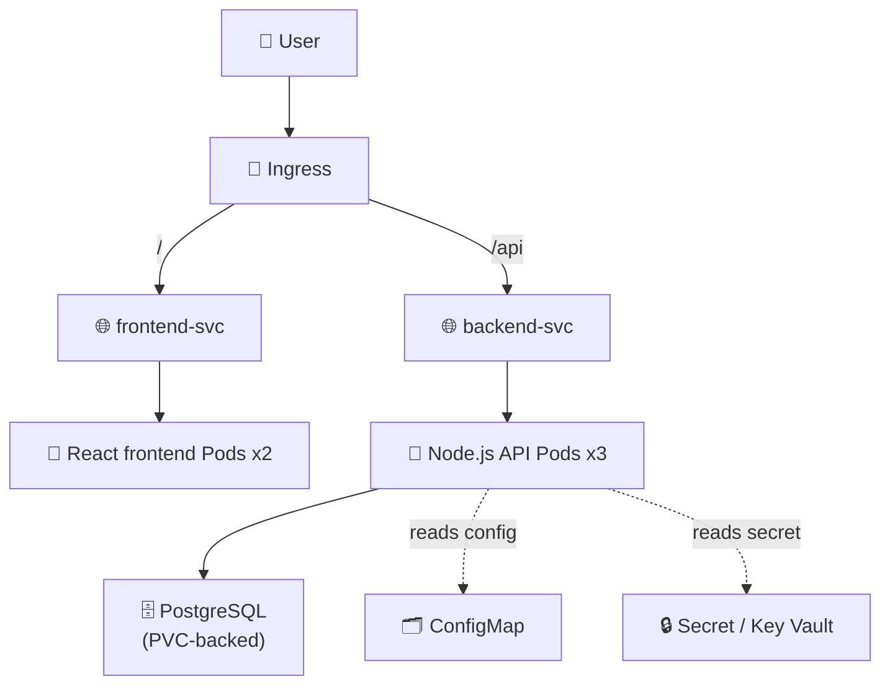
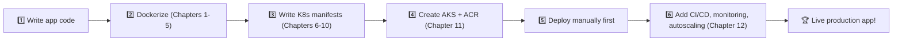
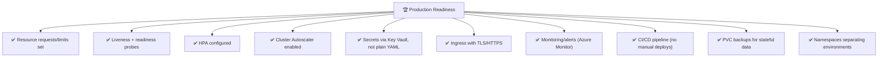
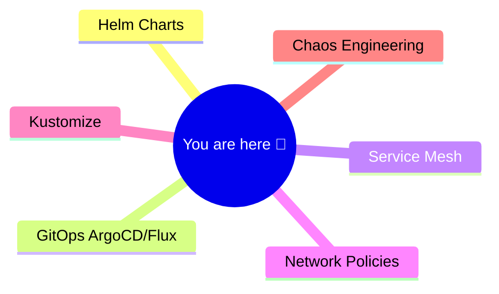

# Chapter 13 — 🏆 Capstone Project: Ship a Full App to AKS

> **Goal:** Combine everything from Chapters 01-12 into one complete, real-world project — from source code to a live URL on Azure.

⬅️ [Previous: AKS Advanced, Monitoring & CI/CD](./12-aks-advanced-cicd-monitoring.md) | 🏠 [Index](./README.md)

---

## 🎯 13.1 What We're Building

A **Task List API + Frontend + Database** — a classic 3-tier app.



---

## 🗺️ 13.2 Full Roadmap



---

## 📁 13.3 Project Structure

```
task-app/
├── backend/
│   ├── Dockerfile
│   ├── package.json
│   └── server.js
├── frontend/
│   ├── Dockerfile
│   ├── package.json
│   └── src/
├── k8s/
│   ├── namespace.yaml
│   ├── postgres-pvc.yaml
│   ├── postgres-deployment.yaml
│   ├── postgres-service.yaml
│   ├── backend-configmap.yaml
│   ├── backend-secret.yaml
│   ├── backend-deployment.yaml
│   ├── backend-service.yaml
│   ├── backend-hpa.yaml
│   ├── frontend-deployment.yaml
│   ├── frontend-service.yaml
│   └── ingress.yaml
└── .github/workflows/deploy.yml
```

---

## 🧩 13.4 Key Manifests

**`k8s/namespace.yaml`:**
```yaml
apiVersion: v1
kind: Namespace
metadata:
  name: task-app
```

**`k8s/postgres-pvc.yaml`:**
```yaml
apiVersion: v1
kind: PersistentVolumeClaim
metadata:
  name: postgres-pvc
  namespace: task-app
spec:
  accessModes: ["ReadWriteOnce"]
  resources:
    requests:
      storage: 2Gi
```

**`k8s/postgres-deployment.yaml`:**
```yaml
apiVersion: apps/v1
kind: Deployment
metadata:
  name: postgres
  namespace: task-app
spec:
  replicas: 1
  selector:
    matchLabels: { app: postgres }
  template:
    metadata:
      labels: { app: postgres }
    spec:
      containers:
        - name: postgres
          image: postgres:16-alpine
          envFrom:
            - secretRef: { name: db-secret }
          volumeMounts:
            - name: data
              mountPath: /var/lib/postgresql/data
          readinessProbe:
            exec:
              command: ["pg_isready", "-U", "taskuser"]
            initialDelaySeconds: 5
      volumes:
        - name: data
          persistentVolumeClaim: { claimName: postgres-pvc }
```

**`k8s/postgres-service.yaml`:**
```yaml
apiVersion: v1
kind: Service
metadata:
  name: postgres-svc
  namespace: task-app
spec:
  selector: { app: postgres }
  ports:
    - port: 5432
```

**`k8s/backend-deployment.yaml`:**
```yaml
apiVersion: apps/v1
kind: Deployment
metadata:
  name: backend
  namespace: task-app
spec:
  replicas: 3
  selector:
    matchLabels: { app: backend }
  template:
    metadata:
      labels: { app: backend }
    spec:
      containers:
        - name: backend
          image: myacrregistry123.azurecr.io/task-backend:1.0
          ports: [{ containerPort: 4000 }]
          envFrom:
            - configMapRef: { name: backend-config }
            - secretRef: { name: db-secret }
          resources:
            requests: { cpu: "100m", memory: "128Mi" }
            limits: { cpu: "300m", memory: "256Mi" }
          readinessProbe:
            httpGet: { path: /ready, port: 4000 }
            initialDelaySeconds: 5
          livenessProbe:
            httpGet: { path: /healthz, port: 4000 }
            initialDelaySeconds: 10
```

**`k8s/backend-hpa.yaml`:**
```yaml
apiVersion: autoscaling/v2
kind: HorizontalPodAutoscaler
metadata:
  name: backend-hpa
  namespace: task-app
spec:
  scaleTargetRef:
    apiVersion: apps/v1
    kind: Deployment
    name: backend
  minReplicas: 2
  maxReplicas: 8
  metrics:
    - type: Resource
      resource:
        name: cpu
        target: { type: Utilization, averageUtilization: 70 }
```

**`k8s/ingress.yaml`:**
```yaml
apiVersion: networking.k8s.io/v1
kind: Ingress
metadata:
  name: task-app-ingress
  namespace: task-app
  annotations:
    nginx.ingress.kubernetes.io/rewrite-target: /$2
spec:
  ingressClassName: nginx
  rules:
    - host: taskapp.example.com
      http:
        paths:
          - path: /api(/|$)(.*)
            pathType: ImplementationSpecific
            backend:
              service: { name: backend-svc, port: { number: 80 } }
          - path: /(.*)
            pathType: ImplementationSpecific
            backend:
              service: { name: frontend-svc, port: { number: 80 } }
```

*(Frontend Deployment/Service and ConfigMap/Secret files follow the same patterns you already learned in Chapters 07-08 — build them yourself as practice!)*

---

## 🚀 13.5 Deploy Everything

```bash
# 1. Create the AKS cluster & ACR (Chapter 11)
az group create --name taskAppRG --location eastus
az aks create --resource-group taskAppRG --name taskAppCluster --node-count 2 --generate-ssh-keys
az acr create --resource-group taskAppRG --name taskappacr123 --sku Basic
az aks update --name taskAppCluster --resource-group taskAppRG --attach-acr taskappacr123
az aks get-credentials --resource-group taskAppRG --name taskAppCluster

# 2. Build & push images
docker build -t taskappacr123.azurecr.io/task-backend:1.0 ./backend
docker build -t taskappacr123.azurecr.io/task-frontend:1.0 ./frontend
az acr login --name taskappacr123
docker push taskappacr123.azurecr.io/task-backend:1.0
docker push taskappacr123.azurecr.io/task-frontend:1.0

# 3. Install Ingress Controller
helm repo add ingress-nginx https://kubernetes.github.io/ingress-nginx
helm install ingress-nginx ingress-nginx/ingress-nginx -n task-app --create-namespace

# 4. Apply all manifests
kubectl apply -f k8s/

# 5. Watch it come alive
kubectl get pods -n task-app -w
kubectl get ingress -n task-app
```

---

## ✅ 13.6 Production Readiness Checklist



| Item | Covered In |
|---|---|
| Resource requests/limits | Chapter 07 |
| Health probes | Chapter 10 |
| Horizontal Pod Autoscaler | Chapter 10 |
| Cluster Autoscaler | Chapter 12 |
| Key Vault secrets | Chapter 12 |
| Ingress + TLS | Chapter 09 |
| Monitoring | Chapter 12 |
| CI/CD | Chapter 12 |
| Persistent storage | Chapter 08 |
| Namespace strategy | Chapter 12 |

---

## 🧠 13.7 What to Learn Next

You've completed a full journey from "what is a container?" to a production-grade AKS deployment. Where to go from here:

- 🎩 **Helm** — package your k8s manifests as reusable, templated "charts"
- 🕸️ **Service Mesh** (Istio / Linkerd) — advanced traffic control, mTLS between services
- 🔄 **GitOps** (ArgoCD / Flux) — declarative, Git-driven deployments instead of imperative `kubectl apply`
- 🛡️ **Pod Security Standards & Network Policies** — locking down what Pods can do and talk to
- 📐 **Kustomize** — manage environment-specific YAML overlays without duplication
- 🧪 **Chaos Engineering** — intentionally break things (e.g., Chaos Mesh) to test resilience



---

## 🎉 Congratulations!

You've gone from **"what is a container?"** to designing, containerizing, orchestrating, scaling, securing, monitoring, and automatically deploying a real multi-service application on **Azure Kubernetes Service**.

That is a genuinely valuable, in-demand skill set. Keep building — the best way to solidify all of this is to deploy a real side project of your own to AKS.

⭐ **If this guide helped you, consider starring the repo and sharing it with others learning DevOps!**

---

⬅️ [Previous: AKS Advanced, Monitoring & CI/CD](./12-aks-advanced-cicd-monitoring.md) | 🏠 [Back to Index](./README.md)
