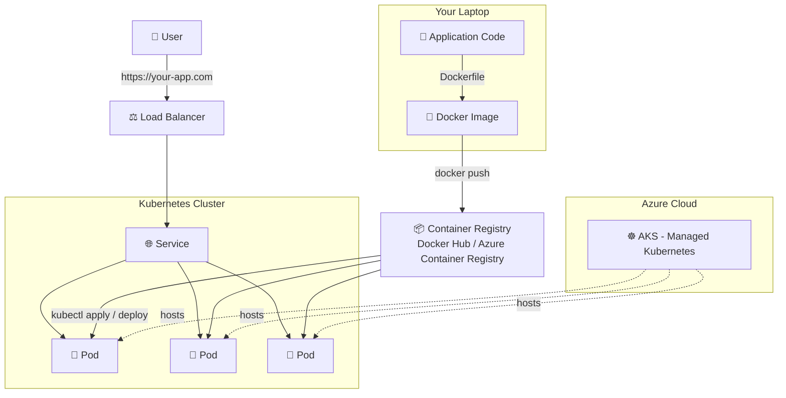

# 🐳☸️ Docker, Kubernetes & Azure AKS — The Complete Baby-Steps Guide

> **From "what is a container?" to running production workloads on Azure Kubernetes Service — explained so simply that a complete beginner can follow along.**

---

## 👋 Welcome

This repository is a **hands-on, chapter-by-chapter training course**. Every chapter builds on the previous one, uses **real commands you can copy-paste**, and includes **diagrams** so you can *see* what's happening, not just read about it.

No prior DevOps experience needed. If you can open a terminal, you can follow this guide. 🚀

### 🧭 How this guide is organized

Each chapter is a **standalone Markdown file**. Read them in order the first time; use them as a reference afterward.

---

## 📚 Table of Contents

### Part 1 — 🐳 Docker
| # | Chapter | What you'll learn |
|---|---------|--------------------|
| 01 | [Introduction to Containers](./01-introduction-to-containers.md) | Why containers exist, VMs vs containers, install Docker |
| 02 | [Docker Fundamentals](./02-docker-fundamentals.md) | Core commands, running your first containers |
| 03 | [Dockerfiles & Images](./03-dockerfile-and-images.md) | Build your own images step by step |
| 04 | [Docker Compose](./04-docker-compose.md) | Run multi-container apps with one command |
| 05 | [Networking & Volumes](./05-docker-networking-volumes.md) | Persist data, connect containers |

### Part 2 — ☸️ Kubernetes
| # | Chapter | What you'll learn |
|---|---------|--------------------|
| 06 | [Kubernetes Introduction](./06-kubernetes-introduction.md) | What K8s solves, architecture, install Minikube |
| 07 | [Core Kubernetes Objects](./07-kubernetes-core-objects.md) | Pods, ReplicaSets, Deployments, Services |
| 08 | [Config, Secrets & Storage](./08-kubernetes-config-secrets-storage.md) | ConfigMaps, Secrets, Volumes, PVCs |
| 09 | [Networking & Ingress](./09-kubernetes-networking-ingress.md) | Service types, Ingress, DNS |
| 10 | [Scaling & Health Checks](./10-kubernetes-scaling-healthchecks.md) | HPA, probes, rolling updates |

### Part 3 — ☁️ Azure Kubernetes Service (AKS)
| # | Chapter | What you'll learn |
|---|---------|--------------------|
| 11 | [AKS Getting Started](./11-aks-getting-started.md) | Create a real AKS cluster on Azure, deploy to it |
| 12 | [AKS Advanced, Monitoring & CI/CD](./12-aks-advanced-cicd-monitoring.md) | Autoscaling, Azure Monitor, GitHub Actions pipeline |

### Part 4 — 🏆 Final Project
| # | Chapter | What you'll learn |
|---|---------|--------------------|
| 13 | [Capstone Project](./13-capstone-project.md) | Build, containerize, and ship a full app to AKS end-to-end |

---

## 🛠️ Prerequisites

| Tool | Why you need it | Install link |
|------|------------------|---------------|
| 💻 A terminal (bash/PowerShell) | Run commands | Built into your OS |
| 🐳 Docker Desktop | Build & run containers | [docker.com/get-started](https://www.docker.com/get-started) |
| ☸️ kubectl | Talk to Kubernetes clusters | [kubernetes.io/docs/tasks/tools](https://kubernetes.io/docs/tasks/tools/) |
| 📦 Minikube or Kind | Run K8s locally | [minikube.sigs.k8s.io](https://minikube.sigs.k8s.io/) |
| ☁️ Azure CLI | Manage Azure resources | [learn.microsoft.com/cli/azure](https://learn.microsoft.com/en-us/cli/azure/install-azure-cli) |
| 🆓 Azure free account | To create an AKS cluster | [azure.microsoft.com/free](https://azure.microsoft.com/free/) |

> 💡 **Tip:** You don't need all of these on day one. Each chapter tells you exactly what to install right before you need it.

---

## 🗺️ The Big Picture (Why these three technologies together?)

**In one sentence each:**
- 🐳 **Docker** packages your app + everything it needs into a portable box called an *image*.
- ☸️ **Kubernetes** runs, heals, scales, and manages many of those boxes (*containers*) automatically.
- ☁️ **AKS** is Microsoft Azure's managed Kubernetes — Azure handles the hard cluster-management parts for you.

---

## ✅ How to use this repo

1. Clone or download this repo.
2. Start at [Chapter 01](./01-introduction-to-containers.md).
3. Type out every command yourself — don't just copy-paste blindly. Muscle memory matters.
4. Each chapter ends with a **"🎯 Try It Yourself"** section — do it before moving on.
5. Struggling? Each chapter has a **"🩹 Common Errors"** section — check there first.

Happy learning! ⭐ If this helped you, consider starring the repo.
